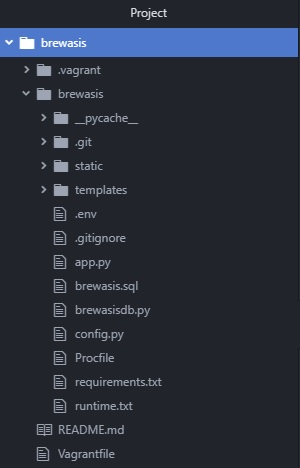
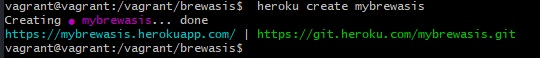

# brewasisdb
Python Postgresql database

This project uses Postgres database and contain a table of sales statistics. Also, the data is presented graphically with the ability to view for each manufacturer and for the top five. 

  ## Steps you need to run these code
These instructions will get you a copy of the project up and running on your local machine for development and testing purposes.
See deployment for notes on how to deploy the project on a live system.

  Install the required software:

- a. Virtual Machine: https://www.virtualbox.org/wiki/Downloads
- b. Vagrant: https://www.vagrantup.com/downloads.html
- c. Download this project as zip file, extract the files and using command line, input the following commands:
```
vagrant up
vagrant ssh
cd /vagrant/brewasis
```

Once you're ready, input these command:
```
python app.py
```
The project should be executed and now you can browse the main page by going to your internet browser and enter the url: http://localhost:6080/

## Steps you need to deploying these code on Heroku
These instructions will get you ability to deploying a project from virtual machine to the Heroku service. 
All commands are executed from the root project directory /vagrant/brewasis$
### Preparation
1. Install Heroku CLI
```
$ curl https://cli-assets.heroku.com/install.sh | sh
```
After installing Heroku CLI, verify installation by
```
$ heroku --version
```
Create a Heroku account if you have not one already and login to your Heroku account in CLI by
```
$ heroku login --interactive
```
2. Define configurations for deploying environments. Create a file named config.py with below code.

```python
import os
basedir = os.path.abspath(os.path.dirname(__file__))

class Config(object):
    DEBUG = False
    TESTING = False
    CSRF_ENABLED = True
    SECRET_KEY = 'this-really-needs-to-be-changed'
    
class ProductionConfig(Config):
    DEBUG = False

class StagingConfig(Config):
    DEVELOPMENT = True
    DEBUG = True

class DevelopmentConfig(Config):
    DEVELOPMENT = True
    DEBUG = True

class TestingConfig(Config):
    TESTING = True
```

According to created configurations set “APP_SETTINGS” environment variable by running this in the terminal:
```
$ export APP_SETTINGS="config.DevelopmentConfig"
```
Also add “DATABASE_URL” to environment variables:
```
$ export DATABASE_URL="postgresql:///brewasis"
```
Now our python application can get database URL for the application from the environment variable which is “DATABASE_URL”
also put these 2 environment variables into a file called .env
```
export APP_SETTINGS="config.DevelopmentConfig"
export DATABASE_URL="postgresql:///brewasis"
```
After this you need to change line 6 in brewasisdb.py:
```python
DATABASE_URL = os.environ['DATABASE_URL']
```
and line 10 in brewasisdb.py:
```python
db = psycopg2.connect(DATABASE_URL)
```
3. Installing gunicorn and creating requirements.txt file.
We need to install gunicorn to our project so we can add it to required packages list for Heroku.
```
$ sudo pip install gunicorn
```
At the moment we have installed all the required packages for this project and we can specify these by creating requirements.txt. This file will be using to identify and install packeges when we push project to Heroku.
```
$ pip freeze > requirements.txt
```
4.Creating Procfile and runtime.txt
Now we need to create Procfile to specify our application to Heroku. Create a file named Procfile with below code.
```
web: gunicorn app:app
```
Also to specify which python version you need to use, create runtime.txt with below:
```
python-3.6.5
```
5. The last thing for preparation change line 75 in app.py for this
```python
  app.run()
```
### Deploying
1. Now to push our project into Heroku we should initialize a git repository for the project. Create an git repository by:
```
$ git init
```
And create a file named .gitignore in the project root directory with below code:
```
.env
__pycache__/
env/
.gitignore
```
At this stage our project file structure should look like this.



Now add project files to git and commit.
```
git add .
git commit -m "initial commit"
```
2. Creating an application on Heroku and pushing code.
To create an application according to your project name use the below command.
```
$ heroku create name_of_your_application
```
This name should be a unique one. Here I created the application named mybrewasis


The link here in blue color is the URL for our application and green color link is the git remote link on Heroku.
Now we can add this git remote link to our local git repository. Let’s name our remote as prod for the meaning of production.

```
$ git remote add prod heroku_git_url
```
In my case 
```
$ git remote add prod https://git.heroku.com/mybrewasis.git
```
Now set the configurations for Heroku application through Heroku CLI.
First set “APP_SETTINGS” environment variable.
```
$ heroku config:set APP_SETTINGS=config.ProductionConfig --remote prod
```
Then add Postgres addon to Heroku server by:
```
$ heroku addons:create heroku-postgresql:hobby-dev --app name_of_your_application
```
In my case 
```
$ heroku addons:create heroku-postgresql:hobby-dev --app mybrewasis
```
You can check variables you set for Heroku server by:
```
$ heroku config --app name_of_your_application
```
3. Push code into Heroku. It is done by using git.
```
$ git push prod master
```
If you have problem with installation some packages from requirements.txt - just
simply delete this package from file, and do init, add, commit and push again. My final version of requirements.txt file looks like this:
```txt
chardet==2.3.0
Click==7.0
Flask==1.1.1
gunicorn==19.9.0
itsdangerous==1.1.0
Jinja2==2.10.1
MarkupSafe==1.1.1
numpy==1.17.1
pandas==0.24.2
psycopg2-binary==2.8.3
pycurl==7.43.0
python-dateutil==2.8.0
pytz==2019.2
requests==2.9.1
six==1.10.0
urllib3==1.13.1
Werkzeug==0.15.5
xlrd==1.2.0
```
4. This steps before have installed required packages and deployed your application on Heroku.
You can check deployed application through the URL Heroku provided. But still there
is one more thing to do. You cannot add or get data through database. That’s should happen because
 we still didn’t migrate the database in Heroku.
To do this run:
```
$ heroku pg:psql --app name_of_your_application < brewasis.sql
```
5. Deployed project is here. http://mybrewasis.herokuapp.com 
