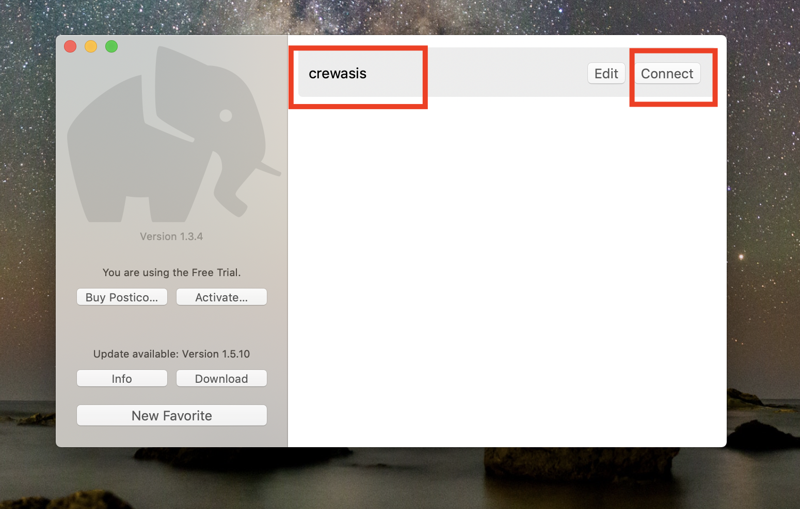
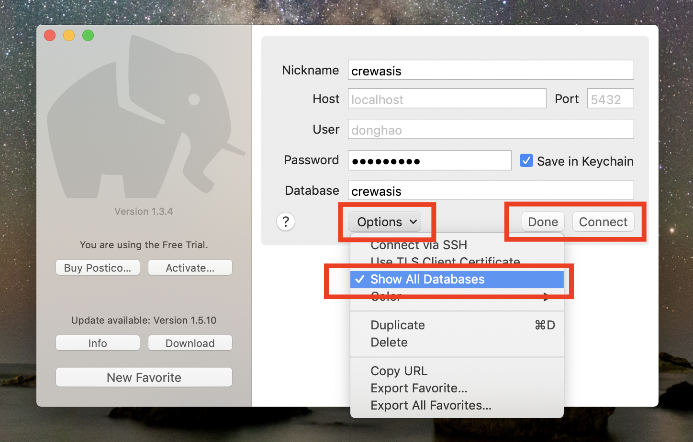
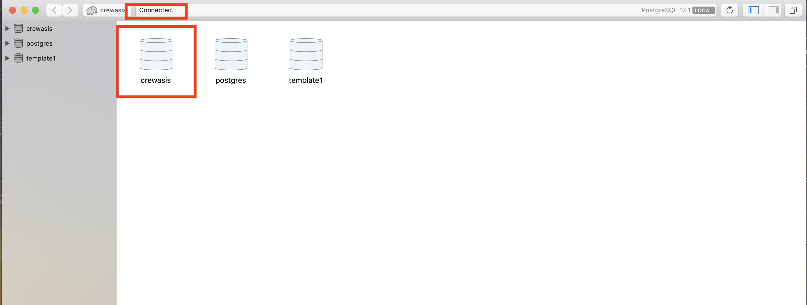
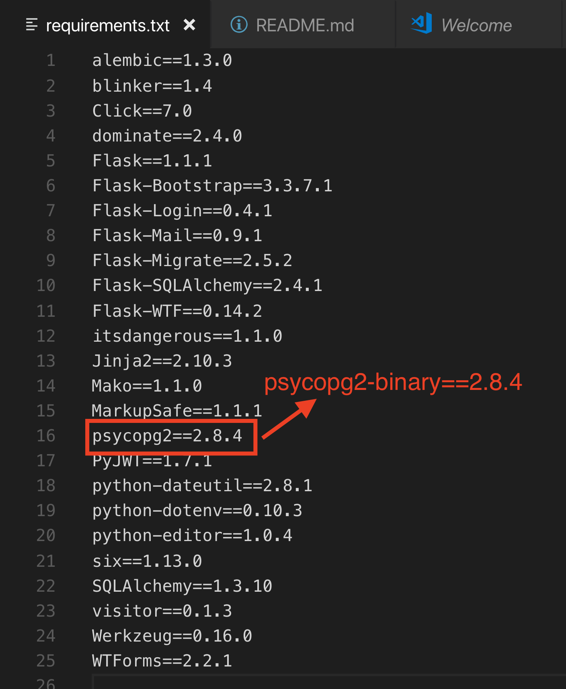

## Steps you need to run these code locally (Mac OS)
These instructions will get you a copy of the project up and running on your local `Mac` machine for development and testing purposes.
### Prerequirements
- a. Python 3.7.4
- b. PostgreSQL 12.1

1. After installing and setting python and postgres on your local `Mac` machine you can check using these commands in git bash:

```bash
$ python -V
$ postgres -V
```

If these commands run without error and shows versions programs installed correctly
Also now you have access to the database <postgres> reated by default using this command in git bash:

```bash
$ psql -U postgres postgres
```

where first <postgres> is username created by default and second <postgres> is database name. Then if asked you can use password 'postgres'.

2. Now let's set our database 'crewasis' and new role. For this run these command inside 'postgres' database:

```
postgres=# create database crewasis;
postgres=# create user <username>;
postgres=# grant all privileges on database crewasis to <username>;
postgres=# \q 
```
For access database crewasis from flask app by default, i.e without username, you can indicate 'username' the same what you have in your git bash console. To find out all username try to run these command from git bash:

```bash
$ psql postgres
postgres=# \du
```

After these settings you can restart server in Postico and find new database crewasis was created.

<p align="center">

</p>

<p align="center">

</p>

<p align="center">

</p>

### Clone, install requirements, environment variables and run
From git bash:

```bash
$ git clone https://github.com/ArtemAleksieiev/crewasis.git
$ cd crewasis
$ source venv/bin/activate
```
### `Important step:`change one dependency name in `requirements.txt`.

<p align="center">

</p>

```bash
$ pip3 install -r requirements.txt
$ export FLASK_APP=microblog.py
$ flask db upgrade
$ flask run
```

If you use different role name in PostgreSQL Server that your username in git bash before upgrading crewasis database you need to change DATABASE_URL variable in .env file:

```
DATABASE_URL="postgresql://<username>@localhost/crewasis"
```

Now you can see app running on http://127.0.0.1:5000