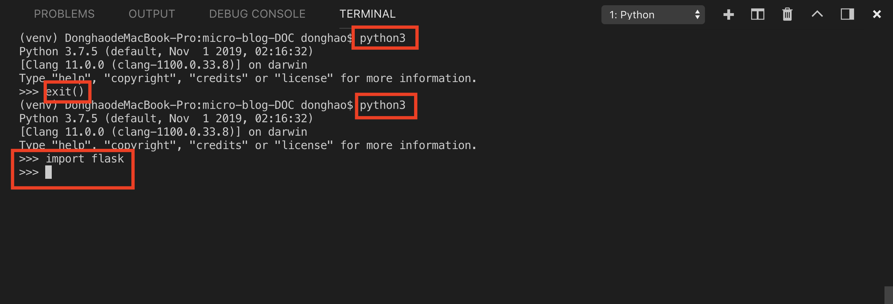
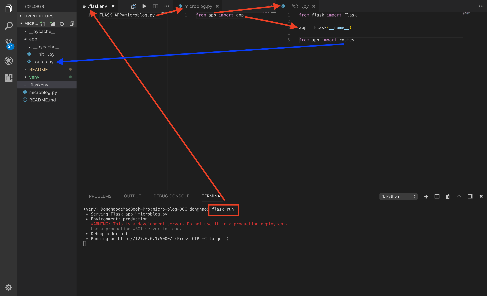
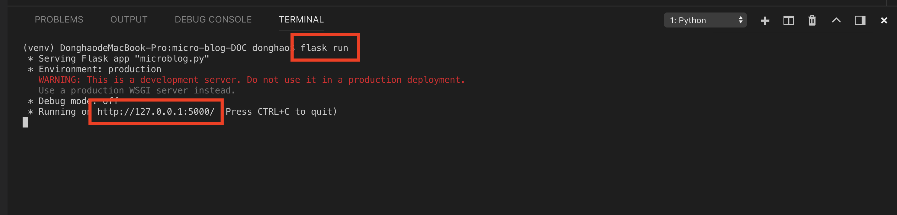
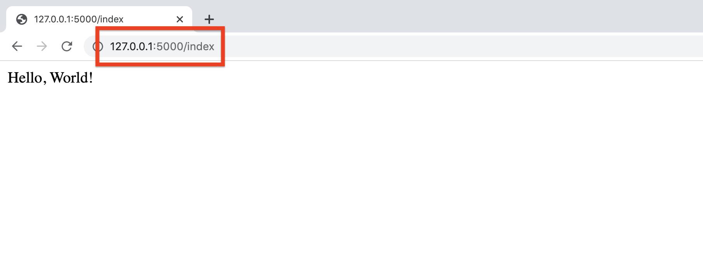
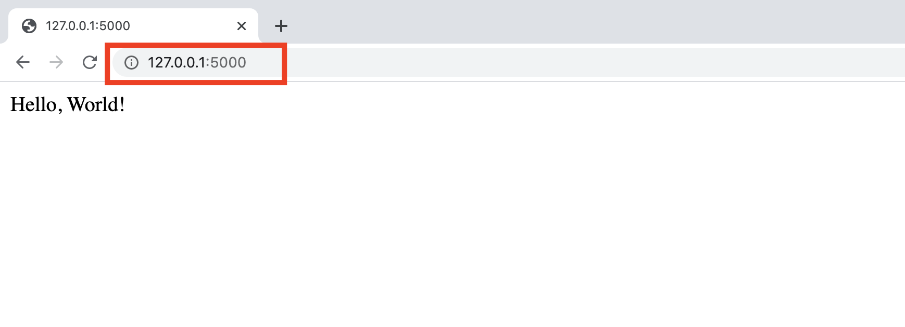

# MICRO-BLOG-DOC (Part 1)

## `Section: Basic`(Basic Python application knowledge)

### `Summary`: In this documentation, we build a python application from basic and talk about some structure knowledge.（文件结构）

### `Check Dependencies:`

```diff
+ flask (new)
+ python-dotenv (new)
```

### `Brief Contents & codes position`
- 1.1 General commands in this section, 
- 1.2 Create a virtual environment and install dependencies.

----------------------------------------------

- 1.3 Create folder and py files, set up the entry and turn the debug mode on. 
- 1.4 How the application works in this structure.

### `Step1:General commands in this section`

#### `1.To make sure your Python installation is functional:`

```bash
$ python3
```

#### `2.Exit the interactive prompt`, For mac: ctrl + D, or

```bash
$ exit()
```

#### `3.验证dependency是否安装：start the Python interpreter (python shell)`
```bash
$ python3

>>> import <dependency name>
```

<p align="center">

</p>

-------------------------------------------------------------------------

### `Step2: Create a virtual environment and install dependencies`

#### `1.Why does python web development need virtual environment?`

- After you install a dependency in general, From that point on, every Python script that you have on your system will have access to this package.(每个dependency具有global属性。)

- A virtual environment is a complete copy of the Python interpreter. When you install packages in a virtual environment, the system-wide Python interpreter is not affected, only the copy is.(另辟独立空间，使空间内只会使用指定的dependency，而不会调用空间外的全局dependency。)

- So the solution to have complete freedom to install any versions of your packages for each application is to use a different virtual environment for each application. Virtual environments have the added benefit that they are owned by the user who creates them, so they do not require an administrator account.

#### `2. How to create a virtual environment?`

If you are using a Python 3 version, virtual environment support is included in it, so all you need to do to create one is this:
##### `(*1.1)`
```bash
$ python3 -m venv venv
```
`这是用来创造虚拟环境的，第一个venv是命令，第二个venv是名字。`

#### `3. How to active a virtual environment?`
##### `(*1.2)`
```bash
$ source venv/bin/activate
```

#### `4. How to install a new dependency in virtual environment?`
##### `(*1.3)`
```bash
(venv) $ pip install flask
(venv) $ pip install python-dotenv
```

#### `5. Run your first web application, with the following command:`

```bash
(venv) $ flask run
```

#### `6. Stop the application`: ctrl + C

### `Step3: Create folder and py files, set up the entry and turn the debug mode on.`

#### `A. Create a file called '.flaskenv' for environment variable.`
##### `(*1.4)Location: ./.flaskenv`

```py
FLASK_APP=microblog.py
FLASK_DEBUG=1
```

#### `B. Create a file called 'microblog.py'`
##### `(*1.5)Location: ./microblog.py`

```py
from app import app
```

#### `C. Let's create a folder called app`
##### `(*1.6)`
```bash
(venv) $ mkdir app
```

#### `D. Create a file called '__init__.py'`
##### `(*1.7)Location: ./app/__init__.py`

```python
from flask import Flask

app = Flask(__name__)

from app import routes
```

#### `Comments:`
- For all practical purposes, passing __name__ is almost always going to configure Flask in the correct way.
- The app variable is defined as an instance of class Flask in the `__init__.py` script, which makes it a member of the app package.

- `from app import app` 的意思是从`app`文件夹里面引用`__init__.py`文件中的`app` 变量。

#### `E. Create a file called 'routes.py'`
##### `(*1.8)Location: ./app/routes.py`

```python
from app import app

@app.route('/')
@app.route('/index')
def index():
    return "Hello, World!"
```

- This is a simple view function.
- 了解编写 view function 的基本格式和变量。

### `Step4: Concept questions.` __`(IMPORTANT)`__

#### `A. How does view function works?` (以 URL 引出 function)

- The two strange @app.route lines above the function are decorators, a unique feature of the Python language. A decorator modifies the function that follows it. A common pattern with decorators is to use them to register functions as callbacks for certain events. In this case, the @app.route decorator creates an association between the URL given as an argument and the function. In this example there are two decorators, which associate the URLs / and /index to this function. __`This means that when a web browser requests either of these two URLs, Flask is going to invoke this function and pass the return value of it back to the browser as a response.`__

#### `B. How does url_for works?` (以 function 引出 URL，同时可以根据 url_for 参数动态改变 URL .)

1. One problem with writing links directly in templates and source files is that if one day you decide to reorganize your links, then you are going to have to search and replace these links in your entire application.

2. To have better control over these links, Flask provides a function called url_for(), which generates URLs using its internal mapping of URLs to view functions. For example, url_for('login') returns /login, and url_for('index') return '/index. __`The argument to url_for() is the endpoint name, which is the name of the view function.`__

3. You may ask why is it better to use the function names instead of URLs. __`The fact is that URLs are much more likely to change than view function names, which are completely internal.`__ A secondary reason is that as you will learn later, some URLs have dynamic components in them, so generating those URLs by hand would require concatenating multiple elements, which is tedious and error prone. The url_for() is also able to generate these complex URLs.

#### `C. How the application works in this structure.`

<p align="center">

</p>

### `Step5: Run the application.`

- Run the command:
##### `(*1.9)`
```bash
(venv) $ flask run
```
<p align="center">

</p>

- Open browser in http://127.0.0.1:5000/
<p align="center">

</p>

------------------------------------------

<p align="center">

</p>

### `总结：`

- 一个基本应用的初始结构，还有基本命令。
- view fucntion 的基本格式。
- 回答为什么需要虚拟环境。