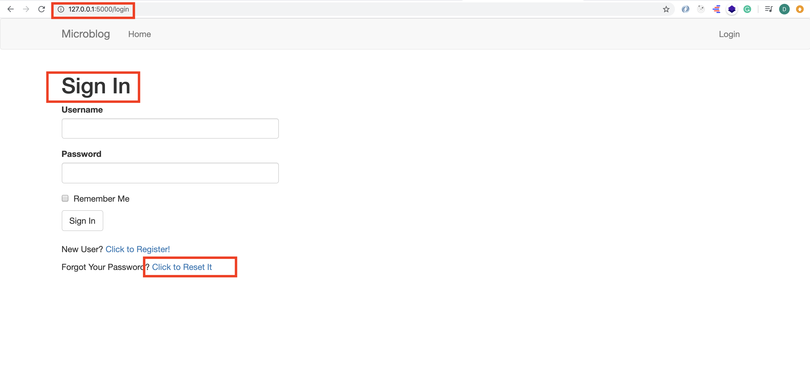

# MICRO-BLOG-DOC (Part 10)

## `Section: Back End`(Email)

### `Summary`: In this documentation, we build email support feature to reset password. （发送一个加密 url，以 token 作为参数，实际上是一个 view function， 用户点击后进入重置密码页面。）

### `Check Dependencies:`

- flask 
- python-dotenv
- flask-wtf
- flask-sqlalchemy
- flask-migrate
- flask-login

```diff
+ flask-mail (new)
+ pyjwt (new)
```

- werkzeug.security (built-in)
- datetime (built-in)

### 本章提要：
1. Why does an application need to email its users? 

- There are many reasons, but one common one is to solve authentication related problems. In this chapter I'm going to add a password reset feature for users that forget their password. When a user requests a password reset, the application will send an email with a specially crafted link. The user then needs to click that link to have access to a form in which to set a new password.(应用在密码重置的用户认证领域。)

2. ** 本章里面使用到的一些句子可以作为之前的术语的参考。

### 本章使用的外部函数：

#### `flask-mail`
```diff
+ Message
```

#### `pyjwt`
```diff

```


### `Brief Contents & codes position:`

- 10.1 Install new extensions and create an instance to configure the extension. 
    - __`(*10.1)Location: ./app/__init__.py`__
- 10.2 Create an email helper function by the instance from extension. 
    - __`Location: ./app/email.py`__

---------------------------------------------------------------------

- 10.3 A new web form to initiate the password reset process. 
    - __`(*10.2)Location: ./app/templates/login.html`__
    - __`Location: ./app/forms.py`__
    - __`(*10.3)Location: ./app/templates/reset_password_request.html`__
    - __`Location: ./app/routes.py`__

---------------------------------------------------------------------

- 10.4 Write the token generation and verification functions as methods in the User model.  
    - __`(*10.4)Location: ./app/models.py`__

---------------------------------------------------------------------

- 10.5 Sending a password reset email.
    - __`Location: ./app/email.py`__
    - __`(*10.5)Location: ./app/templates/email/reset_password.txt`__
    - __`(*10.6)Location: ./app/templates/email/reset_password.html`__

---------------------------------------------------------------------
- 10.6 Resetting a user password. 
    - __`(*10.7)Location: ./app/routes.py`__
    - __`(*10.8)Location: ./app/forms.py`__
    - __`(*10.9)Location: ./app/templates/reset_password.html`__

---------------------------------------------------------------------

- 10.7 Set up Asynchronous Emails. 
    - __`(*10.10)Location: ./app/email.py`__

---------------------------------------------------------------------

### 本章 functions 的应用顺序：
```diff
+ reset_password_request ->  send_password_reset_email(user) -> reset_password
```


### `Step1: Install new extensions and create an instance to configure the extension.`

#### `a. Install new extensions`

```bash
(venv) $ pip install flask-mail
(venv) $ pip install pyjwt
```

#### `b. Create instance right after the flask application is created.`
##### `(*10.1)Location: ./app/__init__.py`

```py
from flask import Flask
from config import Config
from flask_sqlalchemy import SQLAlchemy
from flask_migrate import Migrate
from flask_login import LoginManager

import logging
from logging.handlers import SMTPHandler
from logging.handlers import RotatingFileHandler
import os

from flask_mail import Mail

app = Flask(__name__)
app.config.from_object(Config)
db = SQLAlchemy(app)
migrate = Migrate(app, db)
login = LoginManager(app)
login.login_view = 'login'
mail = Mail(app)

if not app.debug:
    if app.config['MAIL_SERVER']:
        auth = None
        if app.config['MAIL_USERNAME'] or app.config['MAIL_PASSWORD']:
            auth = (app.config['MAIL_USERNAME'], app.config['MAIL_PASSWORD'])
        secure = None
        if app.config['MAIL_USE_TLS']:
            secure = ()
        mail_handler = SMTPHandler(
            mailhost=(app.config['MAIL_SERVER'], app.config['MAIL_PORT']),
            fromaddr='no-reply@' + app.config['MAIL_SERVER'],
            toaddrs=app.config['ADMINS'], subject='Microblog Failure',
            credentials=auth, secure=secure)
        mail_handler.setLevel(logging.ERROR)
        app.logger.addHandler(mail_handler)

    if not os.path.exists('logs'):
        os.mkdir('logs')
    file_handler = RotatingFileHandler('logs/microblog.log', maxBytes=10240, backupCount=10)
    file_handler.setFormatter(logging.Formatter(
        '%(asctime)s %(levelname)s: %(message)s [in %(pathname)s:%(lineno)d]'))
    file_handler.setLevel(logging.INFO)
    app.logger.addHandler(file_handler)

    app.logger.setLevel(logging.INFO)
    app.logger.info('Microblog startup')

from app import routes, models, errors
```

#### `Comment:`
1. 创建 extension instance 的语句.

```py
# ...
from flask_mail import Mail

# app = Flask(__name__)
# ...
mail = Mail(app) # 注意这一句的位置。
``` 


### `Step2: Create an email helper function by the instance from extension.`

##### `（运用上面的instance）Location: ./app/email.py`

```py
from flask_mail import Message
from app import mail

def send_email(subject, sender, recipients, text_body, html_body):
    msg = Message(subject, sender=sender, recipients=recipients)
    msg.body = text_body
    msg.html = html_body
    mail.send(msg)
```

#### `Comment:`
1. 这里的主要过程是使用已经引进的`extension`里面的部件去定义一个`helper function`.


### `Step3. A new web form to initiate the password reset process.`

#### `a. Create a new link to connect view function.`
##### `(*10.2) Location: ./app/templates/login.html`

```html




    <h1>Sign In</h1>
    <div class="row">
        <div class="col-md-4">
            {{ wtf.quick_form(form) }}
        </div>
    </div>
    <br>
    <p>New User? <a href="{{ url_for('register') }}">Click to Register!</a></p>
    <p>
        Forgot Your Password?
        <a href="{{ url_for('reset_password_request') }}">Click to Reset It</a>
    </p>

```

#### `Comment:`

1. 新增`view function (reset_password_request)`.
```html
    <p>
        Forgot Your Password?
        <a href="{{ url_for('reset_password_request') }}">Click to Reset It</a>
    </p>
```

#### `b. Create a new form class.`
##### `Location: ./app/forms.py`

```py
class ResetPasswordRequestForm(FlaskForm):
    email = StringField('Email', validators=[DataRequired(), Email()])
    submit = SubmitField('Request Password Reset')
```

#### `c. Create a corresponding HTML template.`
##### `(*10.3) Location: ./app/templates/reset_password_request.html`

```html



    <h1>Reset Password</h1>
    <form action="" method="post">
        {{ form.hidden_tag() }}
        <p>
            {{ form.email.label }}<br>
            {{ form.email(size=64) }}<br>
            
                <span style="color: red;">[{{ error }}]</span>
            
        </p>
        <p>{{ form.submit() }}</p>
    </form>

```


#### `d. Create a view function to handle this form.`
##### `Location: ./app/routes.py`

```py
from app.forms import ResetPasswordRequestForm
from app.email import send_password_reset_email

@app.route('/reset_password_request', methods=['GET', 'POST'])
def reset_password_request():
    if current_user.is_authenticated:
        return redirect(url_for('index'))
    form = ResetPasswordRequestForm()
    if form.validate_on_submit():
        user = User.query.filter_by(email=form.email.data).first()
        if user:
            send_password_reset_email(user)
        flash('Check your email for the instructions to reset your password')
        return redirect(url_for('login'))
    return render_template('reset_password_request.html',title='Reset Password', form=form)
```

#### `Comment:`

1. 这一步骤很好的展示了整个开发过程常用的步骤：`link (url_for) -> view function -> (form class + template)`

2. 这里的 view function 呼应了第一步的 view function。

3. 上面有一个method还没有定义，`send_password_reset_email(user)`，这会在`STEP5`中实现。


### `Step4 Write the token generation and verification functions as methods in the User model.`

##### `(*10.4)Location: ./app/models.py`

```py
from datetime import datetime
from app import db
from werkzeug.security import generate_password_hash, check_password_hash
from flask_login import UserMixin
from app import login
from hashlib import md5

from time import time
import jwt
from app import app

followers = db.Table('followers',
    db.Column('follower_id', db.Integer, db.ForeignKey('user.id')),
    db.Column('followed_id', db.Integer, db.ForeignKey('user.id'))
)

class User(UserMixin, db.Model):
    id = db.Column(db.Integer, primary_key=True)
    username = db.Column(db.String(64), index=True, unique=True)
    email = db.Column(db.String(120), index=True, unique=True)
    password_hash = db.Column(db.String(128))
    posts = db.relationship('Post', backref='author', lazy='dynamic')
    about_me = db.Column(db.String(140))
    last_seen = db.Column(db.DateTime, default=datetime.utcnow)

    followed = db.relationship(
        'User', secondary=followers,
        primaryjoin=(followers.c.follower_id == id),
        secondaryjoin=(followers.c.followed_id == id),
        backref=db.backref('followers', lazy='dynamic'), lazy='dynamic')

    def __repr__(self):
        return '<User {}>'.format(self.username)

    def set_password(self, password):
        self.password_hash = generate_password_hash(password)

    def check_password(self, password):
        return check_password_hash(self.password_hash, password)

    def avatar(self, size):
        digest = md5(self.email.lower().encode('utf-8')).hexdigest()
        return 'https://www.gravatar.com/avatar/{}?d=identicon&s={}'.format(
            digest, size)
    
    def follow(self, user):
        if not self.is_following(user):
            self.followed.append(user)

    def unfollow(self, user):
        if self.is_following(user):
            self.followed.remove(user)

    def is_following(self, user):
        return self.followed.filter(
            followers.c.followed_id == user.id).count() > 0

    def followed_posts(self):
        followed = Post.query.join(
            followers, (followers.c.followed_id == Post.user_id)).filter(
                followers.c.follower_id == self.id)
        own = Post.query.filter_by(user_id=self.id)
        return followed.union(own).order_by(Post.timestamp.desc())

    def get_reset_password_token(self, expires_in=600):
        return jwt.encode({'reset_password': self.id, 'exp': time() + expires_in},
            app.config['SECRET_KEY'], algorithm='HS256').decode('utf-8')

    @staticmethod
    def verify_reset_password_token(token):
        try:
            id = jwt.decode(token, app.config['SECRET_KEY'],algorithms=['HS256'])['reset_password']
        except:
            return
        return User.query.get(id)


class Post(db.Model):
    id = db.Column(db.Integer, primary_key=True)
    body = db.Column(db.String(140))
    timestamp = db.Column(db.DateTime, index=True, default=datetime.utcnow)
    user_id = db.Column(db.Integer, db.ForeignKey('user.id'))

    def __repr__(self):
        return '<Post {}>'.format(self.body)


@login.user_loader
def load_user(id):
    return User.query.get(int(id))
```


#### `Comment:`
1. 新增语句
```py
from time import time
import jwt
from app import app

class User(UserMixin, db.Model):
    # ...

    def get_reset_password_token(self, expires_in=600):
        return jwt.encode(
            {'reset_password': self.id, 'exp': time() + expires_in},
            app.config['SECRET_KEY'], algorithm='HS256').decode('utf-8')

    @staticmethod
    def verify_reset_password_token(token):
        try:
            id = jwt.decode(token, app.config['SECRET_KEY'], algorithms=['HS256'])['reset_password']
        except:
            return
        return User.query.get(id)
```


2. The links are going to be provisioned with a token, and this token will be validated before allowing the password change, as proof that the user that requested the email has access to the email address on the account. A very popular token standard for this type of process is the JSON Web Token, or JWT. The nice thing about JWTs is that they are self contained. You can send a token to a user in an email, and when the user clicks the link that feeds the token back into the application, it can be verified on its own.

3. What makes the token secure is that the payload is signed. If somebody tried to forge or tamper with the payload in a token, then the signature would be invalidated, and to generate a new signature the secret key is needed. When a token is verified, the contents of the payload are decoded and returned back to the caller. If the token's signature was validated, then the payload can be trusted as authentic.

4. When the user clicks on the emailed link, the token is going to be sent back to the application as part of the URL, and the first thing the view function that handles this URL will do is to verify it. If the signature is valid, then the user can be identified by the ID stored in the payload. Once the user's identity is known, the application can ask for a new password and set it on the user's account.


### `Step5 Sending a password reset email.`

#### `a. Create a helper function to set a new email format.`
##### `Location: ./app/email.py`

```py
from flask import render_template
from app import app

# ...

def send_password_reset_email(user):
    token = user.get_reset_password_token()
    send_email('[Microblog] Reset Your Password',
               sender=app.config['ADMINS'][0],
               recipients=[user.email],
               text_body=render_template('email/reset_password.txt',user=user, token=token),
               html_body=render_template('email/reset_password.html',user=user, token=token))
```

#### `Comment:`
1.  注意这一句，用到了`txt`文件
```py
text_body=render_template('email/reset_password.txt',user=user，token=token),
```

2. 为什么要分别发送两个文件，作为`text_body`和`html_body`?

3. The interesting part in this function is that the text and HTML content for the emails is generated from templates using the familiar render_template() function. The templates receive the user and the token as arguments, so that a personalized email message can be generated. 

4. 这里使用到了 model 中新定义的 `user.get_reset_password_token()`

#### `b. Write the text template for the reset password email.`
##### `(*10.5) Location: ./app/templates/email/reset_password.txt`

```txt
Dear {{ user.username }},

To reset your password click on the following link:

{{ url_for('reset_password', token=token, _external=True) }}

If you have not requested a password reset simply ignore this message.

Sincerely,

The Microblog Team
```

#### `c. Write the html template for the reset password email.`
##### `(*10.6) Location: ./app/templates/email/reset_password.html`

```html
<p>Dear {{ user.username }},</p>
<p>
    To reset your password
    <a href="{{ url_for('reset_password', token=token, _external=True) }}">
        click here
    </a>.
</p>
<p>Alternatively, you can paste the following link in your browser's address bar:</p>
<p>{{ url_for('reset_password', token=token, _external=True) }}</p>
<p>If you have not requested a password reset simply ignore this message.</p>
<p>Sincerely,</p>
<p>The Microblog Team</p>
```

#### `Comment:`

- The reset_password route that is referenced in the url_for() call in these two email templates does not exist yet, this will be added in the next section. The _external=True argument that I included in the url_for() calls in both templates is also new. The URLs that are generated by url_for() by default are relative URLs, so for example, the url_for('user', username='susan') call would return /user/susan. This is normally sufficient for links that are generated in web pages, because the web browser takes the remaining parts of the URL from the current page. When sending a URL by email however, that context does not exist, so fully qualified URLs need to be used. When _external=True is passed as an argument, complete URLs are generated, so the previous example would return http://localhost:5000/user/susan, or the appropriate URL when the application is deployed on a domain name.

- The reset_password route that is referenced in the url_for() call in these two email templates does not exist yet. (这个`view function`未定义。)


### `Step6 Resetting a user password.`

#### `a.When the user clicks on the email link, a second route associated with this feature is triggered. (view function)`

##### `(*10.7)Location: ./app/routes.py`

```py
from flask import render_template, flash, redirect, url_for
from app import app
from app import db
from app.forms import LoginForm, RegistrationForm
from flask_login import current_user, login_user, logout_user, login_required
from app.models import User
from flask import request
from werkzeug.urls import url_parse

from datetime import datetime
from app.forms import EditProfileForm

from app.forms import PostForm
from app.models import Post

from app.forms import ResetPasswordRequestForm
from app.email import send_password_reset_email

from app.forms import ResetPasswordForm


@app.before_request
def before_request():
    if current_user.is_authenticated:
        current_user.last_seen = datetime.utcnow()
        db.session.commit()


@app.route('/', methods=['GET', 'POST'])
@app.route('/index', methods=['GET', 'POST'])
@login_required
def index():
    form = PostForm()
    if form.validate_on_submit():
        post = Post(body=form.post.data, author=current_user)
        db.session.add(post)
        db.session.commit()
        flash('Your post is now live!')
        return redirect(url_for('index'))
    page = request.args.get('page', 1, type=int)
    posts = current_user.followed_posts().paginate(
        page, app.config['POSTS_PER_PAGE'], False)
    next_url = url_for('index', page=posts.next_num) \
        if posts.has_next else None
    prev_url = url_for('index', page=posts.prev_num) \
        if posts.has_prev else None
    return render_template('index.html', title='Home', form=form,
                           posts=posts.items, next_url=next_url,
                           prev_url=prev_url)


@app.route('/explore')
@login_required
def explore():
    page = request.args.get('page', 1, type=int)
    posts = Post.query.order_by(Post.timestamp.desc()).paginate(
        page, app.config['POSTS_PER_PAGE'], False)
    next_url = url_for('explore', page=posts.next_num) \
        if posts.has_next else None
    prev_url = url_for('explore', page=posts.prev_num) \
        if posts.has_prev else None
    return render_template("index.html", title='Explore', posts=posts.items,
                          next_url=next_url, prev_url=prev_url)


@app.route('/user/<username>')
@login_required
def user(username):
    user = User.query.filter_by(username=username).first_or_404()
    page = request.args.get('page', 1, type=int)
    posts = user.posts.order_by(Post.timestamp.desc()).paginate(
        page, app.config['POSTS_PER_PAGE'], False)
    next_url = url_for('user', username=user.username, page=posts.next_num) \
        if posts.has_next else None
    prev_url = url_for('user', username=user.username, page=posts.prev_num) \
        if posts.has_prev else None
    return render_template('user.html', user=user, posts=posts.items, next_url=next_url, prev_url=prev_url)


@app.route('/login', methods=['GET', 'POST'])
def login():
    # current_user(variabel)
    if current_user.is_authenticated:
        return redirect(url_for('index'))
    form = LoginForm()
    if form.validate_on_submit():
        # User(model)
        user = User.query.filter_by(username=form.username.data).first()
        if user is None or not user.check_password(form.password.data):
            flash('Invalid username or password')
            return redirect(url_for('login'))
        # login_user(method)
        login_user(user, remember=form.remember_me.data)
        next_page = request.args.get('next')
        if not next_page or url_parse(next_page).netloc != '':
            next_page = url_for('index')
        return redirect(next_page)
    return render_template('login.html', title='Sign In', form=form)


@app.route('/logout')
def logout():
    logout_user()
    return redirect(url_for('index'))


@app.route('/register', methods=['GET', 'POST'])
def register():
    if current_user.is_authenticated:
        return redirect(url_for('index'))
    form = RegistrationForm()
    if form.validate_on_submit():
        user = User(username=form.username.data, email=form.email.data)
        user.set_password(form.password.data)
        db.session.add(user)
        db.session.commit()
        flash('Congratulations, you are now a registered user!')
        return redirect(url_for('login'))
    return render_template('register.html', title='Register', form=form)


@app.route('/edit_profile', methods=['GET', 'POST'])
@login_required
def edit_profile():
    form = EditProfileForm(current_user.username)
    if form.validate_on_submit():
        current_user.username = form.username.data
        current_user.about_me = form.about_me.data
        db.session.commit()
        flash('Your changes have been saved.')
        return redirect(url_for('edit_profile'))
    elif request.method == 'GET':
        form.username.data = current_user.username
        form.about_me.data = current_user.about_me
    return render_template('edit_profile.html', title='Edit Profile', form=form)

@app.route('/follow/<username>')
@login_required
def follow(username):
    user = User.query.filter_by(username=username).first()
    if user is None:
        flash('User {} not found.'.format(username))
        return redirect(url_for('index'))
    if user == current_user:
        flash('You cannot follow yourself!')
        return redirect(url_for('user', username=username))
    current_user.follow(user)
    db.session.commit()
    flash('You are following {}!'.format(username))
    return redirect(url_for('user', username=username))

@app.route('/unfollow/<username>')
@login_required
def unfollow(username):
    user = User.query.filter_by(username=username).first()
    if user is None:
        flash('User {} not found.'.format(username))
        return redirect(url_for('index'))
    if user == current_user:
        flash('You cannot unfollow yourself!')
        return redirect(url_for('user', username=username))
    current_user.unfollow(user)
    db.session.commit()
    flash('You are not following {}.'.format(username))
    return redirect(url_for('user', username=username))


@app.route('/reset_password_request', methods=['GET', 'POST'])
def reset_password_request():
    if current_user.is_authenticated:
        return redirect(url_for('index'))
    form = ResetPasswordRequestForm()
    if form.validate_on_submit():
        user = User.query.filter_by(email=form.email.data).first()
        if user:
            send_password_reset_email(user)
        flash('Check your email for the instructions to reset your password')
        return redirect(url_for('login'))
    return render_template('reset_password_request.html', title='Reset Password', form=form)


@app.route('/reset_password/<token>', methods=['GET', 'POST'])
def reset_password(token):
    if current_user.is_authenticated:
        return redirect(url_for('index'))
    user = User.verify_reset_password_token(token)
    if not user:
        return redirect(url_for('index'))
    form = ResetPasswordForm()
    if form.validate_on_submit():
        user.set_password(form.password.data)
        db.session.commit()
        flash('Your password has been reset.')
        return redirect(url_for('login'))
    return render_template('reset_password.html', form=form)
```

#### `Comments:`
1. 新增语句：
```py
from app.forms import ResetPasswordForm

@app.route('/reset_password/<token>', methods=['GET', 'POST'])
def reset_password(token):
    if current_user.is_authenticated:
        return redirect(url_for('index'))
    user = User.verify_reset_password_token(token)
    if not user:
        return redirect(url_for('index'))
    form = ResetPasswordForm()
    if form.validate_on_submit():
        user.set_password(form.password.data)
        db.session.commit()
        flash('Your password has been reset.')
        return redirect(url_for('login'))
    return render_template('reset_password.html', form=form)
```

2. In this view function I first make sure the user is not logged in, and then I determine who the user is by invoking the token verification method in the User class. This method returns the user if the token is valid, or None if not. If the token is invalid I redirect to the home page.

3. If the token is valid, then I present the user with a second form, in which the new password is requested. This form is processed in a way similar to previous forms, and as a result of a valid form submission, I invoke the set_password() method of User to change the password, and then redirect to the login page, where the user can now login.

4. 这里使用到了 model 中新定义的 `User.verify_reset_password_token(token)`，用来解密 `url` 里面的 `token`，从而得到对应 `user` 身份信息。

#### `b. Set up form class.`

##### `(*10.8)Location: ./app/forms.py`

```py
from flask_wtf import FlaskForm
from wtforms import StringField, PasswordField, BooleanField, SubmitField, TextAreaField
from wtforms.validators import ValidationError, DataRequired, Email, EqualTo, Length
from app.models import User


class LoginForm(FlaskForm):
    username = StringField('Username', validators=[DataRequired()])
    password = PasswordField('Password', validators=[DataRequired()])
    remember_me = BooleanField('Remember Me')
    submit = SubmitField('Sign In')


class RegistrationForm(FlaskForm):
    username = StringField('Username', validators=[DataRequired()])
    email = StringField('Email', validators=[DataRequired(), Email()])
    password = PasswordField('Password', validators=[DataRequired()])
    password2 = PasswordField(
        'Repeat Password', validators=[DataRequired(), EqualTo('password')])
    submit = SubmitField('Register')

    def validate_username(self, username):
        user = User.query.filter_by(username=username.data).first()
        if user is not None:
            raise ValidationError('Please use a different username.')

    def validate_email(self, email):
        user = User.query.filter_by(email=email.data).first()
        if user is not None:
            raise ValidationError('Please use a different email address.')


class EditProfileForm(FlaskForm):
    username = StringField('Username', validators=[DataRequired()])
    about_me = TextAreaField('About me', validators=[Length(min=0, max=140)])
    submit = SubmitField('Submit')

    def __init__(self, original_username, *args, **kwargs):
        super(EditProfileForm, self).__init__(*args, **kwargs)
        self.original_username = original_username

    def validate_username(self, username):
        if username.data != self.original_username:
            user = User.query.filter_by(username=self.username.data).first()
            if user is not None:
                raise ValidationError('Please use a different username.')

class PostForm(FlaskForm):
    post = TextAreaField('Say something', validators=[
        DataRequired(), Length(min=1, max=140)])
    submit = SubmitField('Submit')

class ResetPasswordRequestForm(FlaskForm):
    email = StringField('Email', validators=[DataRequired(), Email()])
    submit = SubmitField('Request Password Reset')

class ResetPasswordForm(FlaskForm):
    password = PasswordField('Password', validators=[DataRequired()])
    password2 = PasswordField(
        'Repeat Password', validators=[DataRequired(), EqualTo('password')])
    submit = SubmitField('Request Password Reset')
```

#### `Comments:`
1. 新增语句：

```py
class ResetPasswordForm(FlaskForm):
    password = PasswordField('Password', validators=[DataRequired()])
    password2 = PasswordField(
        'Repeat Password', validators=[DataRequired(), EqualTo('password')])
    submit = SubmitField('Request Password Reset')
```

#### `c. Set up form corresponding HTML template.`

##### `(*10.9)Location: ./app/templates/reset_password.html`

```html



    <h1>Reset Your Password</h1>
    <form action="" method="post">
        {{ form.hidden_tag() }}
        <p>
            {{ form.password.label }}<br>
            {{ form.password(size=32) }}<br>
            
                <span style="color: red;">[{{ error }}]</span>
            
        </p>
        <p>
            {{ form.password2.label }}<br>
            {{ form.password2(size=32) }}<br>
            
                <span style="color: red;">[{{ error }}]</span>
            
        </p>
        <p>{{ form.submit() }}</p>
    </form>

```

#### `Comments:`
1. 


### `Step7 Set up Asynchronous Emails.`
##### `(*10.10)Location: ./app/email.py`

```py
from flask_mail import Message
from app import mail

from flask import render_template
from app import app

from threading import Thread

def send_async_email(app, msg):
    with app.app_context():
        mail.send(msg)


def send_email(subject, sender, recipients, text_body, html_body):
    msg = Message(subject, sender=sender, recipients=recipients)
    msg.body = text_body
    msg.html = html_body
    Thread(target=send_async_email, args=(app, msg)).start()


def send_password_reset_email(user):
    token = user.get_reset_password_token()
    send_email('[Microblog] Reset Your Password',
               sender=app.config['ADMINS'][0],
               recipients=[user.email],
               text_body=render_template('email/reset_password.txt', user=user, token=token),
               html_body=render_template('email/reset_password.html', user=user, token=token))
```

#### `Comments:`
1. The send_async_email function now runs in a background thread, invoked via the Thread() class in the last line of send_email(). With this change, the sending of the email will run in the thread, and when the process completes the thread will end and clean itself up. If you have configured a real email server, you will definitely notice a speed improvement when you press the submit button on the password reset request form.

2. You probably expected that only the msg argument would be sent to the thread, but as you can see in the code, I'm also sending the application instance. When working with threads there is an important design aspect of Flask that needs to be kept in mind. Flask uses contexts to avoid having to pass arguments across functions.

3. There are many extensions that require an application context to be in place to work, because that allows them to find the Flask application instance without it being passed as an argument. The reason many extensions need to know the application instance is because they have their configuration stored in the app.config object. This is exactly the situation with Flask-Mail. The mail.send() method needs to access the configuration values for the email server, and that can only be done by knowing what the application is. The application context that is created with the with app.app_context() call makes the application instance accessible via the current_app variable from Flask.


### `Step8 Concept questions.`

#### `A. Why do we need Asynchronous Emails?`

1. If you are using the simulated email server that Python provides you may not have noticed this, but sending an email slows the application down considerably. All the interactions that need to happen when sending an email make the task slow, it usually takes a few seconds to get an email out, and maybe more if the email server of the addressee is slow, or if there are multiple addressees.

2. What I really want is for the send_email() function to be asynchronous. What does that mean? It means that when this function is called, the task of sending the email is scheduled to happen in the background, freeing the send_email() to return immediately so that the application can continue running concurrently with the email being sent.

3. Python has support for running asynchronous tasks, actually in more than one way. The threading and multiprocessing modules can both do this. Starting a background thread for email being sent is much less resource intensive than starting a brand new process.

### `Step9 TEST.`

#### Run the tests file.

```bash
(venv) $ python tests.py
```

#### Run the application.
```bash
(venv) $ flask run
```

1. In the sign in page, we can see the `forget password` link.
<p align="center">

</p>

2. In the second terminal, run this command:

```bash
(venv) $ python -m smtpd -n -c DebuggingServer localhost:8025
```

3. Click on the link, we can see a form to input email.
<p align="center">

</p>

-------------------------------------------------------------

<p align="center">

</p>


4. In the second terminal, we recieve the new email with a url inside.
<p align="center">

</p>

5. Copy the url and paste it in the browser, then you get a reset password page.
<p align="center">

</p>

6. Rest password successfully.
<p align="center">

</p>


### `总结：`
- *** 重点在 step5 和 step6，关于如何生成 token，如何把 token 放进 url，如何设计 url 对应的 view function。
- url_for() 增加参数的方法很常见，目前见到过的有加 `username，page` 的，这一章增加的是 `token`。
- 理解为什么需要 `Asynchronous`。
