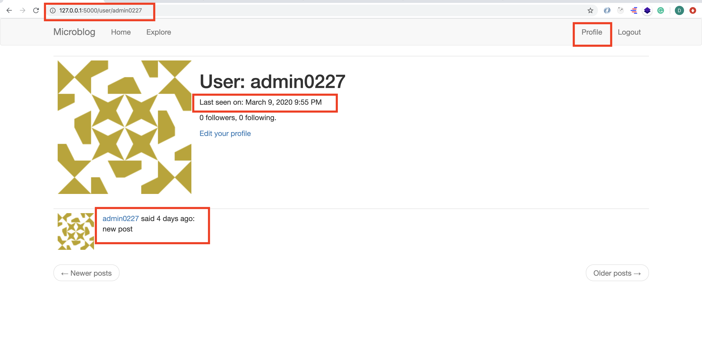
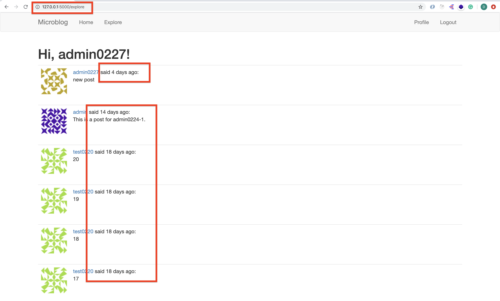

# MICRO-BLOG-DOC (Part 12)

## `Section: Front End`(Dates and Time)

### `Summary`: In this documentation, we add time feature based on users' timezone.(根据用户时区不同显示时间.)

### `Check Dependencies:`

- flask 
- python-dotenv
- flask-wtf
- flask-sqlalchemy
- flask-migrate
- flask-login
- werkzeug.security (built-in)
- datetime (built-in)
- flask-mail
- pyjwt
- flask-bootstrap

```diff
+ flask-moment
```

### 本章提要：
1. 根据用户时区不一样这个现实，如果去安排服务器为每个用户设置时区和时间是效率低的。所以需要一个写入 database 的统一时区时间，然后再根据用户所在的时区进行变形。（在这里使用的是 `UTC`）

2. 接下来下一步就是如何知道用户所在的时区，目前的方案是直接从所在设备获得对应的时区信息。
3. The "new school" approach would be to not change a thing in the server, and let the conversion from UTC to local timezone happen in the client, using JavaScript.
4. 主要转换的方法是使用 moment extension，自动在本地转换显示时区时间。

### `Brief Contents & codes position`

- 12.1 Install new extensions and create an instance to configure the extension. 
    - __`(*12.1)Location: ./app/__init__.py`__

- 12.2 All templates of the application must include Flask-Moment. 
    - __`(*12.2)Location: ./app/templates/base.html`__

- 12.3 Using Moment.js.
    - __`(*12.3)Location: ./app/templates/user.html`__
    - __`(*12.4)Location: ./app/templates/_post.html`__

### `Step1: Install new extensions and create an instance to configure the extension.`

a. __`Install`__
```bash
(venv) $ pip install flask-moment
```
b. __`Create instance right after the flask application is created.`__
#### `(*12.1)Location: ./app/__init__.py`

```py
from flask import Flask
from config import Config
from flask_sqlalchemy import SQLAlchemy
from flask_migrate import Migrate
from flask_login import LoginManager

from flask_mail import Mail

from flask_bootstrap import Bootstrap

from flask_moment import Moment

import logging
from logging.handlers import SMTPHandler
from logging.handlers import RotatingFileHandler
import os

app = Flask(__name__)
app.config.from_object(Config)
db = SQLAlchemy(app)
migrate = Migrate(app, db)
login = LoginManager(app)
login.login_view = 'login'
mail = Mail(app)
bootstrap = Bootstrap(app)
moment = Moment(app)

if not app.debug:
    if app.config['MAIL_SERVER']:
        auth = None
        if app.config['MAIL_USERNAME'] or app.config['MAIL_PASSWORD']:
            auth = (app.config['MAIL_USERNAME'], app.config['MAIL_PASSWORD'])
        secure = None
        if app.config['MAIL_USE_TLS']:
            secure = ()
        mail_handler = SMTPHandler(
            mailhost=(app.config['MAIL_SERVER'], app.config['MAIL_PORT']),
            fromaddr='no-reply@' + app.config['MAIL_SERVER'],
            toaddrs=app.config['ADMINS'], subject='Microblog Failure',
            credentials=auth, secure=secure)
        mail_handler.setLevel(logging.ERROR)
        app.logger.addHandler(mail_handler)

    if not os.path.exists('logs'):
        os.mkdir('logs')
    file_handler = RotatingFileHandler('logs/microblog.log', maxBytes=10240, backupCount=10)
    file_handler.setFormatter(logging.Formatter(
        '%(asctime)s %(levelname)s: %(message)s [in %(pathname)s:%(lineno)d]'))
    file_handler.setLevel(logging.INFO)
    app.logger.addHandler(file_handler)

    app.logger.setLevel(logging.INFO)
    app.logger.info('Microblog startup')

from app import routes, models, errors
```

#### `Comment:`
1. 引进 flask-moment 并 使用：
```py
from flask_moment import Moment

app = Flask(__name__)
# ...
moment = Moment(app)

```


### `Step2: All templates of the application must include Flask-Moment.`

#### `(*12.2)Location: ./app/templates/base.html`

```html



    {{ title }} - MicroblogWelcome to Microblog



    <nav class="navbar navbar-default">
        <div class="container">
            <div class="navbar-header">
                <button type="button" class="navbar-toggle collapsed" data-toggle="collapse" data-target="#bs-example-navbar-collapse-1" aria-expanded="false">
                    <span class="sr-only">Toggle navigation</span>
                    <span class="icon-bar"></span>
                    <span class="icon-bar"></span>
                    <span class="icon-bar"></span>
                </button>
                <a class="navbar-brand" href="{{ url_for('index') }}">Microblog</a>
            </div>
            <div class="collapse navbar-collapse" id="bs-example-navbar-collapse-1">
                <ul class="nav navbar-nav">
                    <li><a href="{{ url_for('index') }}">Home</a></li>
                    <li><a href="{{ url_for('explore') }}">Explore</a></li>
                </ul>
                <ul class="nav navbar-nav navbar-right">
                    
                    <li><a href="{{ url_for('login') }}">Login</a></li>
                    
                    <li><a href="{{ url_for('user', username=current_user.username) }}">Profile</a></li>
                    <li><a href="{{ url_for('logout') }}">Logout</a></li>
                    
                </ul>
            </div>
        </div>
    </nav>



    <div class="container">
        
        
            
            <div class="alert alert-info" role="alert">{{ message }}</div>
            
        
        

        {# application content needs to be provided in the app_content block #}
        
    </div>



    {{ super() }}
    {{ moment.include_moment() }}

```

#### `Comment:`
1. 新增内容
```html

    {{ super() }}
    {{ moment.include_moment() }}

```

2. The scripts block that I added here is another block exported by Flask-Bootstrap's base template. This is the place where JavaScript imports are to be included. This block is different from previous ones in that it already comes with some content defined in the base template. All I want to do is add the moment.js library, without losing the base contents. And this is achieved with the super() statement, which preserves the content from the base template. If you define a block in your template without using super(), then any content defined for this block in the base template will be lost.


### `Step3. Using Moment.js.`

#### `(*12.3)Location: ./app/templates/user.html`

```html



    <table class="table table-hover">
        <tr>
            <td width="256px"></td>
            <td>
                <h1>User: {{ user.username }}</h1>
                <p>{{ user.about_me }}</p>
                
                    <p>Last seen on: {{ moment(user.last_seen).format('LLL') }}</p>
                
                <p>{{ user.followers.count() }} followers, {{ user.followed.count() }} following.</p>
                
                <p><a href="{{ url_for('edit_profile') }}">Edit your profile</a></p>
                
                <p><a href="{{ url_for('follow', username=user.username) }}">Follow</a></p>
                
                <p><a href="{{ url_for('unfollow', username=user.username) }}">Unfollow</a></p>
                
            </td>
        </tr>
    </table>
    
        
    
    <nav aria-label="...">
        <ul class="pager">
            <li class="previous disabled">
                <a href="{{ prev_url or '#' }}">
                    <span aria-hidden="true">&larr;</span> Newer posts
                </a>
            </li>
            <li class="next disabled">
                <a href="{{ next_url or '#' }}">
                    Older posts <span aria-hidden="true">&rarr;</span>
                </a>
            </li>
        </ul>
    </nav>

```

#### `Comment:`
1. 修改内容：

```html
    
        <p>Last seen on: {{ moment(user.last_seen).format('LLL') }}</p>
    
```

#### `(*12.4)Location: ./app/templates/_post.html`

```html
<table class="table table-hover">
    <tr>
        <td width="70px">
            <a href="{{ url_for('user', username=post.author.username) }}">
                
            </a>
        </td>
        <td>
            <a href="{{ url_for('user', username=post.author.username) }}">
                {{ post.author.username }}
            </a>
            said {{ moment(post.timestamp).fromNow() }}:
            <br>
            {{ post.body }}
        </td>
    </tr>
</table>
```

#### `Comment:`
1. 修改内容：

```html
    <a href="{{ url_for('user', username=post.author.username) }}">
        {{ post.author.username }}
    </a>
    said {{ moment(post.timestamp).fromNow() }}:
    <br>
    {{ post.body }}
```


### `Step4 Concept questions.`

#### `A. Something about Moment.js`

1. Moment.js makes a moment class available to the browser. The first step to render a timestamp is to create an object of this class, passing the desired timestamp in ISO 8601 format. 

2. If you are not familiar with the ISO 8601 standard format for dates and times, the format is as follows: {{ year }}-{{ month }}-{{ day }}T{{ hour }}:{{ minute }}:{{ second }}{{ timezone }}. I already decided that I was only going to work with UTC timezones, so the last part is always going to be Z, which represents UTC in the ISO 8601 standard.

3. So as you can see, Flask-Moment uses a syntax that is similar to that of the JavaScript library, with one difference being that the argument to moment() is now a Python datetime object and not an ISO 8601 string. The moment() call issued from a template also automatically generates the required JavaScript code to insert the rendered timestamp in the proper place of the DOM.

4. moment自适应时区例子

```py
moment('2017-09-28T21:45:23Z').format('L')
"09/28/2017"
moment('2017-09-28T21:45:23Z').format('LL')
"September 28, 2017"
moment('2017-09-28T21:45:23Z').format('LLL')
"September 28, 2017 2:45 PM"
moment('2017-09-28T21:45:23Z').format('LLLL')
"Thursday, September 28, 2017 2:45 PM"
moment('2017-09-28T21:45:23Z').format('dddd')
"Thursday"
moment('2017-09-28T21:45:23Z').fromNow()
"7 hours ago"
moment('2017-09-28T21:45:23Z').calendar()
"Today at 2:45 PM"
```

- This example creates a moment object initialized to September 28th 2017 at 9:45pm UTC. You can see that all the options I tried above are rendered in UTC-7, __`which is the timezone configured on my computer`__. You can enter the above commands in your browser's console, making sure the page on which you open the console has moment.js included.

### `Step5 TEST.`

```bash
(venv) $ flask run
```

1. explore page
<p align="center">

</p>

2. profile page
<p align="center">

</p>


