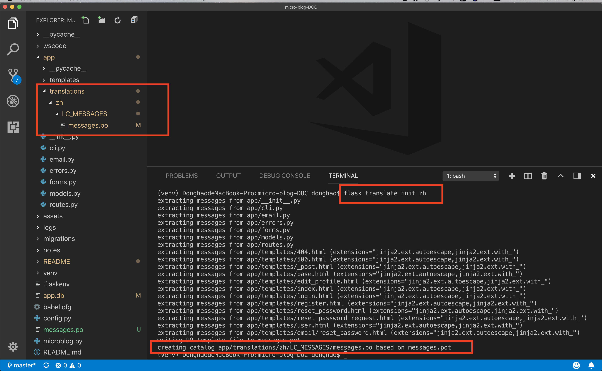
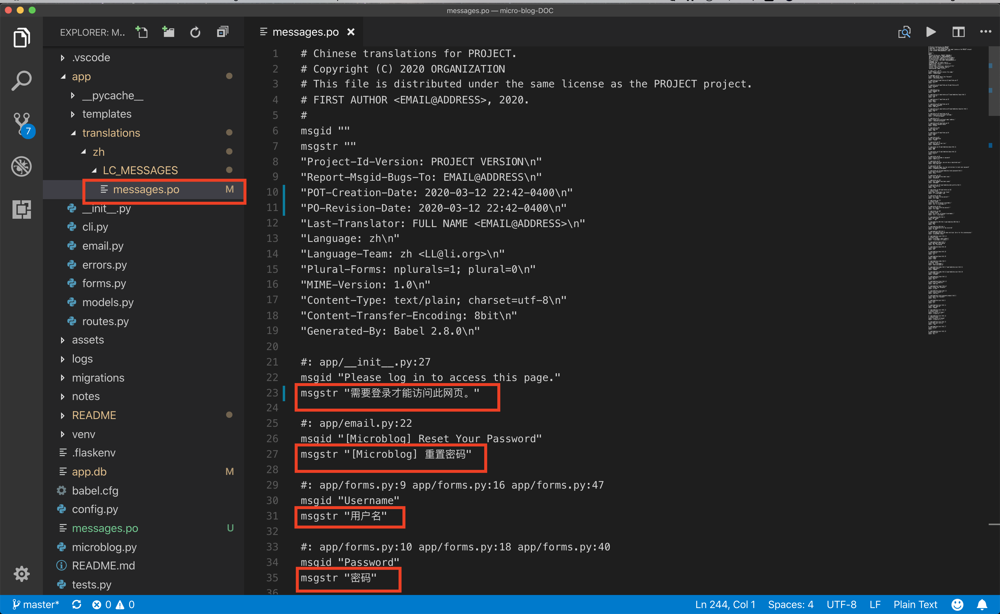
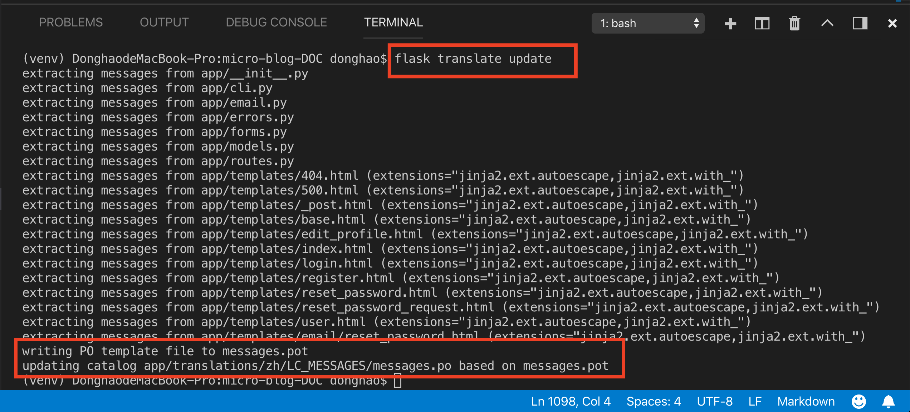
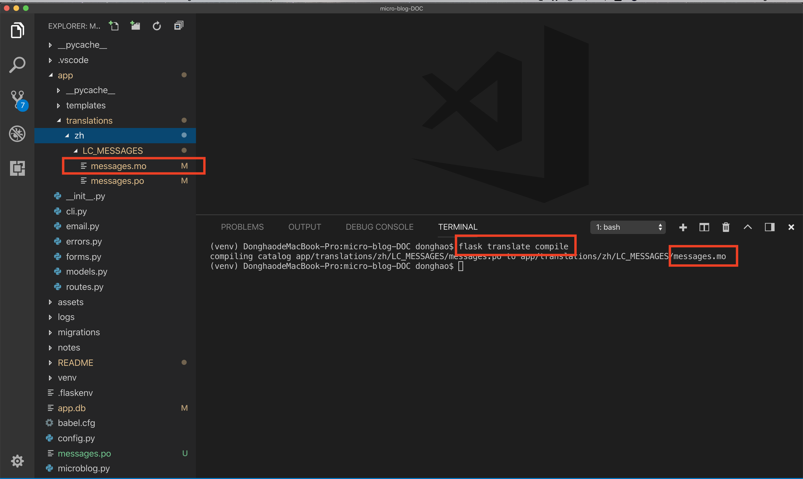
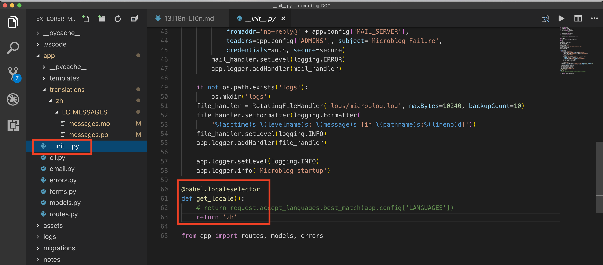
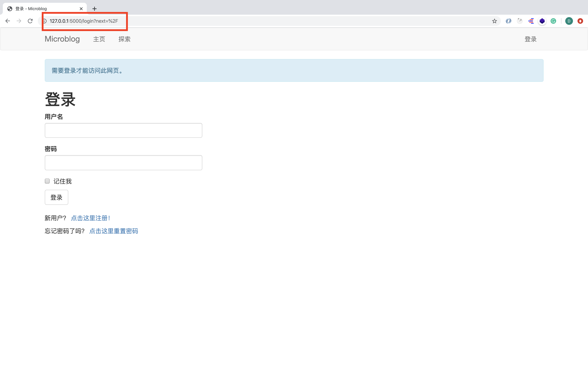

# MICRO-BLOG-DOC (Part 13)

## `Section: Front End`(Internationalization and Localization)

### `Summary`: In this documentation, we implement a translation workflow. (为不同语言的用户定制语言。)

### `Check Dependencies:`

- flask 
- python-dotenv
- flask-wtf
- flask-sqlalchemy
- flask-migrate
- flask-login
- werkzeug.security (built-in)
- datetime (built-in)
- flask-mail
- pyjwt
- flask-bootstrap
- flask-moment

```diff
+ flask-babel
```

### 本章提要：
1. 本章对应用程序进行多语言版本化的设计思路：

- 针对需要改变的文本文件部分进行标记
- 将标记部分转化成一个文档 (.pot file)
- 将 .pot 文件转化成 .po file，并对 .po file 进行本地语言翻译  `(.pot file => .po file)`
- 通过 bash 命令对 .po file 转化成 .mo file `(.po file => .mo file)`

2. 需要标记的几个代码部分：
- flash 类型信息
- 有动态信息的 flash 语句
- 表格相关的 label (lazy processing)）
- flask-login 自带的信息
- templates 信息
- Dates & Times

3. 本章最后定制了几个新的flask简捷命令：

```bash
# To add a new language
(venv) $ flask translate init <language-code>
# To update all the languages after making changes to the _() and _l() language markers
(venv) $ flask translate update
# To compile all languages after updating the translation files
(venv) $ flask translate compile
```


### `Brief Contents & codes position`

- 13.1 Install new extensions and create an instance to configure the extension. 
    - __`(*13.1)Location: ./app/__init__.py`__
    - __`(*13.2)Location: ./config.py`__

- 13.2 Marking Texts to Translate In Python Source Code.
    - __`(*13.3)Location: ./app/email.py`__
    - __`(*13.4)Location: ./app/forms.py`__
    - __`(*13.5)Location: ./app/routes.py`__


- 13.3 Marking Texts to Translate In Templates.
    - __`(*13.6)Location: ./app/templates/404.html`__
    - __`(*13.7)Location: ./app/templates/500.html`__
    - __`(*13.8)Location: ./app/templates/_post.html`__
    - __`(*13.9)Location: ./app/templates/base.html`__
    - __`(*13.10)Location: ./app/templates/edit_profile.html`__
    - __`(*13.11)Location: ./app/templates/index.html`__
    - __`(*13.12)Location: ./app/templates/login.html`__
    - __`(*13.13)Location: ./app/templates/register.html`__
    - __`(*13.14)Location: ./app/templates/reset_password.html`__
    - __`(*13.15)Location: ./app/templates/reset_password_request.html`__
    - __`(*13.16)Location: ./app/templates/user.html`__

- 13.4 Extracting Text to Translate & compile.
    - __`(*13.17)Location: ./babel.cfg`__

- 13.5 Commands about updating the Translations.

- 13.6 Translating Dates and Times.
    - __`(*13.5)Location: ./app/routes.py`__
    - __`(*13.9)Location: ./app/templates/base.html`__

- 13.7 Command-Line Enhancements.
    - __`(*13.18)Location: ./app/cli.py`__
    - __`(*13.19)Location: ./microblog.py`__

### `Step1: Install new extensions and create an instance to configure the extension.`

a. __`Install`__
```bash
(venv) $ pip install flask-babel
```
b. __`Create instance right after the flask application is created.`__
#### `(*13.1)Location: ./app/__init__.py`

```py
from flask import Flask
from config import Config
from flask_sqlalchemy import SQLAlchemy
from flask_migrate import Migrate
from flask_login import LoginManager

from flask_mail import Mail

from flask_bootstrap import Bootstrap

from flask_moment import Moment

from flask_babel import Babel, lazy_gettext as _l
from flask import request

import logging
from logging.handlers import SMTPHandler
from logging.handlers import RotatingFileHandler
import os

app = Flask(__name__)
app.config.from_object(Config)
db = SQLAlchemy(app)
migrate = Migrate(app, db)
login = LoginManager(app)
login.login_view = 'login'
login.login_message = _l('Please log in to access this page.')
mail = Mail(app)
bootstrap = Bootstrap(app)
moment = Moment(app)
babel = Babel(app)

if not app.debug:
    if app.config['MAIL_SERVER']:
        auth = None
        if app.config['MAIL_USERNAME'] or app.config['MAIL_PASSWORD']:
            auth = (app.config['MAIL_USERNAME'], app.config['MAIL_PASSWORD'])
        secure = None
        if app.config['MAIL_USE_TLS']:
            secure = ()
        mail_handler = SMTPHandler(
            mailhost=(app.config['MAIL_SERVER'], app.config['MAIL_PORT']),
            fromaddr='no-reply@' + app.config['MAIL_SERVER'],
            toaddrs=app.config['ADMINS'], subject='Microblog Failure',
            credentials=auth, secure=secure)
        mail_handler.setLevel(logging.ERROR)
        app.logger.addHandler(mail_handler)

    if not os.path.exists('logs'):
        os.mkdir('logs')
    file_handler = RotatingFileHandler('logs/microblog.log', maxBytes=10240, backupCount=10)
    file_handler.setFormatter(logging.Formatter(
        '%(asctime)s %(levelname)s: %(message)s [in %(pathname)s:%(lineno)d]'))
    file_handler.setLevel(logging.INFO)
    app.logger.addHandler(file_handler)

    app.logger.setLevel(logging.INFO)
    app.logger.info('Microblog startup')

@babel.localeselector
def get_locale():
    return request.accept_languages.best_match(app.config['LANGUAGES'])

from app import routes, models, errors
```

#### `Comment:`
1. 新增部分：
```py
from flask_babel import Babel, lazy_gettext as _l
from flask import request

login.login_message = _l('Please log in to access this page.') # 修改 extension 自带信息
babel = Babel(app)

@babel.localeselector
def get_locale():
    return request.accept_languages.best_match(app.config['LANGUAGES'])
```

#### `Comment:`
1. Here I'm using an attribute of Flask's request object called accept_languages. This object provides a high-level interface to work with the Accept-Language header that clients send with a request. This header specifies the client language and locale preferences as a weighted list. The contents of this header can be configured in the browser's preferences page, with the default being usually imported from the language settings in the computer's operating system. (设定语言备选列表)

c. __`Add a configuration variable`__
#### `(*13.2)Location: ./config.py`

```py
import os
basedir = os.path.abspath(os.path.dirname(__file__))

class Config(object):
    SECRET_KEY = os.environ.get('SECRET_KEY') or 'you-will-never-guess'
    SQLALCHEMY_DATABASE_URI = os.environ.get('DATABASE_URL') or \
        'sqlite:///' + os.path.join(basedir, 'app.db')
    SQLALCHEMY_TRACK_MODIFICATIONS = False

    MAIL_SERVER = os.environ.get('MAIL_SERVER')
    MAIL_PORT = int(os.environ.get('MAIL_PORT') or 25)
    MAIL_USE_TLS = os.environ.get('MAIL_USE_TLS') is not None
    MAIL_USERNAME = os.environ.get('MAIL_USERNAME')
    MAIL_PASSWORD = os.environ.get('MAIL_PASSWORD')
    ADMINS = ['your-email@example.com']

    POSTS_PER_PAGE = 10
    LANGUAGES = ['en', 'es']
```


### `Step2: Marking Texts to Translate In Python Source Code.`

#### `(*13.3)Location: ./app/email.py`

```py
from threading import Thread
from flask import render_template
from flask_mail import Message
from flask_babel import _
from app import app, mail


def send_async_email(app, msg):
    with app.app_context():
        mail.send(msg)


def send_email(subject, sender, recipients, text_body, html_body):
    msg = Message(subject, sender=sender, recipients=recipients)
    msg.body = text_body
    msg.html = html_body
    Thread(target=send_async_email, args=(app, msg)).start()


def send_password_reset_email(user):
    token = user.get_reset_password_token()
    send_email(_('[Microblog] Reset Your Password'),
               sender=app.config['ADMINS'][0],
               recipients=[user.email],
               text_body=render_template('email/reset_password.txt',
                                         user=user, token=token),
               html_body=render_template('email/reset_password.html',
                                         user=user, token=token))
```

#### `Comment:`
1. 新增内容

```py
from flask_babel import _
# ...
```

#### `(*13.4)Location: ./app/forms.py`

```py
from flask_wtf import FlaskForm
from wtforms import StringField, PasswordField, BooleanField, SubmitField, TextAreaField
from wtforms.validators import ValidationError, DataRequired, Email, EqualTo, Length
from flask_babel import _, lazy_gettext as _l
from app.models import User


class LoginForm(FlaskForm):
    username = StringField(_l('Username'), validators=[DataRequired()])
    password = PasswordField(_l('Password'), validators=[DataRequired()])
    remember_me = BooleanField(_l('Remember Me'))
    submit = SubmitField(_l('Sign In'))


class RegistrationForm(FlaskForm):
    username = StringField(_l('Username'), validators=[DataRequired()])
    email = StringField(_l('Email'), validators=[DataRequired(), Email()])
    password = PasswordField(_l('Password'), validators=[DataRequired()])
    password2 = PasswordField(
        _l('Repeat Password'), validators=[DataRequired(), EqualTo('password')])
    submit = SubmitField(_l('Register'))

    def validate_username(self, username):
        user = User.query.filter_by(username=username.data).first()
        if user is not None:
            raise ValidationError(_('Please use a different username.'))

    def validate_email(self, email):
        user = User.query.filter_by(email=email.data).first()
        if user is not None:
            raise ValidationError(_('Please use a different email address.'))


class ResetPasswordRequestForm(FlaskForm):
    email = StringField(_l('Email'), validators=[DataRequired(), Email()])
    submit = SubmitField(_l('Request Password Reset'))


class ResetPasswordForm(FlaskForm):
    password = PasswordField(_l('Password'), validators=[DataRequired()])
    password2 = PasswordField(
        _l('Repeat Password'), validators=[DataRequired(), EqualTo('password')])
    submit = SubmitField(_l('Request Password Reset'))


class EditProfileForm(FlaskForm):
    username = StringField(_l('Username'), validators=[DataRequired()])
    about_me = TextAreaField(_l('About me'), validators=[Length(min=0, max=140)])
    submit = SubmitField(_l('Submit'))

    def __init__(self, original_username, *args, **kwargs):
        super(EditProfileForm, self).__init__(*args, **kwargs)
        self.original_username = original_username

    def validate_username(self, username):
        if username.data != self.original_username:
            user = User.query.filter_by(username=self.username.data).first()
            if user is not None:
                raise ValidationError(_('Please use a different username.'))


class PostForm(FlaskForm):
    post = TextAreaField(_l('Say something'), validators=[DataRequired()])
    submit = SubmitField(_l('Submit'))
```

#### `Comment:`
1. 新增内容
```py
from flask_babel import _, lazy_gettext as _l
# ...
```

#### `(*13.5)Location: ./app/routes.py`

```py
from datetime import datetime
from flask import render_template, flash, redirect, url_for, request, g
from flask_login import login_user, logout_user, current_user, login_required
from werkzeug.urls import url_parse
from flask_babel import _, get_locale
from app import app, db
from app.forms import LoginForm, RegistrationForm, EditProfileForm, PostForm, ResetPasswordRequestForm, ResetPasswordForm
from app.models import User, Post
from app.email import send_password_reset_email


@app.before_request
def before_request():
    if current_user.is_authenticated:
        current_user.last_seen = datetime.utcnow()
        db.session.commit()
    g.locale = str(get_locale())


@app.route('/', methods=['GET', 'POST'])
@app.route('/index', methods=['GET', 'POST'])
@login_required
def index():
    form = PostForm()
    if form.validate_on_submit():
        post = Post(body=form.post.data, author=current_user)
        db.session.add(post)
        db.session.commit()
        flash(_('Your post is now live!'))
        return redirect(url_for('index'))
    page = request.args.get('page', 1, type=int)
    posts = current_user.followed_posts().paginate(
        page, app.config['POSTS_PER_PAGE'], False)
    next_url = url_for('index', page=posts.next_num) \
        if posts.has_next else None
    prev_url = url_for('index', page=posts.prev_num) \
        if posts.has_prev else None
    return render_template('index.html', title=_('Home'), form=form,
                           posts=posts.items, next_url=next_url,
                           prev_url=prev_url)


@app.route('/explore')
@login_required
def explore():
    page = request.args.get('page', 1, type=int)
    posts = Post.query.order_by(Post.timestamp.desc()).paginate(
        page, app.config['POSTS_PER_PAGE'], False)
    next_url = url_for('explore', page=posts.next_num) \
        if posts.has_next else None
    prev_url = url_for('explore', page=posts.prev_num) \
        if posts.has_prev else None
    return render_template('index.html', title=_('Explore'),
                           posts=posts.items, next_url=next_url,
                           prev_url=prev_url)


@app.route('/login', methods=['GET', 'POST'])
def login():
    if current_user.is_authenticated:
        return redirect(url_for('index'))
    form = LoginForm()
    if form.validate_on_submit():
        user = User.query.filter_by(username=form.username.data).first()
        if user is None or not user.check_password(form.password.data):
            flash(_('Invalid username or password'))
            return redirect(url_for('login'))
        login_user(user, remember=form.remember_me.data)
        next_page = request.args.get('next')
        if not next_page or url_parse(next_page).netloc != '':
            next_page = url_for('index')
        return redirect(next_page)
    return render_template('login.html', title=_('Sign In'), form=form)


@app.route('/logout')
def logout():
    logout_user()
    return redirect(url_for('index'))


@app.route('/register', methods=['GET', 'POST'])
def register():
    if current_user.is_authenticated:
        return redirect(url_for('index'))
    form = RegistrationForm()
    if form.validate_on_submit():
        user = User(username=form.username.data, email=form.email.data)
        user.set_password(form.password.data)
        db.session.add(user)
        db.session.commit()
        flash(_('Congratulations, you are now a registered user!'))
        return redirect(url_for('login'))
    return render_template('register.html', title=_('Register'), form=form)


@app.route('/reset_password_request', methods=['GET', 'POST'])
def reset_password_request():
    if current_user.is_authenticated:
        return redirect(url_for('index'))
    form = ResetPasswordRequestForm()
    if form.validate_on_submit():
        user = User.query.filter_by(email=form.email.data).first()
        if user:
            send_password_reset_email(user)
        flash(
            _('Check your email for the instructions to reset your password'))
        return redirect(url_for('login'))
    return render_template('reset_password_request.html',
                           title=_('Reset Password'), form=form)


@app.route('/reset_password/<token>', methods=['GET', 'POST'])
def reset_password(token):
    if current_user.is_authenticated:
        return redirect(url_for('index'))
    user = User.verify_reset_password_token(token)
    if not user:
        return redirect(url_for('index'))
    form = ResetPasswordForm()
    if form.validate_on_submit():
        user.set_password(form.password.data)
        db.session.commit()
        flash(_('Your password has been reset.'))
        return redirect(url_for('login'))
    return render_template('reset_password.html', form=form)


@app.route('/user/<username>')
@login_required
def user(username):
    user = User.query.filter_by(username=username).first_or_404()
    page = request.args.get('page', 1, type=int)
    posts = user.posts.order_by(Post.timestamp.desc()).paginate(
        page, app.config['POSTS_PER_PAGE'], False)
    next_url = url_for('user', username=user.username, page=posts.next_num) \
        if posts.has_next else None
    prev_url = url_for('user', username=user.username, page=posts.prev_num) \
        if posts.has_prev else None
    return render_template('user.html', user=user, posts=posts.items,
                           next_url=next_url, prev_url=prev_url)


@app.route('/edit_profile', methods=['GET', 'POST'])
@login_required
def edit_profile():
    form = EditProfileForm(current_user.username)
    if form.validate_on_submit():
        current_user.username = form.username.data
        current_user.about_me = form.about_me.data
        db.session.commit()
        flash(_('Your changes have been saved.'))
        return redirect(url_for('edit_profile'))
    elif request.method == 'GET':
        form.username.data = current_user.username
        form.about_me.data = current_user.about_me
    return render_template('edit_profile.html', title=_('Edit Profile'),
                           form=form)


@app.route('/follow/<username>')
@login_required
def follow(username):
    user = User.query.filter_by(username=username).first()
    if user is None:
        flash(_('User %(username)s not found.', username=username))
        return redirect(url_for('index'))
    if user == current_user:
        flash(_('You cannot follow yourself!'))
        return redirect(url_for('user', username=username))
    current_user.follow(user)
    db.session.commit()
    flash(_('You are following %(username)s!', username=username))
    return redirect(url_for('user', username=username))


@app.route('/unfollow/<username>')
@login_required
def unfollow(username):
    user = User.query.filter_by(username=username).first()
    if user is None:
        flash(_('User %(username)s not found.', username=username))
        return redirect(url_for('index'))
    if user == current_user:
        flash(_('You cannot unfollow yourself!'))
        return redirect(url_for('user', username=username))
    current_user.unfollow(user)
    db.session.commit()
    flash(_('You are not following %(username)s.', username=username))
    return redirect(url_for('user', username=username))
```

#### `Comment:`
1. 新增内容
```py
from flask import g
from flask_babel import _, get_locale
# ...
@app.before_request
def before_request():
    if current_user.is_authenticated:
        current_user.last_seen = datetime.utcnow()
        db.session.commit()
    g.locale = str(get_locale())
```

2. 特殊修改(动态 flash 信息)
```diff
- flash('User {} not found.'.format(username))
+ flash(_('User %(username)s not found.', username=username))
```

### `Step3. Marking Texts to Translate In Templates.`

#### `(*13.6)Location: ./app/templates/404.html`

```html



    <h1>{{ _('Not Found') }}</h1>
    <p><a href="{{ url_for('index') }}">{{ _('Back') }}</a></p>

```

#### `Comment:`
1. 修改内容：
```html

```

#### `(*13.7)Location: ./app/templates/500.html`

```html



    <h1>{{ _('An unexpected error has occurred') }}</h1>
    <p>{{ _('The administrator has been notified. Sorry for the inconvenience!') }}</p>
    <p><a href="{{ url_for('index') }}">{{ _('Back') }}</a></p>

```

#### `Comment:`
1. 修改内容：

```html

```

#### `(*13.8)Location: ./app/templates/_post.html`

```html
   <table class="table table-hover">
        <tr>
            <td width="70px">
                <a href="{{ url_for('user', username=post.author.username) }}">
                    
                </a>
            </td>
            <td>
                
                    <a href="{{ url_for('user', username=post.author.username) }}">
                        {{ post.author.username }}
                    </a>
                
                {{ _('%(username)s said %(when)s',
                    username=user_link, when=moment(post.timestamp).fromNow()) }}
                <br>
                {{ post.body }}
            </td>
        </tr>
    </table>
```

#### `Comment:`
1. 修改内容：
```html
    
        <a href="{{ url_for('user', username=post.author.username) }}">
            {{ post.author.username }}
        </a>
    
```

2. The problem here is that I wanted the username to be a link that points to the profile page of the user, not just the name, so I had to create an intermediate variable called user_link using the set and endset template directives, and then pass that as an argument to the translation function.

#### `(*13.9)Location: ./app/templates/base.html`

```html



    {{ title }} - Microblog{{ _('Welcome to Microblog') }}



    <nav class="navbar navbar-default">
        <div class="container">
            <div class="navbar-header">
                <button type="button" class="navbar-toggle collapsed" data-toggle="collapse" data-target="#bs-example-navbar-collapse-1" aria-expanded="false">
                    <span class="sr-only">Toggle navigation</span>
                    <span class="icon-bar"></span>
                    <span class="icon-bar"></span>
                    <span class="icon-bar"></span>
                </button>
                <a class="navbar-brand" href="{{ url_for('index') }}">Microblog</a>
            </div>
            <div class="collapse navbar-collapse" id="bs-example-navbar-collapse-1">
                <ul class="nav navbar-nav">
                    <li><a href="{{ url_for('index') }}">{{ _('Home') }}</a></li>
                    <li><a href="{{ url_for('explore') }}">{{ _('Explore') }}</a></li>
                </ul>
                <ul class="nav navbar-nav navbar-right">
                    
                    <li><a href="{{ url_for('login') }}">{{ _('Login') }}</a></li>
                    
                    <li><a href="{{ url_for('user', username=current_user.username) }}">{{ _('Profile') }}</a></li>
                    <li><a href="{{ url_for('logout') }}">{{ _('Logout') }}</a></li>
                    
                </ul>
            </div>
        </div>
    </nav>



    <div class="container">
        
        
            
            <div class="alert alert-info" role="alert">{{ message }}</div>
            
        
        

        {# application content needs to be provided in the app_content block #}
        
    </div>



    {{ super() }}
    {{ moment.include_moment() }}
    {{ moment.lang(g.locale) }}

```

#### `Comment:`
1. 特殊修改（时间）：
```html

    {{ super() }}
    {{ moment.include_moment() }}
    {{ moment.lang(g.locale) }}

```

#### `(*13.10)Location: ./app/templates/edit_profile.html`

```html




    <h1>{{ _('Edit Profile') }}</h1>
    <div class="row">
        <div class="col-md-4">
            {{ wtf.quick_form(form) }}
        </div>
    </div>

```

#### `Comment:`
1. 修改内容：
```html

```

#### `(*13.11)Location: ./app/templates/index.html`

```html




    <h1>{{ _('Hi, %(username)s!', username=current_user.username) }}</h1>
    
    {{ wtf.quick_form(form) }}
    <br>
    
    
        
    
    <nav aria-label="...">
        <ul class="pager">
            <li class="previous disabled">
                <a href="{{ prev_url or '#' }}">
                    <span aria-hidden="true">&larr;</span> {{ _('Newer posts') }}
                </a>
            </li>
            <li class="next disabled">
                <a href="{{ next_url or '#' }}">
                    {{ _('Older posts') }} <span aria-hidden="true">&rarr;</span>
                </a>
            </li>
        </ul>
    </nav>

```

#### `Comment:`
1. 修改内容：
```html

```

#### `(*13.12)Location: ./app/templates/login.html`

```html




    <h1>{{ _('Sign In') }}</h1>
    <div class="row">
        <div class="col-md-4">
            {{ wtf.quick_form(form) }}
        </div>
    </div>
    <br>
    <p>{{ _('New User?') }} <a href="{{ url_for('register') }}">{{ _('Click to Register!') }}</a></p>
    <p>
        {{ _('Forgot Your Password?') }}
        <a href="{{ url_for('reset_password_request') }}">{{ _('Click to Reset It') }}</a>
    </p>

```

#### `Comment:`
1. 修改内容：
```html

```

#### `(*13.13)Location: ./app/templates/register.html`

```html




    <h1>{{ _('Register') }}</h1>
    <div class="row">
        <div class="col-md-4">
            {{ wtf.quick_form(form) }}
        </div>
    </div>

```

#### `Comment:`
1. 修改内容：
```html

```

#### `(*13.14)Location: ./app/templates/reset_password.html`

```html




    <h1>{{ _('Reset Your Password') }}</h1>
    <div class="row">
        <div class="col-md-4">
            {{ wtf.quick_form(form) }}
        </div>
    </div>

```

#### `Comment:`
1. 修改内容：
```html

```

#### `(*13.15)Location: ./app/templates/reset_password_request.html`

```html




    <h1>{{ _('Reset Password') }}</h1>
    <div class="row">
        <div class="col-md-4">
            {{ wtf.quick_form(form) }}
        </div>
    </div>

```

#### `Comment:`
1. 修改内容：
```html

```

#### `(*13.16)Location: ./app/templates/user.html`

```html



    <table class="table table-hover">
        <tr>
            <td width="256px"></td>
            <td>
                <h1>{{ _('User') }}: {{ user.username }}</h1>
                <p>{{ user.about_me }}</p>
                
                <p>{{ _('Last seen on') }}: {{ moment(user.last_seen).format('LLL') }}</p>
                
                <p>{{ _('%(count)d followers', count=user.followers.count()) }}, {{ _('%(count)d following', count=user.followed.count()) }}</p>
                
                <p><a href="{{ url_for('edit_profile') }}">{{ _('Edit your profile') }}</a></p>
                
                <p><a href="{{ url_for('follow', username=user.username) }}">{{ _('Follow') }}</a></p>
                
                <p><a href="{{ url_for('unfollow', username=user.username) }}">{{ _('Unfollow') }}</a></p>
                
            </td>
        </tr>
    </table>
    
        
    
    <nav aria-label="...">
        <ul class="pager">
            <li class="previous disabled">
                <a href="{{ prev_url or '#' }}">
                    <span aria-hidden="true">&larr;</span> {{ _('Newer posts') }}
                </a>
            </li>
            <li class="next disabled">
                <a href="{{ next_url or '#' }}">
                    {{ _('Older posts') }} <span aria-hidden="true">&rarr;</span>
                </a>
            </li>
        </ul>
    </nav>

```

#### `Comment:`
1. 修改内容：
```html

```

### `Step4 Extracting Text to Translate & compile.`

- __`A. (*13.17)Location: ./babel.cfg`__

```py
[python: app/**.py]
[jinja2: app/templates/**.html]
extensions=jinja2.ext.autoescape,jinja2.ext.with_
```

- __`B. 运行 bash 命令, 生成 .pot 文件:`__

```bash
(venv) $ pybabel extract -F babel.cfg -k _l -o messages.pot .
```

#### `Comment:`
1. The pybabel extract command reads the configuration file given in the -F option, then scans all the code and template files in the directories that match the configured sources, starting from the directory given in the command (the current directory or . in this case). By default, pybabel will look for _() as a text marker, but I have also used the lazy version, which I imported as _l(), so I need to tell the tool to look for those too with the -k _l. The -o option provides the name of the output file.

- __`C. 运行 bash 命令, 为指定语言生成文件夹和 .po 文件`__

```bash
(venv) $ pybabel init -i messages.pot -d app/translations -l es
# creating catalog app/translations/es/LC_MESSAGES/messages.po based on messages.pot
```

- ##### `添加中文：`
```bash
(venv) $ pybabel init -i messages.pot -d app/translations -l zh
# creating catalog app/translations/zh/SM_MESSAGES/messages.po based on messages.pot
```

#### `Comment:`
1. The pybabel init command takes the messages.po file as input and writes a new language catalog to the directory given in the -d option for the language specified in the -l option. I'm going to be installing all the translations in the app/translations directory, because that is where Flask-Babel will expect translation files to be by default. The command will create a es subdirectory inside this directory for the Spanish data files.

2. In particular, there will be a new file named `app/translations/es/LC_MESSAGES/messages.po`, that is where the translations need to be made.

3. 这一步就是生成了对应语言的 `po` 文件。

4. 可以使用 editor 对一些 `po` 文件进行修改编辑。 
- There are many translation applications that work with .po files. If you feel comfortable editing the text file, then that's sufficient, but if you are working with a large project it may be recommended to work with a specialized editor. The most popular translation application is the open-source poedit, which is available for all major operating systems. If you are familiar with vim, then the po.vim plugin gives some key mappings that make working with these files easier.

- __`D. 运行 bash 命令，生成 .mo 文件`__

```bash
(venv) $ pybabel compile -d app/translations
compiling catalog app/translations/es/LC_MESSAGES/messages.po to
app/translations/es/LC_MESSAGES/messages.mo
```

#### `Comment:`
1. The messages.po file is a sort of source file for translations. When you want to start using these translated texts, this file needs to be compiled into a format that is efficient to be used by the application at run-time.

2. This operation adds a messages.mo file next to messages.po in each language repository. The .mo file is the file that Flask-Babel will use to load translations for the application.

3. After you create the messages.mo file for Spanish or any other languages you added to the project, these languages are ready to be used in the application. If you want to see how the application looks in Spanish, you can edit the language configuration in your web browser to have Spanish as the preferred language. 

4. 指定默认的语言。If you prefer not to change your browser settings, the other alternative is to force a language by making the localeselector function always return it. For Spanish, this would be how you would do it:

- __`Location: ./__init__.py`__
```py
@babel.localeselector
def get_locale():
    # return request.accept_languages.best_match(app.config['LANGUAGES'])
    return 'zh'
```

### `Step5 Updating the Translations.`

```bash
(venv) $ pybabel extract -F babel.cfg -k _l -o messages.pot .
(venv) $ pybabel update -i messages.pot -d app/translations
```

#### `Comment:`
1. `第一条命令跟 step4 的 B 命令一样。`
2. The extract command is identical to the one I issued earlier, but now it will generate a new version of messages.pot with all the previous texts plus anything new that you recently wrapped with _() or _l(). The update call takes the new messages.pot file and merges it into all the messages.po files associated with the project. This is going to be an intelligent merge, in which any existing texts will be left alone, while only entries that were added or removed in messages.pot will be affected.

3. After the messages.po are updated, you can go ahead and translate any new tests, then compile the messages one more time to make them available to the application.


### `Step6 Translating Dates and Times.`

- __`(*13.5)Location: ./app/routes.py`__
- __`(*13.9)Location: ./app/templates/base.html`__

#### `Comment:`
1. The moment.js library does support localization and internationalization, so all I need to do is configure the proper language. Flask-Babel returns the selected language and locale for a given request via the get_locale() function, so what I'm going to do is add the locale to the g object, so that I can then access it from the base template.

2. The get_locale() function from Flask-Babel returns a locale object, but I just want to have the language code, which can be obtained by converting the object to a string. Now that I have g.locale, I can access it from the base template to configure moment.js with the correct language.

3. And now all dates and times should appear in the same language as the text.


### `Step7 Command-Line Enhancements. (简化操作命令)`

- __`A.(*13.18)Location: ./app/cli.py`__

```py
import os
import click
from app import app


@app.cli.group()
def translate():
    """Translation and localization commands."""
    pass


@translate.command()
@click.argument('lang')
def init(lang):
    """Initialize a new language."""
    if os.system('pybabel extract -F babel.cfg -k _l -o messages.pot .'):
        raise RuntimeError('extract command failed')
    if os.system(
            'pybabel init -i messages.pot -d app/translations -l ' + lang):
        raise RuntimeError('init command failed')
    os.remove('messages.pot')


@translate.command()
def update():
    """Update all languages."""
    if os.system('pybabel extract -F babel.cfg -k _l -o messages.pot .'):
        raise RuntimeError('extract command failed')
    if os.system('pybabel update -i messages.pot -d app/translations'):
        raise RuntimeError('update command failed')
    os.remove('messages.pot')


@translate.command()
def compile():
    """Compile all languages."""
    if os.system('pybabel compile -d app/translations'):
        raise RuntimeError('compile command failed')
```

#### `Comment:`
1.  It is actually easy to add application-specific commands to flask as well. So what I'm going to do now is create a few simple commands that trigger the pybabel commands with all the arguments that are specific to this application. 


- __`B.(*13.19)Location: ./microblog.py`__

```py
from app import app, db, cli
from app.models import User, Post


@app.shell_context_processor
def make_shell_context():
    return {'db': db, 'User': User, 'Post': Post}
```

#### `Comment:`
1. The final step to enable these commands to work is to import them, so that the commands get registered. I decided to do this in the microblog.py file in the top-level directory.

2. 完成这些步骤之后，可以使用一下简化版命令：

```bash
(venv) $ flask translate init <language-code>
(venv) $ flask translate update
(venv) $ flask translate compile
```

### `Step8 Concept questions.`

#### `A. Something about '_()'`

1. The idea is that the _() function wraps the text in the base language (English in this case). This function will use the best language selected by the function decorated with the localeselector function to find the correct translation for a given client. The _() function then returns the translated text, which in this case will become the argument to flash().

#### `B. Something about '_l()'`

1. There is an even harder case to handle. Some string literals are assigned outside of a request, usually when the application is starting up, so at the time these texts are evaluated there is no way to know what language to use. An example of this is the labels associated with form fields. The only solution to handle those texts is to find a way to delay the evaluation of the string until it is used, which is going to be under an actual request. Flask-Babel provides a lazy evaluation version of _() that is called lazy_gettext().


### `Step9 TEST.`

1. 生成指定语言的默认文件夹。(For example: Chinese)
```bash
(venv) $ flask translate init zh
```

- Get new folder and new .po file.
<p align="center">

</p>

2. 如果对源文件进行过修改，执行更新命令更新 .po 文件。

```bash
(venv) $ flask translate update
```

3. 编辑 .po file.

<p align="center">

</p>


<p align="center">

</p>

4. 执行编译命令，更新 .mo 文件。

```bash
(venv) $ flask translate compile
```

- Get new folder and new .mo file.

<p align="center">

</p>

5. Set the default language to Chinese.

<p align="center">

</p>

6. Run the application.

```bash
(venv) $ flask run
```

<p align="center">

</p>