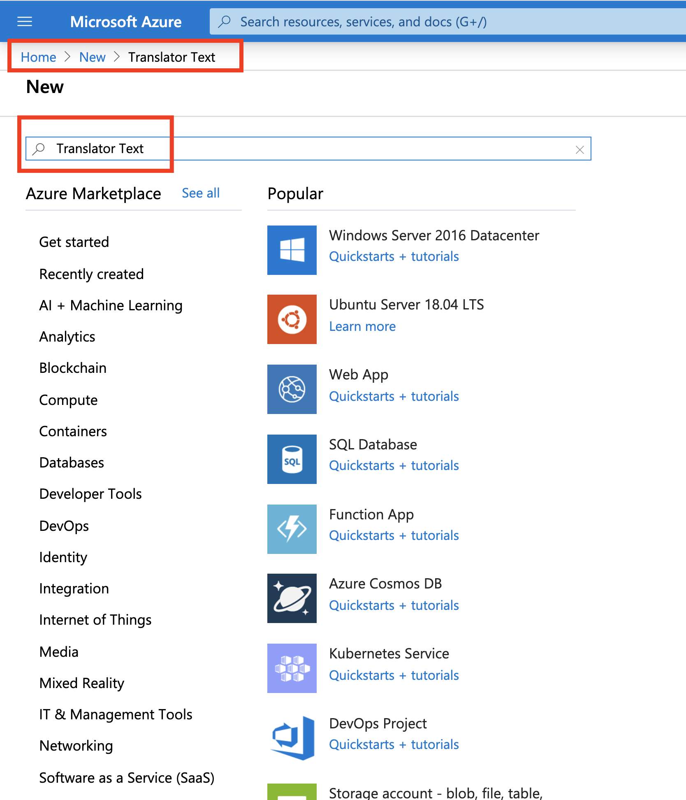

# MICRO-BLOG-DOC (Part 14)

## `Section: Front End`(Live Translation)

### `Summary`: In this documentation, we add live translation feature.(调用 API 翻译贴文.)

### `Check Dependencies:`

- flask 
- python-dotenv
- flask-wtf
- flask-sqlalchemy
- flask-migrate
- flask-login
- werkzeug.security (built-in)
- datetime (built-in)
- flask-mail
- pyjwt
- flask-bootstrap
- flask-moment

```diff
+ guess_language-spirit
+ requests
+ (venv) $ export MS_TRANSLATOR_KEY=<paste-your-key-here>
```

### 本章提要：
1. 实时翻译的主要思路 (workflow)：

- 利用 extension，识别需要被翻译的语种，并把结果存放在 database 。
- 获取系统当前使用语言信息。
- 当按下翻译按钮，发送一个 Ajax request 到 server
- server 向第三方 API 发送请求
- 获得 API 回复数据后，client-side 的 JS 代码把 API 返回的数据加入到页面。

__`必须要说明的是，这个过程虽然经过 server，但是页面是没有 refresh 的出现。因为这个过程没有向 server 获得数据或者修改数据，而是在 server 读取数据用于 API 请求，在得到 API 返回的数据后利用 JS 语言调用 AJax request function 并把返回数据作为新元素添加到 DOM 中。整个过程 server参与度很低，且没有对其中的任何数据进行更改。`__


### `Brief Contents & codes position`

- 14.1 Language Identification, install new extension and create a new column in Post model. 
    - __`(*14.1)Location: ./app/models.py`__
    - __`Location: ./app/routes.py`__

- 14.2 Displaying a "Translate" Link. 
    - __`Location: ./app/templates/_post.html`__

- 14.3 Using a Third-Party Translation Service.
    - __`(*14.2)Location: ./config.py`__
    - __`(*14.3)Location: ./app/translate.py`__

- 14.4 Ajax From The Server.
    - __`(*14.4)Location: ./app/routes.py`__

- 14.5 Ajax From The Client.
    - __`(*14.5)Location: ./app/templates/base.html`__
    - __`(*14.6)Location: ./app/templates/_post.html`__

- 14.6 Update the translation catalogs.

```diff
+ <a href="javascript:translate(...) (_post.html) 引用 
+ $.post('/translate',...) (base.html) 引用 
+ translate_text (routes.py) 引用 
+ translate (translate.py) 可以做一个图。
```

- 下图很好地把 html + javaScript + python 结合起来，且传递过程中以 `object` 为介质。
<p align="center">

</p>


### `Step1: Language Identification, install new extension and create a new column in Post model.`

#### A. `Install extension`

```bash
(venv) $ pip install guess_language-spirit
```

#### B. `Add a language field to the Post model.`
#### `(*14.1)Location: ./app/models.py`

```py
from datetime import datetime
from hashlib import md5
from time import time
from flask_login import UserMixin
from werkzeug.security import generate_password_hash, check_password_hash
import jwt
from app import app, db, login


followers = db.Table(
    'followers',
    db.Column('follower_id', db.Integer, db.ForeignKey('user.id')),
    db.Column('followed_id', db.Integer, db.ForeignKey('user.id'))
)


class User(UserMixin, db.Model):
    id = db.Column(db.Integer, primary_key=True)
    username = db.Column(db.String(64), index=True, unique=True)
    email = db.Column(db.String(120), index=True, unique=True)
    password_hash = db.Column(db.String(128))
    posts = db.relationship('Post', backref='author', lazy='dynamic')
    about_me = db.Column(db.String(140))
    last_seen = db.Column(db.DateTime, default=datetime.utcnow)
    followed = db.relationship(
        'User', secondary=followers,
        primaryjoin=(followers.c.follower_id == id),
        secondaryjoin=(followers.c.followed_id == id),
        backref=db.backref('followers', lazy='dynamic'), lazy='dynamic')

    def __repr__(self):
        return '<User {}>'.format(self.username)

    def set_password(self, password):
        self.password_hash = generate_password_hash(password)

    def check_password(self, password):
        return check_password_hash(self.password_hash, password)

    def avatar(self, size):
        digest = md5(self.email.lower().encode('utf-8')).hexdigest()
        return 'https://www.gravatar.com/avatar/{}?d=identicon&s={}'.format(
            digest, size)

    def follow(self, user):
        if not self.is_following(user):
            self.followed.append(user)

    def unfollow(self, user):
        if self.is_following(user):
            self.followed.remove(user)

    def is_following(self, user):
        return self.followed.filter(
            followers.c.followed_id == user.id).count() > 0

    def followed_posts(self):
        followed = Post.query.join(
            followers, (followers.c.followed_id == Post.user_id)).filter(
                followers.c.follower_id == self.id)
        own = Post.query.filter_by(user_id=self.id)
        return followed.union(own).order_by(Post.timestamp.desc())

    def get_reset_password_token(self, expires_in=600):
        return jwt.encode(
            {'reset_password': self.id, 'exp': time() + expires_in},
            app.config['SECRET_KEY'], algorithm='HS256').decode('utf-8')

    @staticmethod
    def verify_reset_password_token(token):
        try:
            id = jwt.decode(token, app.config['SECRET_KEY'],
                            algorithms=['HS256'])['reset_password']
        except:
            return
        return User.query.get(id)


@login.user_loader
def load_user(id):
    return User.query.get(int(id))


class Post(db.Model):
    id = db.Column(db.Integer, primary_key=True)
    body = db.Column(db.String(140))
    timestamp = db.Column(db.DateTime, index=True, default=datetime.utcnow)
    user_id = db.Column(db.Integer, db.ForeignKey('user.id'))
    language = db.Column(db.String(5))

    def __repr__(self):
        return '<Post {}>'.format(self.body)
```

#### `Comment:`
1. 新增语句：
```py
    language = db.Column(db.String(5))
```

#### C. `Database migration and apply.`

```bash
(venv) $ flask db migrate -m "add language column to posts"
(venv) $ flask db upgrade
```

#### D. `Detect and store the language when a post is submitted.`
#### `Location: ./app/routes.py`

```py
from guess_language import guess_language

@app.route('/', methods=['GET', 'POST'])
@app.route('/index', methods=['GET', 'POST'])
@login_required
def index():
    form = PostForm()
    if form.validate_on_submit():
        language = guess_language(form.post.data)
        if language == 'UNKNOWN' or len(language) > 5:
            language = ''
        post = Post(body=form.post.data, author=current_user,
                    language=language)
        # ...
```

#### `Comment:`
1. With this change, each time a post is submitted, I run the text through the guess_language function to try to determine the language. If the language comes back as unknown or if I get an unexpectedly long result, I play it safe and save an empty string to the database. I'm going to adopt the convention that any post that have the language set to an empty string is assumed to have an unknown language.


### `Step2: Displaying a "Translate" Link.`

#### `Location: ./app/templates/_post.html`

```html
    
    <br><br>
    <a href="#">{{ _('Translate') }}</a>
    
```

#### `Comment:`
1. 新增内容
```html

```

### `Step3. Using a Third-Party Translation Service.`

#### A. `Create an account with Azure and create Translator Text API.`

<p align="center">

</p>

-------------------------------------------------------------------------

<p align="center">

</p>

-------------------------------------------------------------------------

<p align="center">

</p>

-------------------------------------------------------------------------

<p align="center">

</p>

-------------------------------------------------------------------------

<p align="center">

</p>

-------------------------------------------------------------------------

<p align="center">

</p>

-------------------------------------------------------------------------

<p align="center">

</p>

-------------------------------------------------------------------------

<p align="center">

</p>

-------------------------------------------------------------------------
<p align="center">

</p>

#### B. `Copy key1 to the clipboard and then enter it into an environment variable in your terminal.`

```bash
(venv) $ export MS_TRANSLATOR_KEY=<paste-your-key-here>
```

#### C. `This key is used to authenticate with the translation service, so it needs to be added to the application configuration.`

#### `(*14.2)Location: ./config.py`
```py
import os
basedir = os.path.abspath(os.path.dirname(__file__))

class Config(object):
    SECRET_KEY = os.environ.get('SECRET_KEY') or 'you-will-never-guess'
    SQLALCHEMY_DATABASE_URI = os.environ.get('DATABASE_URL') or 'sqlite:///' + os.path.join(basedir, 'app.db')
    SQLALCHEMY_TRACK_MODIFICATIONS = False

    MAIL_SERVER = os.environ.get('MAIL_SERVER')
    MAIL_PORT = int(os.environ.get('MAIL_PORT') or 25)
    MAIL_USE_TLS = os.environ.get('MAIL_USE_TLS') is not None
    MAIL_USERNAME = os.environ.get('MAIL_USERNAME')
    MAIL_PASSWORD = os.environ.get('MAIL_PASSWORD')
    ADMINS = ['your-email@example.com']

    POSTS_PER_PAGE = 10
    LANGUAGES = ['en', 'zh','es']
    MS_TRANSLATOR_KEY = os.environ.get('MS_TRANSLATOR_KEY')
```

#### `Comment:`
1. 新增内容
```html
    MS_TRANSLATOR_KEY = os.environ.get('MS_TRANSLATOR_KEY')
```

2. As always with configuration values, I prefer to install them in environment variables and import them into the Flask configuration from there. This is particularly important with sensitive information such as keys or passwords that enable access to third-party services. You definitely do not want to write those explicitly in the code.

3. 在 flask 应用使用这种方法，敏感的 API keys 都不会上传公开，而是通过 bash 命令引入 environment variables 并在 configuration 中使用的方式。（这是安全性很重要的一环，而且讲解了`环境变量跟全局变量`的合作关系。）

#### D. `The Microsoft Translator API is a web service that accepts HTTP requests, so we need to install extension.`

```bash
(venv) $ pip install requests
```

#### E. `Create a function to call the API and get translated text.`

#### `(*14.3)Location: ./app/translate.py`

```py
import json
import requests
from flask_babel import _
from app import app

def translate(text, source_language, dest_language):
    if 'MS_TRANSLATOR_KEY' not in app.config or \
            not app.config['MS_TRANSLATOR_KEY']:
        return _('Error: the translation service is not configured.')
    auth = {'Ocp-Apim-Subscription-Key': app.config['MS_TRANSLATOR_KEY']}
    r = requests.get('https://api.microsofttranslator.com/v2/Ajax.svc'
                     '/Translate?text={}&from={}&to={}'.format(
                         text, source_language, dest_language),
                     headers=auth)
    if r.status_code != 200:
        return _('Error: the translation service failed.')
    return json.loads(r.content.decode('utf-8-sig'))
```

#### `Comment:`
1. The function takes the text to translate and the source and destination language codes as arguments, and it returns a string with the translated text. It starts by checking that there is a key for the translation service in the configuration, and if it isn't there it returns an error. The error is also a string, so from the outside, this is going to look like the translated text. This ensures that in the case of an error, the user will see a meaningful error message.

2. The get() method from the requests package sends an HTTP request with a GET method to the URL given as the first argument. I'm using the /v2/Ajax.svc/Translate URL, which is an endpoint from the translation service that returns translations as a JSON payload. The text, source and destination languages need to be given as query string arguments in the URL, named text, from and to respectively. To authenticate with the service, I need to pass the key that I added to the configuration. This key needs to be given in a custom HTTP header with the name Ocp-Apim-Subscription-Key. I created the auth dictionary with this header and then pass it to requests in the headers argument.

3. The requests.get() method returns a response object, which contains all the details provided by the service. I first need to check that the status code is 200, which is the code for a successful request. If I get any other codes, I know that there was an error, so in that case I return an error string. If the status code is 200, then the body of the response has a JSON encoded string with the translation, so all I need to do is `use the json.loads() function from the Python standard library to decode the JSON into a Python string that I can use. `The content attribute of the response object contains the raw body of the response as a bytes object, which is converted to a UTF-8 string and sent to json.loads().


### `Step4. Ajax From The Server.`

#### A. `Create a view function.`

#### `(*14.4)Location: ./app/routes.py`

```py
from datetime import datetime
from flask import render_template, flash, redirect, url_for, request, g, jsonify
from flask_login import login_user, logout_user, current_user, login_required
from werkzeug.urls import url_parse
from flask_babel import _, get_locale
from guess_language import guess_language
from app import app, db
from app.forms import LoginForm, RegistrationForm, EditProfileForm, PostForm, ResetPasswordRequestForm, ResetPasswordForm
from app.models import User, Post
from app.email import send_password_reset_email
from app.translate import translate


@app.before_request
def before_request():
    if current_user.is_authenticated:
        current_user.last_seen = datetime.utcnow()
        db.session.commit()
    g.locale = str(get_locale())


@app.route('/', methods=['GET', 'POST'])
@app.route('/index', methods=['GET', 'POST'])
@login_required
def index():
    form = PostForm()
    if form.validate_on_submit():
        language = guess_language(form.post.data)
        if language == 'UNKNOWN' or len(language) > 5:
            language = ''
        post = Post(body=form.post.data, author=current_user,
                    language=language)
        db.session.add(post)
        db.session.commit()
        flash(_('Your post is now live!'))
        return redirect(url_for('index'))
    page = request.args.get('page', 1, type=int)
    posts = current_user.followed_posts().paginate(
        page, app.config['POSTS_PER_PAGE'], False)
    next_url = url_for('index', page=posts.next_num) \
        if posts.has_next else None
    prev_url = url_for('index', page=posts.prev_num) \
        if posts.has_prev else None
    return render_template('index.html', title=_('Home'), form=form,
                           posts=posts.items, next_url=next_url,
                           prev_url=prev_url)


@app.route('/explore')
@login_required
def explore():
    page = request.args.get('page', 1, type=int)
    posts = Post.query.order_by(Post.timestamp.desc()).paginate(
        page, app.config['POSTS_PER_PAGE'], False)
    next_url = url_for('explore', page=posts.next_num) \
        if posts.has_next else None
    prev_url = url_for('explore', page=posts.prev_num) \
        if posts.has_prev else None
    return render_template('index.html', title=_('Explore'),
                           posts=posts.items, next_url=next_url,
                           prev_url=prev_url)


@app.route('/login', methods=['GET', 'POST'])
def login():
    if current_user.is_authenticated:
        return redirect(url_for('index'))
    form = LoginForm()
    if form.validate_on_submit():
        user = User.query.filter_by(username=form.username.data).first()
        if user is None or not user.check_password(form.password.data):
            flash(_('Invalid username or password'))
            return redirect(url_for('login'))
        login_user(user, remember=form.remember_me.data)
        next_page = request.args.get('next')
        if not next_page or url_parse(next_page).netloc != '':
            next_page = url_for('index')
        return redirect(next_page)
    return render_template('login.html', title=_('Sign In'), form=form)


@app.route('/logout')
def logout():
    logout_user()
    return redirect(url_for('index'))


@app.route('/register', methods=['GET', 'POST'])
def register():
    if current_user.is_authenticated:
        return redirect(url_for('index'))
    form = RegistrationForm()
    if form.validate_on_submit():
        user = User(username=form.username.data, email=form.email.data)
        user.set_password(form.password.data)
        db.session.add(user)
        db.session.commit()
        flash(_('Congratulations, you are now a registered user!'))
        return redirect(url_for('login'))
    return render_template('register.html', title=_('Register'), form=form)


@app.route('/reset_password_request', methods=['GET', 'POST'])
def reset_password_request():
    if current_user.is_authenticated:
        return redirect(url_for('index'))
    form = ResetPasswordRequestForm()
    if form.validate_on_submit():
        user = User.query.filter_by(email=form.email.data).first()
        if user:
            send_password_reset_email(user)
        flash(
            _('Check your email for the instructions to reset your password'))
        return redirect(url_for('login'))
    return render_template('reset_password_request.html',
                           title=_('Reset Password'), form=form)


@app.route('/reset_password/<token>', methods=['GET', 'POST'])
def reset_password(token):
    if current_user.is_authenticated:
        return redirect(url_for('index'))
    user = User.verify_reset_password_token(token)
    if not user:
        return redirect(url_for('index'))
    form = ResetPasswordForm()
    if form.validate_on_submit():
        user.set_password(form.password.data)
        db.session.commit()
        flash(_('Your password has been reset.'))
        return redirect(url_for('login'))
    return render_template('reset_password.html', form=form)


@app.route('/user/<username>')
@login_required
def user(username):
    user = User.query.filter_by(username=username).first_or_404()
    page = request.args.get('page', 1, type=int)
    posts = user.posts.order_by(Post.timestamp.desc()).paginate(
        page, app.config['POSTS_PER_PAGE'], False)
    next_url = url_for('user', username=user.username, page=posts.next_num) \
        if posts.has_next else None
    prev_url = url_for('user', username=user.username, page=posts.prev_num) \
        if posts.has_prev else None
    return render_template('user.html', user=user, posts=posts.items,
                           next_url=next_url, prev_url=prev_url)


@app.route('/edit_profile', methods=['GET', 'POST'])
@login_required
def edit_profile():
    form = EditProfileForm(current_user.username)
    if form.validate_on_submit():
        current_user.username = form.username.data
        current_user.about_me = form.about_me.data
        db.session.commit()
        flash(_('Your changes have been saved.'))
        return redirect(url_for('edit_profile'))
    elif request.method == 'GET':
        form.username.data = current_user.username
        form.about_me.data = current_user.about_me
    return render_template('edit_profile.html', title=_('Edit Profile'),
                           form=form)


@app.route('/follow/<username>')
@login_required
def follow(username):
    user = User.query.filter_by(username=username).first()
    if user is None:
        flash(_('User %(username)s not found.', username=username))
        return redirect(url_for('index'))
    if user == current_user:
        flash(_('You cannot follow yourself!'))
        return redirect(url_for('user', username=username))
    current_user.follow(user)
    db.session.commit()
    flash(_('You are following %(username)s!', username=username))
    return redirect(url_for('user', username=username))


@app.route('/unfollow/<username>')
@login_required
def unfollow(username):
    user = User.query.filter_by(username=username).first()
    if user is None:
        flash(_('User %(username)s not found.', username=username))
        return redirect(url_for('index'))
    if user == current_user:
        flash(_('You cannot unfollow yourself!'))
        return redirect(url_for('user', username=username))
    current_user.unfollow(user)
    db.session.commit()
    flash(_('You are not following %(username)s.', username=username))
    return redirect(url_for('user', username=username))


@app.route('/translate', methods=['POST'])
@login_required
def translate_text():
    return jsonify({'text': translate(request.form['text'],
                                      request.form['source_language'],
                                      request.form['dest_language'])})
```


#### `Comment:`
1. 新增内容：
```py
from flask import jsonify
from app.translate import translate

@app.route('/translate', methods=['POST'])
@login_required
def translate_text():
    return jsonify({'text': translate(request.form['text'],
                                      request.form['source_language'],
                                      request.form['dest_language'])})
```

1. As you can see, this is simple. I implemented this route as a POST request. There is really no absolute rule as to when t use GET or POST (or other request methods that you haven't seen yet). Since the client will be sending data, I decided to use a POST request, as that is similar to the requests that submit form data. The request.form attribute is a dictionary that Flask exposes with all the data that has included in the submission. When I worked with web forms, I did not need to look at request.form because Flask-WTF does all that work for me, but in this case, there is really no web form, so I have to access the data directly.

2. So what I'm doing in this function is to invoke the translate() function from the previous section passing the three arguments directly from the data that was submitted with the request. The result is incorporated into a single-key dictionary, under the key text, and the dictionary is passed as an argument to Flask's jsonify() function, which converts the dictionary to a JSON formatted payload. The return value from jsonify() is the HTTP response that is going to be sent back to the client.

3. 在从 API 获得 JSON 文件之后，取其中重要的数据转化成 string，然后在 view function 中转化回 JSON 格式，最后传输到 client 中使用。

4. 这个过程就是从 server 发出 API request。


### `Step5. Ajax From The Client.`

#### A. `Wrap the translate element in a new element with id.`

#### `Location: ./app/templates/_post.html`

```html
    <span id="translation{{ post.id }}">
        <a href="#">{{ _('Translate') }}</a>
    </span>
```

#### B. `Write a JavaScript function that can do all the translation work.`

#### `(*14.5)Location: ./app/templates/base.html`

```html



    {{ title }} - Microblog{{ _('Welcome to Microblog') }}



    <nav class="navbar navbar-default">
        <div class="container">
            <div class="navbar-header">
                <button type="button" class="navbar-toggle collapsed" data-toggle="collapse" data-target="#bs-example-navbar-collapse-1" aria-expanded="false">
                    <span class="sr-only">Toggle navigation</span>
                    <span class="icon-bar"></span>
                    <span class="icon-bar"></span>
                    <span class="icon-bar"></span>
                </button>
                <a class="navbar-brand" href="{{ url_for('index') }}">Microblog</a>
            </div>
            <div class="collapse navbar-collapse" id="bs-example-navbar-collapse-1">
                <ul class="nav navbar-nav">
                    <li><a href="{{ url_for('index') }}">{{ _('Home') }}</a></li>
                    <li><a href="{{ url_for('explore') }}">{{ _('Explore') }}</a></li>
                </ul>
                <ul class="nav navbar-nav navbar-right">
                    
                    <li><a href="{{ url_for('login') }}">{{ _('Login') }}</a></li>
                    
                    <li><a href="{{ url_for('user', username=current_user.username) }}">{{ _('Profile') }}</a></li>
                    <li><a href="{{ url_for('logout') }}">{{ _('Logout') }}</a></li>
                    
                </ul>
            </div>
        </div>
    </nav>



    <div class="container">
        
        
            
            <div class="alert alert-info" role="alert">{{ message }}</div>
            
        
        

        {# application content needs to be provided in the app_content block #}
        
    </div>



    {{ super() }}
    {{ moment.include_moment() }}
    {{ moment.lang(g.locale) }}
    <script>
        function translate(sourceElem, destElem, sourceLang, destLang) {
            $(destElem).html('');
            $.post('/translate', {
                text: $(sourceElem).text(),
                source_language: sourceLang,
                dest_language: destLang
            }).done(function(response) {
                $(destElem).text(response['text'])
            }).fail(function() {
                $(destElem).text("{{ _('Error: Could not contact server.') }}");
            });
        }
    </script>

```

#### `Comment:`
1. This function will take the input and output DOM nodes, and the source and destination languages, issue the asynchronous request to the server with the three arguments needed, and finally replace the Translate link with the translated text once the server responds. 

2. The first two arguments are the unique IDs for the post and the translate link nodes. The last two argument are the source and destination language codes.

3. The function begins with a nice touch: it adds a spinner replacing the Translate link so that the user knows that the translation is in progress. This is done with jQuery, using the $(destElem).html() function to replace the original HTML that defined the translate link with new HTML content based on the  link. For the spinner, I'm going to use a small animated GIF that I have added to the app/static/loading.gif directory, which Flask reserves for static files. To generate the URL that references this image, I'm using the url_for() function, passing the special route name static and giving the filename of the image as an argument.

4. So now I have a nice spinner that took the place of the Translate link, so the user knows to wait for the translation to appear. The next step is to send the POST request to the /translate URL that I defined in the previous section. For this I'm also going to use jQuery, in this case the $.post() function. This function submits data to the server in a format that is similar to how the browser submits a web form, which is convenient because that allows Flask to incorporate this data into the request.form dictionary. The arguments to $.post() are two, first the URL to send the request to, and then a dictionary (or object, as these are called in JavaScript) with the three data items the server expects.

5. What I want to do now is indicate what I want done once this request completes and the browser receives the response. In JavaScript there is no such thing as waiting for something, everything is asynchronous. What I need to do instead is to provide a callback function that the browser will invoke when the response is received. And also as a way to make everything as robust as possible, I want to indicate what to do in the case an error has ocurred, so that would be a second callback function to handle errors. There are a few ways to specify these callbacks, but for this case, using promises makes the code fairly clear.

6. The promise syntax allows you to basically "chain" the callbacks to the return value of the $.post() call. In the success callback, all I need to do is call $(destElem).text() with the translated text, which comes in a dictionary under the text key. In the case of an error, I do the same, but the text that I display is a generic error message, which I make sure is entered in the base template as a translatable text.

7. 可以尝试在 react 中添加这个函数。

#### C. `Embed the call to the function in the href attribute of the link.`

#### `Location: ./app/templates/_post.html`

```html
    <table class="table table-hover">
        <tr>
            <td width="70px">
                <a href="{{ url_for('user', username=post.author.username) }}">
                    
                </a>
            </td>
            <td>
                
                    <a href="{{ url_for('user', username=post.author.username) }}">
                        {{ post.author.username }}
                    </a>
                
                {{ _('%(username)s said %(when)s',
                    username=user_link, when=moment(post.timestamp).fromNow()) }}
                <br>
                <span id="post{{ post.id }}">{{ post.body }}</span>
                
                <br><br>
                <span id="translation{{ post.id }}">
                    <a href="javascript:translate(
                                '#post{{ post.id }}',
                                '#translation{{ post.id }}',
                                '{{ post.language }}',
                                '{{ g.locale }}');">{{ _('Translate') }}</a>
                </span>
                
            </td>
        </tr>
    </table>
```

#### `Comment:`
1. The href element of a link can accept any JavaScript code if it is prefixed with javascript:, so that is a convenient way to make the call to the translation function. Because this link is going to be rendered in the server when the client requests the page, I can use {{ }} expressions to generate the four arguments to the function. Each post will have its own translate link, with its uniquely generated arguments. The # that you see as a prefix to the post<ID> and translation<ID> elements indicates that what follows is an element ID.

### `Step6. Update the translation catalogs.`

- 因为增加了新的 marker，所以需要更新 .pot 文件和 .po 文件，最后编译出新的 .mo 文件。

```bash
(venv) $ flask translate update
(venv) $ flask translate compile
```

### `Step7 Concept questions.`

#### `A. What is traditional server-side model?`

- In the traditional server-side model that I've followed so far there is a client (a web browser commanded by a user) making HTTP requests to the application server. A request can simply ask for an HTML page, like when you click the "Profile" link, or it can trigger an action, like when you click the Submit button after editing your profile information. In both types of requests the server completes the request by sending a new web page to the client, either directly or by issuing a redirect. The client then replaces the current page with the new one. This cycle repeats for as long as the user stays on the application's web site. `In this model the server does all the work, while the client just displays the web pages and accepts user input.`

#### `B. What is client-side model?`

- There is a different model in which the client takes a more active role. In this model, the client issues a request to the server and the server responds with a web page, but unlike the previous case, not all the page data is HTML, `there is also sections of the page with code, typically written in Javascript. Once the client receives the page it displays the HTML portions, and executes the code.` From then on you have an active client that can do work on its own without little or no contact with the server. In a strict client-side application the entire application is downloaded to the client with the initial page request, and `then the application runs entirely on the client, only contacting the server to retrieve or store data and making dynamic changes to the appearance of that first and only web page.` This type of applications are called Single Page Applications or SPAs.

#### `C. What is Ajax technique?`

- Most applications are a hybrid between the two models and combine techniques of both. My Microblog application is mostly a server-side application, but today I will be adding a little bit of client-side action to it. To do real time translations of user posts, `the client browser will send asynchronous requests to the server, to which the server will respond without causing a page refresh. The client will then insert the translations into the current page dynamically.` This technique is known as Ajax, which is short for Asynchronous JavaScript and XML (even though these days XML is often replaced with JSON).


### `Step8 TEST.`

```bash
(venv) $ export MS_TRANSLATOR_KEY=<paste-your-key-here>
(venv) $ flask run
```

1. Home page
<p align="center">

</p>

--------------------------------------------------------------

<p align="center">

</p>

--------------------------------------------------------------

2. Explore page
<p align="center">

</p>

`Notes:`

- 目前有一个问题是，当在设定 APP 的语言为中文时，里面是没有翻译功能的。估计这个翻译功能的按钮的判断依据`g.locale`不是以 APP 设定的语言为准，而是以操作系统的默认语言为准。现在还没实现设定 APP 语言为中文时，可以出现一个翻译按钮实现把非中文翻译为中文的功能。估计原因是即使 APP 语言为中文，操作系统语言仍然为英文，所以当发现有贴文为英文时仍然不会出现翻译功能，也就是说这种情况下 APP 不能实现将英文翻译成中文。


