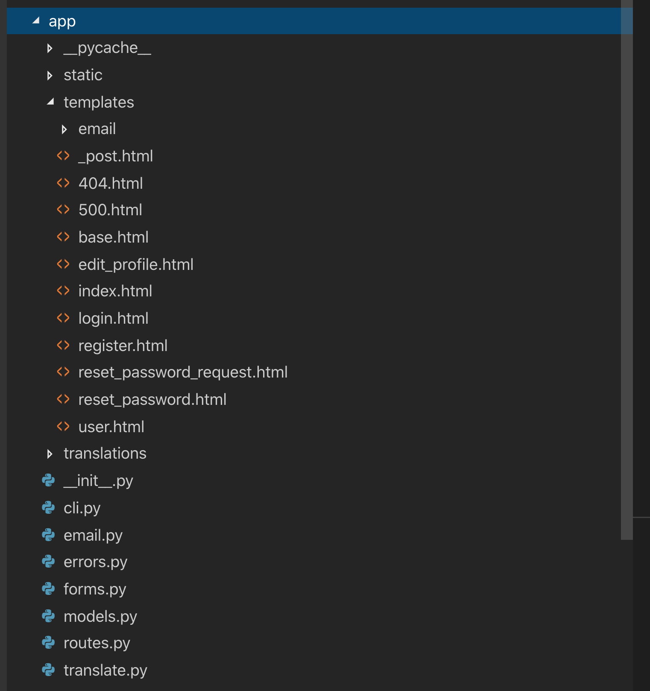
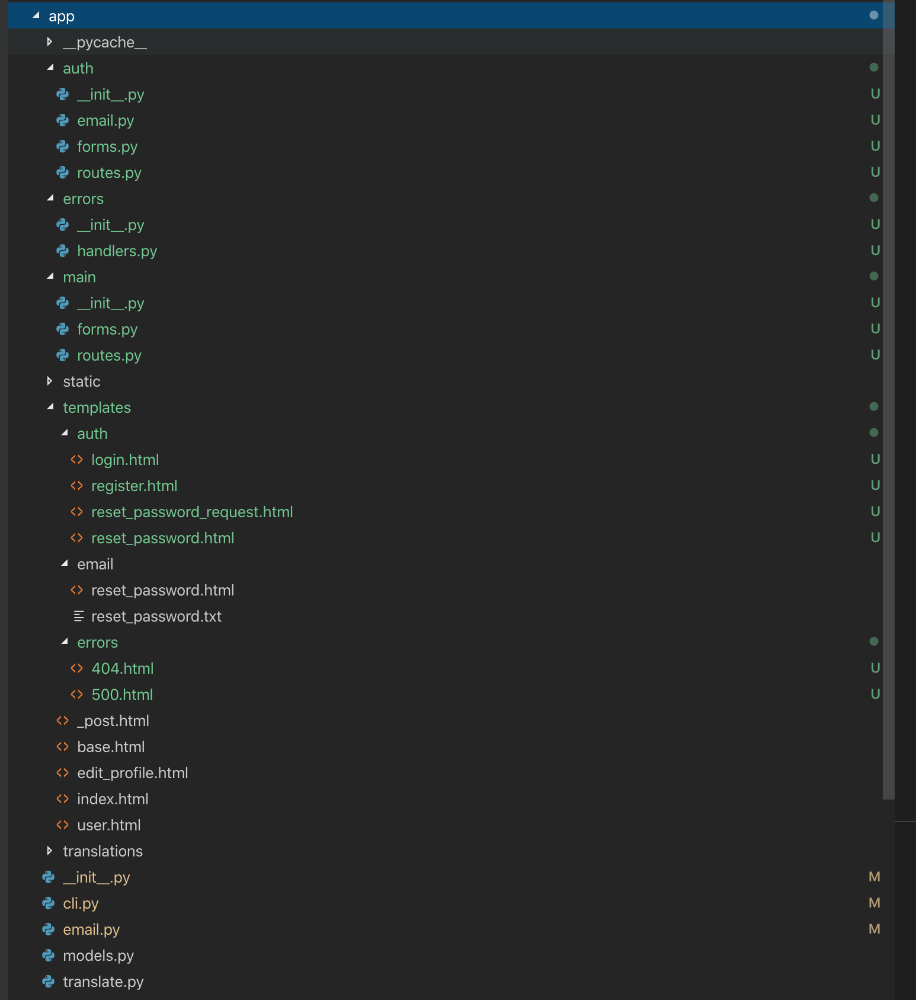
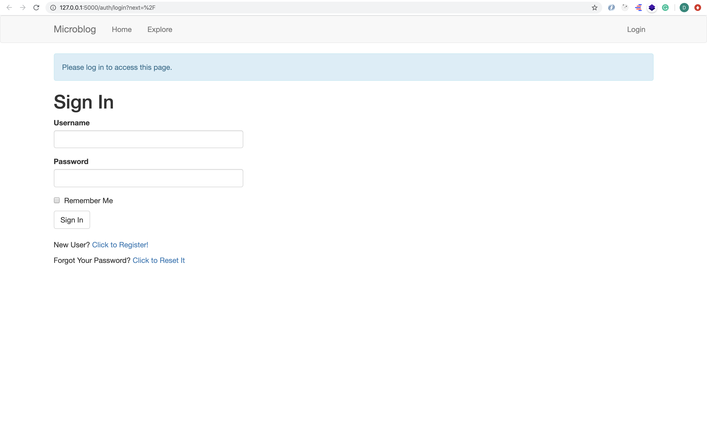

# MICRO-BLOG-DOC (Part 15)

## `Section: File structure`

### `Summary`: In this documentation, we change the structure to apply to large application.(改变文件组织构造方式.)

### `Check Dependencies:`

- flask 
- python-dotenv
- flask-wtf
- flask-sqlalchemy
- flask-migrate
- flask-login
- werkzeug.security (built-in)
- datetime (built-in)
- flask-mail
- pyjwt
- flask-bootstrap
- flask-moment
- guess_language-spirit
- requests

```diff
```

### 本章提要：
1. 改变文件架构的主要原因：

- 第一个需求是：适应未来更大的扩展需要，更多的功能实现必定会带来更多当文件管理，所以一个更好的归类管理架构是很必要的。
- 更好的文件架构，主要体现在更好的组织和更方便的维护支持能力。
- 第一个思路是模块化 (For example, the user authentication portion should work well in other applications.) Flask 有一个功能 blueprints 可以实现更轻松的代码重用。

- 第二个需求是目前整个应用是用全局变量 (global variable) 来定义的，不利于测试。 ( Because the application is defined as a global variable, there is really no way to instantiate two applications that use different configuration variables. Another situation that is not ideal is that all the tests use the same application, so a test could be making changes to the application that affect another test that runs later. Ideally you want all tests to run on a pristine application instance.)

- 第二个思路是创造 instance。(Using an application factory function to create the function at runtime. This would be a function that accepts a configuration object as an argument, and returns a Flask application instance, configured with those settings.) 这种情况下写 testing 就可以根据不同的特别配置 configuration 去编写 (because each test can create its own application.) 


### `Brief Contents & codes position`

- 15.1 Error Handling Blueprint. (`errors` Blueprint)
    - __`(*15.1)Location: ./app/errors/__init__.py`__
    - __`(*15.2)Location: ./app/errors/handlers.py`__

- 15.2 Authentication Blueprint. (`auth` Blueprint)
    - __`(*15.3)Location: ./app/auth/__init__.py`__
    - __`(*15.4)Location: ./app/auth/email.py`__
    - __`(*15.5)Location: ./app/auth/forms.py`__
    - __`(*15.6)Location: ./app/auth/routes.py`__

- 15.3 Main Application Blueprint. (`main` Blueprint)
    - __`(*15.7)Location: ./app/main/__init__.py`__
    - __`(*15.8)Location: ./app/main/forms.py`__
    - __`(*15.9)Location: ./app/main/routes.py`__

    __`在修改成 Blueprint 模式后，所有相关的 html template 里面使用到的 url_for() 的 view function 名字都需要修改。`__

------------------------------------------------------------

- 15.4 The Application Factory Pattern.
    - __`(*15.10)Location: ./app/__init__.py`__
    - __`(*15.11)Location: ./app/models.py`__
    - __`(*15.12)Location: ./app/email.py`__
    - __`(*15.13)Location: ./app/translate.py`__
    - __`(*15.14)Location: ./app/cli.py`__
    - __`(*15.15)Location: ./microblog.py`__

    __`在修改成 instance 模式后，所有相关的 py 里面使用到的 引用 的 app 都要改成 current_app 。`__

------------------------------------------------------------

- 15.5 Unit Testing Improvements.
    - __`(*15.16)Location: ./app/test.py`__

------------------------------------------------------------

- 15.6 Environment Variables.
    - __`(*15.17)Location: ./config.py`__
    - __`(*15.18)Location: ./.flaskenv`__
    - __`(*15.19)Location: ./.env`__
    - __`(*15.20)Location: ./.gitignore`__

------------------------------------------------------------

- 15.7 Requirements File.
    - __`Location: ./requirements.txt`__
```bash
(venv) $ pip freeze > requirements.txt
```
------------------------------------------------------------

#### `Old structure and new structure:`

<div align="center">
    
    
</div>


### `Step1: Error Handling Blueprint.` (`errors` Blueprint)

#### A. `Create the blueprint:`
#### `(*15.1)Location: ./app/errors/__init__.py`

```py
from flask import Blueprint

bp = Blueprint('errors', __name__)

from app.errors import handlers
```

#### `(*15.2)Location: ./app/errors/handlers.py`

```py
from flask import render_template
from app import db
from app.errors import bp


@bp.app_errorhandler(404)
def not_found_error(error):
    return render_template('errors/404.html'), 404


@bp.app_errorhandler(500)
def internal_error(error):
    db.session.rollback()
    return render_template('errors/500.html'), 500
```

#### `Comment:`
1. 主要改变，在 app 增加一个 error folder，作为一个 blueprint 模块。另外在 templates 中增加一个 errors folder，把相关 html 文件放进去。
2. handler.py 是从 errors.py 转变过去的，errors.py 的代码是：

```py
from flask import render_template
from app import app, db

@app.errorhandler(404)
def not_found_error(error):
    return render_template('404.html'), 404

@app.errorhandler(500)
def internal_error(error):
    db.session.rollback()
    return render_template('500.html'), 500
```

#### B. `Register the blueprint:`
#### `Location: ./app/__init__.py`

```py
app = Flask(__name__)

# ...

from app.errors import bp as errors_bp
app.register_blueprint(errors_bp)

# ...

from app import routes, models  # <-- remove errors from this import!
```

#### `Comment:`
1. To register a blueprint, the register_blueprint() method of the Flask application instance is used. When a blueprint is registered, any view functions, templates, static files, error handlers, etc. are connected to the application. I put the import of the blueprint right above the app.register_blueprint() to avoid circular dependencies.

### `Step2: Authentication Blueprint.` (`auth` Blueprint)

#### A. `Create the blueprint:`
#### `(*15.3)Location: ./app/auth/__init__.py`

```py
from flask import Blueprint

bp = Blueprint('auth', __name__)

from app.auth import routes
```

#### `(*15.4)Location: ./app/auth/email.py`

```py
from flask import render_template, current_app
from flask_babel import _
from app.email import send_email


def send_password_reset_email(user):
    token = user.get_reset_password_token()
    send_email(_('[Microblog] Reset Your Password'),
               sender=current_app.config['ADMINS'][0],
               recipients=[user.email],
               text_body=render_template('email/reset_password.txt',
                                         user=user, token=token),
               html_body=render_template('email/reset_password.html',
                                         user=user, token=token))
```

#### `(*15.5)Location: ./app/auth/forms.py`

```py
from flask_wtf import FlaskForm
from wtforms import StringField, PasswordField, BooleanField, SubmitField
from wtforms.validators import ValidationError, DataRequired, Email, EqualTo
from flask_babel import _, lazy_gettext as _l
from app.models import User


class LoginForm(FlaskForm):
    username = StringField(_l('Username'), validators=[DataRequired()])
    password = PasswordField(_l('Password'), validators=[DataRequired()])
    remember_me = BooleanField(_l('Remember Me'))
    submit = SubmitField(_l('Sign In'))


class RegistrationForm(FlaskForm):
    username = StringField(_l('Username'), validators=[DataRequired()])
    email = StringField(_l('Email'), validators=[DataRequired(), Email()])
    password = PasswordField(_l('Password'), validators=[DataRequired()])
    password2 = PasswordField(
        _l('Repeat Password'), validators=[DataRequired(),
                                           EqualTo('password')])
    submit = SubmitField(_l('Register'))

    def validate_username(self, username):
        user = User.query.filter_by(username=username.data).first()
        if user is not None:
            raise ValidationError(_('Please use a different username.'))

    def validate_email(self, email):
        user = User.query.filter_by(email=email.data).first()
        if user is not None:
            raise ValidationError(_('Please use a different email address.'))


class ResetPasswordRequestForm(FlaskForm):
    email = StringField(_l('Email'), validators=[DataRequired(), Email()])
    submit = SubmitField(_l('Request Password Reset'))


class ResetPasswordForm(FlaskForm):
    password = PasswordField(_l('Password'), validators=[DataRequired()])
    password2 = PasswordField(
        _l('Repeat Password'), validators=[DataRequired(),
                                           EqualTo('password')])
    submit = SubmitField(_l('Request Password Reset'))
```

#### `(*15.6)Location: ./app/auth/routes.py`

```py
from flask import render_template, redirect, url_for, flash, request
from werkzeug.urls import url_parse
from flask_login import login_user, logout_user, current_user
from flask_babel import _
from app import db
from app.auth import bp
from app.auth.forms import LoginForm, RegistrationForm, \
    ResetPasswordRequestForm, ResetPasswordForm
from app.models import User
from app.auth.email import send_password_reset_email


@bp.route('/login', methods=['GET', 'POST'])
def login():
    if current_user.is_authenticated:
        return redirect(url_for('main.index'))
    form = LoginForm()
    if form.validate_on_submit():
        user = User.query.filter_by(username=form.username.data).first()
        if user is None or not user.check_password(form.password.data):
            flash(_('Invalid username or password'))
            return redirect(url_for('auth.login'))
        login_user(user, remember=form.remember_me.data)
        next_page = request.args.get('next')
        if not next_page or url_parse(next_page).netloc != '':
            next_page = url_for('main.index')
        return redirect(next_page)
    return render_template('auth/login.html', title=_('Sign In'), form=form)


@bp.route('/logout')
def logout():
    logout_user()
    return redirect(url_for('main.index'))


@bp.route('/register', methods=['GET', 'POST'])
def register():
    if current_user.is_authenticated:
        return redirect(url_for('main.index'))
    form = RegistrationForm()
    if form.validate_on_submit():
        user = User(username=form.username.data, email=form.email.data)
        user.set_password(form.password.data)
        db.session.add(user)
        db.session.commit()
        flash(_('Congratulations, you are now a registered user!'))
        return redirect(url_for('auth.login'))
    return render_template('auth/register.html', title=_('Register'),
                           form=form)


@bp.route('/reset_password_request', methods=['GET', 'POST'])
def reset_password_request():
    if current_user.is_authenticated:
        return redirect(url_for('main.index'))
    form = ResetPasswordRequestForm()
    if form.validate_on_submit():
        user = User.query.filter_by(email=form.email.data).first()
        if user:
            send_password_reset_email(user)
        flash(
            _('Check your email for the instructions to reset your password'))
        return redirect(url_for('auth.login'))
    return render_template('auth/reset_password_request.html',
                           title=_('Reset Password'), form=form)


@bp.route('/reset_password/<token>', methods=['GET', 'POST'])
def reset_password(token):
    if current_user.is_authenticated:
        return redirect(url_for('main.index'))
    user = User.verify_reset_password_token(token)
    if not user:
        return redirect(url_for('main.index'))
    form = ResetPasswordForm()
    if form.validate_on_submit():
        user.set_password(form.password.data)
        db.session.commit()
        flash(_('Your password has been reset.'))
        return redirect(url_for('auth.login'))
    return render_template('auth/reset_password.html', form=form)
```

#### `Comment:`
1. Main changes:
```diff
- @app.route
+ @bp.route

- url_for('login')
+ url_for('auth.login')

- return render_template('login.html', title=_('Sign In'), form=form)
+ return render_template('auth/login.html', title=_('Sign In'), form=form)
```

2. When defining routes in a blueprint, the @bp.route decorate is used instead of @app.route. There is also a required change in the syntax used in the url_for() to build URLs. For regular view functions attached directly to the application, the first argument to url_for() is the view function name. When a route is defined in a blueprint, this argument must include the blueprint name and the view function name, separated by a period. So for example, I had to replace all occurrences of url_for('login') with url_for('auth.login'), and same for the remaining view functions.


#### B. `Register the blueprint:`
#### `Location: ./app/__init__.py`

```py
app = Flask(__name__)

# ...

from app.auth import bp as auth_bp
app.register_blueprint(auth_bp, url_prefix='/auth')

# ...

from app import models  # <-- remove errors from this import!
```

#### `Comment:`
1. The register_blueprint() call in this case has an extra argument, url_prefix. This is entirely optional, but Flask gives you the option to attach a blueprint under a URL prefix, so any routes defined in the blueprint get this prefix in their URLs. In many cases this is useful as a sort of "namespacing" that keeps all the routes in the blueprint separated from other routes in the application or other blueprints. For authentication, I thought it was nice to have all the routes starting with /auth, so I added the prefix. So now the login URL is going to be http://localhost:5000/auth/login. Because I'm using url_for() to generate the URLs, all URLs will automatically incorporate the prefix. `(为整个模块增加 URL 前缀)`


### `Step3: Main Application Blueprint.` (`main` Blueprint)

#### A. `Create the blueprint:`
#### `(*15.7)Location: ./app/main/__init__.py`

```py
from flask import Blueprint

bp = Blueprint('main', __name__)

from app.main import routes
```

#### `Comment:`
1. 

#### `(*15.8)Location: ./app/main/forms.py`

```py
from flask import request
from flask_wtf import FlaskForm
from wtforms import StringField, SubmitField, TextAreaField
from wtforms.validators import ValidationError, DataRequired, Length
from flask_babel import _, lazy_gettext as _l
from app.models import User


class EditProfileForm(FlaskForm):
    username = StringField(_l('Username'), validators=[DataRequired()])
    about_me = TextAreaField(_l('About me'),
                             validators=[Length(min=0, max=140)])
    submit = SubmitField(_l('Submit'))

    def __init__(self, original_username, *args, **kwargs):
        super(EditProfileForm, self).__init__(*args, **kwargs)
        self.original_username = original_username

    def validate_username(self, username):
        if username.data != self.original_username:
            user = User.query.filter_by(username=self.username.data).first()
            if user is not None:
                raise ValidationError(_('Please use a different username.'))


class PostForm(FlaskForm):
    post = TextAreaField(_l('Say something'), validators=[DataRequired()])
    submit = SubmitField(_l('Submit'))
```

#### `Comment:`
1. 

#### `(*15.9)Location: ./app/main/routes.py`

```py
from datetime import datetime
from flask import render_template, flash, redirect, url_for, request, g, \
    jsonify, current_app
from flask_login import current_user, login_required
from flask_babel import _, get_locale
from guess_language import guess_language
from app import db
from app.main.forms import EditProfileForm, PostForm
from app.models import User, Post
from app.translate import translate
from app.main import bp


@bp.before_app_request
def before_request():
    if current_user.is_authenticated:
        current_user.last_seen = datetime.utcnow()
        db.session.commit()
    g.locale = str(get_locale())


@bp.route('/', methods=['GET', 'POST'])
@bp.route('/index', methods=['GET', 'POST'])
@login_required
def index():
    form = PostForm()
    if form.validate_on_submit():
        language = guess_language(form.post.data)
        if language == 'UNKNOWN' or len(language) > 5:
            language = ''
        post = Post(body=form.post.data, author=current_user,
                    language=language)
        db.session.add(post)
        db.session.commit()
        flash(_('Your post is now live!'))
        return redirect(url_for('main.index'))
    page = request.args.get('page', 1, type=int)
    posts = current_user.followed_posts().paginate(
        page, current_app.config['POSTS_PER_PAGE'], False)
    next_url = url_for('main.index', page=posts.next_num) \
        if posts.has_next else None
    prev_url = url_for('main.index', page=posts.prev_num) \
        if posts.has_prev else None
    return render_template('index.html', title=_('Home'), form=form,
                           posts=posts.items, next_url=next_url,
                           prev_url=prev_url)


@bp.route('/explore')
@login_required
def explore():
    page = request.args.get('page', 1, type=int)
    posts = Post.query.order_by(Post.timestamp.desc()).paginate(
        page, current_app.config['POSTS_PER_PAGE'], False)
    next_url = url_for('main.explore', page=posts.next_num) \
        if posts.has_next else None
    prev_url = url_for('main.explore', page=posts.prev_num) \
        if posts.has_prev else None
    return render_template('index.html', title=_('Explore'),
                           posts=posts.items, next_url=next_url,
                           prev_url=prev_url)


@bp.route('/user/<username>')
@login_required
def user(username):
    user = User.query.filter_by(username=username).first_or_404()
    page = request.args.get('page', 1, type=int)
    posts = user.posts.order_by(Post.timestamp.desc()).paginate(
        page, current_app.config['POSTS_PER_PAGE'], False)
    next_url = url_for('main.user', username=user.username,
                       page=posts.next_num) if posts.has_next else None
    prev_url = url_for('main.user', username=user.username,
                       page=posts.prev_num) if posts.has_prev else None
    return render_template('user.html', user=user, posts=posts.items,
                           next_url=next_url, prev_url=prev_url)


@bp.route('/edit_profile', methods=['GET', 'POST'])
@login_required
def edit_profile():
    form = EditProfileForm(current_user.username)
    if form.validate_on_submit():
        current_user.username = form.username.data
        current_user.about_me = form.about_me.data
        db.session.commit()
        flash(_('Your changes have been saved.'))
        return redirect(url_for('main.edit_profile'))
    elif request.method == 'GET':
        form.username.data = current_user.username
        form.about_me.data = current_user.about_me
    return render_template('edit_profile.html', title=_('Edit Profile'),
                           form=form)


@bp.route('/follow/<username>')
@login_required
def follow(username):
    user = User.query.filter_by(username=username).first()
    if user is None:
        flash(_('User %(username)s not found.', username=username))
        return redirect(url_for('main.index'))
    if user == current_user:
        flash(_('You cannot follow yourself!'))
        return redirect(url_for('main.user', username=username))
    current_user.follow(user)
    db.session.commit()
    flash(_('You are following %(username)s!', username=username))
    return redirect(url_for('main.user', username=username))


@bp.route('/unfollow/<username>')
@login_required
def unfollow(username):
    user = User.query.filter_by(username=username).first()
    if user is None:
        flash(_('User %(username)s not found.', username=username))
        return redirect(url_for('main.index'))
    if user == current_user:
        flash(_('You cannot unfollow yourself!'))
        return redirect(url_for('main.user', username=username))
    current_user.unfollow(user)
    db.session.commit()
    flash(_('You are not following %(username)s.', username=username))
    return redirect(url_for('main.user', username=username))


@bp.route('/translate', methods=['POST'])
@login_required
def translate_text():
    return jsonify({'text': translate(request.form['text'],
                                      request.form['source_language'],
                                      request.form['dest_language'])})
```

#### `Comment:`
1. Main changes:
```diff
- @app.route
+ @bp.route

- url_for('index')
+ url_for('main.index')
```

#### B. `Register the blueprint:`
#### `Location: ./app/__init__.py`

```py
app = Flask(__name__)

# ...

from app.main import bp as main_bp
app.register_blueprint(main_bp)

# ...

from app import models  # <-- remove errors, routes from this import!
```


### `Step4. The Application Factory Pattern.`

#### A. `Change application global to instance.`

#### `(*15.10)Location: ./app/__init__.py`

```py
import logging
from logging.handlers import SMTPHandler, RotatingFileHandler
import os
from flask import Flask, request, current_app
from flask_sqlalchemy import SQLAlchemy
from flask_migrate import Migrate
from flask_login import LoginManager
from flask_mail import Mail
from flask_bootstrap import Bootstrap
from flask_moment import Moment
from flask_babel import Babel, lazy_gettext as _l
from config import Config

db = SQLAlchemy()
migrate = Migrate()
login = LoginManager()
login.login_view = 'auth.login'
login.login_message = _l('Please log in to access this page.')
mail = Mail()
bootstrap = Bootstrap()
moment = Moment()
babel = Babel()


def create_app(config_class=Config):
    app = Flask(__name__)
    app.config.from_object(config_class)

    db.init_app(app)
    migrate.init_app(app, db)
    login.init_app(app)
    mail.init_app(app)
    bootstrap.init_app(app)
    moment.init_app(app)
    babel.init_app(app)

    from app.errors import bp as errors_bp
    app.register_blueprint(errors_bp)

    from app.auth import bp as auth_bp
    app.register_blueprint(auth_bp, url_prefix='/auth')

    from app.main import bp as main_bp
    app.register_blueprint(main_bp)

    if not app.debug and not app.testing:
        if app.config['MAIL_SERVER']:
            auth = None
            if app.config['MAIL_USERNAME'] or app.config['MAIL_PASSWORD']:
                auth = (app.config['MAIL_USERNAME'],
                        app.config['MAIL_PASSWORD'])
            secure = None
            if app.config['MAIL_USE_TLS']:
                secure = ()
            mail_handler = SMTPHandler(
                mailhost=(app.config['MAIL_SERVER'], app.config['MAIL_PORT']),
                fromaddr='no-reply@' + app.config['MAIL_SERVER'],
                toaddrs=app.config['ADMINS'], subject='Microblog Failure',
                credentials=auth, secure=secure)
            mail_handler.setLevel(logging.ERROR)
            app.logger.addHandler(mail_handler)

        if not os.path.exists('logs'):
            os.mkdir('logs')
        file_handler = RotatingFileHandler('logs/microblog.log',
                                           maxBytes=10240, backupCount=10)
        file_handler.setFormatter(logging.Formatter(
            '%(asctime)s %(levelname)s: %(message)s '
            '[in %(pathname)s:%(lineno)d]'))
        file_handler.setLevel(logging.INFO)
        app.logger.addHandler(file_handler)

        app.logger.setLevel(logging.INFO)
        app.logger.info('Microblog startup')

    return app


@babel.localeselector
def get_locale():
    return request.accept_languages.best_match(current_app.config['LANGUAGES'])


from app import models
```

#### `Comment:`
1. So what I'm going to do, is add a function called create_app() that constructs a Flask application instance, and eliminate the global variable.

2. You have seen that most Flask extensions are initialized by creating an instance of the extension and passing the application as an argument. When the application does not exist as a global variable, there is an alternative mode in which extensions are initialized in two phases. The extension instance is first created in the global scope as before, but no arguments are passed to it. This creates an instance of the extension that is not attached to the application. At the time the application instance is created in the factory function, the init_app() method must be invoked on the extension instances to bind it to the now known application.

3. Other tasks performed during initialization remain the same, but are moved to the factory function instead of being in the global scope. This includes the registration of blueprints and logging configuration. Note that I have added a not app.testing clause to the conditional that decides if email and file logging should be enabled or not, so that all this logging is skipped during unit tests. The app.testing flag is going to be True when running unit tests, due to the TESTING variable being set to True in the configuration.

4. So who calls the application factory function? The obvious place to use this function is the top-level microblog.py script, which is the only module in which the application now exists in the global scope. The other place is in tests.py, and I will discuss unit testing in more detail in the next section.

5. As I mentioned above, most references to app went away with the introduction of blueprints, but there were some still in the code that I had to address. For example, the app/models.py, app/translate.py, and app/main/routes.py modules all had references to app.config. Fortunately, the Flask developers tried to make it easy for view functions to access the application instance without having to import it like I have been doing until now. The current_app variable that Flask provides is a special "context" variable that Flask initializes with the application before it dispatches a request. You have already seen another context variable before, the g variable in which I'm storing the current locale. These two, along with Flask-Login's current_user and a few others you haven't seen yet, are somewhat "magical" variables, in that they work like global variables, but are only accessible during the handling of a request, and only in the thread that is handling it.

6. `Replacing app with Flask's current_app variable eliminates the need of importing the application instance as a global variable. I was able to change all references to app.config with current_app.config without any difficulty through simple search and replace.`

#### B. `Change app/models.py module.`
#### `(*15.11)Location: ./app/models.py`

```py
from datetime import datetime
from hashlib import md5
from time import time
from flask import current_app
from flask_login import UserMixin
from werkzeug.security import generate_password_hash, check_password_hash
import jwt
from app import db, login


followers = db.Table(
    'followers',
    db.Column('follower_id', db.Integer, db.ForeignKey('user.id')),
    db.Column('followed_id', db.Integer, db.ForeignKey('user.id'))
)


class User(UserMixin, db.Model):
    id = db.Column(db.Integer, primary_key=True)
    username = db.Column(db.String(64), index=True, unique=True)
    email = db.Column(db.String(120), index=True, unique=True)
    password_hash = db.Column(db.String(128))
    posts = db.relationship('Post', backref='author', lazy='dynamic')
    about_me = db.Column(db.String(140))
    last_seen = db.Column(db.DateTime, default=datetime.utcnow)
    followed = db.relationship(
        'User', secondary=followers,
        primaryjoin=(followers.c.follower_id == id),
        secondaryjoin=(followers.c.followed_id == id),
        backref=db.backref('followers', lazy='dynamic'), lazy='dynamic')

    def __repr__(self):
        return '<User {}>'.format(self.username)

    def set_password(self, password):
        self.password_hash = generate_password_hash(password)

    def check_password(self, password):
        return check_password_hash(self.password_hash, password)

    def avatar(self, size):
        digest = md5(self.email.lower().encode('utf-8')).hexdigest()
        return 'https://www.gravatar.com/avatar/{}?d=identicon&s={}'.format(
            digest, size)

    def follow(self, user):
        if not self.is_following(user):
            self.followed.append(user)

    def unfollow(self, user):
        if self.is_following(user):
            self.followed.remove(user)

    def is_following(self, user):
        return self.followed.filter(
            followers.c.followed_id == user.id).count() > 0

    def followed_posts(self):
        followed = Post.query.join(
            followers, (followers.c.followed_id == Post.user_id)).filter(
                followers.c.follower_id == self.id)
        own = Post.query.filter_by(user_id=self.id)
        return followed.union(own).order_by(Post.timestamp.desc())

    def get_reset_password_token(self, expires_in=600):
        return jwt.encode(
            {'reset_password': self.id, 'exp': time() + expires_in},
            current_app.config['SECRET_KEY'],
            algorithm='HS256').decode('utf-8')

    @staticmethod
    def verify_reset_password_token(token):
        try:
            id = jwt.decode(token, current_app.config['SECRET_KEY'],
                            algorithms=['HS256'])['reset_password']
        except:
            return
        return User.query.get(id)


@login.user_loader
def load_user(id):
    return User.query.get(int(id))


class Post(db.Model):
    id = db.Column(db.Integer, primary_key=True)
    body = db.Column(db.String(140))
    timestamp = db.Column(db.DateTime, index=True, default=datetime.utcnow)
    user_id = db.Column(db.Integer, db.ForeignKey('user.id'))
    language = db.Column(db.String(5))

    def __repr__(self):
        return '<Post {}>'.format(self.body)
```

#### C. `Change app/email.py module.`
#### `(*15.12)Location: ./app/email.py`
```py
from threading import Thread
from flask import current_app
from flask_mail import Message
from app import mail


def send_async_email(app, msg):
    with app.app_context():
        mail.send(msg)


def send_email(subject, sender, recipients, text_body, html_body):
    msg = Message(subject, sender=sender, recipients=recipients)
    msg.body = text_body
    msg.html = html_body
    Thread(target=send_async_email,
           args=(current_app._get_current_object(), msg)).start()
```

#### `Comment:`
1. In the send_email() function, the application instance is passed as an argument to a background thread that will then deliver the email without blocking the main application. Using current_app directly in the send_async_email() function that runs as a background thread would not have worked, because current_app is a context-aware variable that is tied to the thread that is handling the client request. In a different thread, current_app would not have a value assigned. Passing current_app directly as an argument to the thread object would not have worked either, because current_app is really a proxy object that is dynamically mapped to the application instance. So passing the proxy object would be the same as using current_app directly in the thread. What I needed to do is access the real application instance that is stored inside the proxy object, and pass that as the app argument. The current_app._get_current_object() expression extracts the actual application instance from inside the proxy object, so that is what I passed to the thread as an argument.

#### D. `Change app/translate.py module.`
#### `(*15.13)Location: ./app/translate.py`

```py
import json
import requests
from flask import current_app
from flask_babel import _


def translate(text, source_language, dest_language):
    if 'MS_TRANSLATOR_KEY' not in current_app.config or \
            not current_app.config['MS_TRANSLATOR_KEY']:
        return _('Error: the translation service is not configured.')
    auth = {
        'Ocp-Apim-Subscription-Key': current_app.config['MS_TRANSLATOR_KEY']}
    r = requests.get('https://api.microsofttranslator.com/v2/Ajax.svc'
                     '/Translate?text={}&from={}&to={}'.format(
                         text, source_language, dest_language),
                     headers=auth)
    if r.status_code != 200:
        return _('Error: the translation service failed.')
    return json.loads(r.content.decode('utf-8-sig'))
```

#### E. `Change app/cli.py shortcut commands module.`
#### `(*15.14)Location: ./app/cli.py`

```py
import os
import click


def register(app):
    @app.cli.group()
    def translate():
        """Translation and localization commands."""
        pass

    @translate.command()
    @click.argument('lang')
    def init(lang):
        """Initialize a new language."""
        if os.system('pybabel extract -F babel.cfg -k _l -o messages.pot .'):
            raise RuntimeError('extract command failed')
        if os.system(
                'pybabel init -i messages.pot -d app/translations -l ' + lang):
            raise RuntimeError('init command failed')
        os.remove('messages.pot')

    @translate.command()
    def update():
        """Update all languages."""
        if os.system('pybabel extract -F babel.cfg -k _l -o messages.pot .'):
            raise RuntimeError('extract command failed')
        if os.system('pybabel update -i messages.pot -d app/translations'):
            raise RuntimeError('update command failed')
        os.remove('messages.pot')

    @translate.command()
    def compile():
        """Compile all languages."""
        if os.system('pybabel compile -d app/translations'):
            raise RuntimeError('compile command failed')
```

#### `Comment:`
1. The current_app variable does not work in this case because these commands are registered at start up, not during the handling of a request, which is the only time when current_app can be used. To remove the reference to app in this module, I resorted to another trick, which is to move these custom commands inside a register() function that takes the app instance as an argument.

#### F. `Call the register() function from microblog.py.`
#### `(*15.15)Location: ./microblog.py`

```py
from app import create_app, db, cli
from app.models import User, Post

app = create_app()
cli.register(app)

@app.shell_context_processor
def make_shell_context():
    return {'db': db, 'User': User, 'Post' :Post}
```

#### `Comment:`
1. previous code:
```py
from app import app, db, cli
from app.models import User, Post


@app.shell_context_processor
def make_shell_context():
    return {'db': db, 'User': User, 'Post': Post}
```


### `Step5. Unit Testing Improvements.`

#### `(*15.16)Location: ./test.py`

```py
#!/usr/bin/env python
from datetime import datetime, timedelta
import unittest
from app import create_app, db
from app.models import User, Post
from config import Config


class TestConfig(Config):
    TESTING = True
    SQLALCHEMY_DATABASE_URI = 'sqlite://'


class UserModelCase(unittest.TestCase):
    def setUp(self):
        self.app = create_app(TestConfig)
        self.app_context = self.app.app_context()
        self.app_context.push()
        db.create_all()

    def tearDown(self):
        db.session.remove()
        db.drop_all()
        self.app_context.pop()

    def test_password_hashing(self):
        u = User(username='susan')
        u.set_password('cat')
        self.assertFalse(u.check_password('dog'))
        self.assertTrue(u.check_password('cat'))

    def test_avatar(self):
        u = User(username='john', email='john@example.com')
        self.assertEqual(u.avatar(128), ('https://www.gravatar.com/avatar/'
                                         'd4c74594d841139328695756648b6bd6'
                                         '?d=identicon&s=128'))

    def test_follow(self):
        u1 = User(username='john', email='john@example.com')
        u2 = User(username='susan', email='susan@example.com')
        db.session.add(u1)
        db.session.add(u2)
        db.session.commit()
        self.assertEqual(u1.followed.all(), [])
        self.assertEqual(u1.followers.all(), [])

        u1.follow(u2)
        db.session.commit()
        self.assertTrue(u1.is_following(u2))
        self.assertEqual(u1.followed.count(), 1)
        self.assertEqual(u1.followed.first().username, 'susan')
        self.assertEqual(u2.followers.count(), 1)
        self.assertEqual(u2.followers.first().username, 'john')

        u1.unfollow(u2)
        db.session.commit()
        self.assertFalse(u1.is_following(u2))
        self.assertEqual(u1.followed.count(), 0)
        self.assertEqual(u2.followers.count(), 0)

    def test_follow_posts(self):
        # create four users
        u1 = User(username='john', email='john@example.com')
        u2 = User(username='susan', email='susan@example.com')
        u3 = User(username='mary', email='mary@example.com')
        u4 = User(username='david', email='david@example.com')
        db.session.add_all([u1, u2, u3, u4])

        # create four posts
        now = datetime.utcnow()
        p1 = Post(body="post from john", author=u1,
                  timestamp=now + timedelta(seconds=1))
        p2 = Post(body="post from susan", author=u2,
                  timestamp=now + timedelta(seconds=4))
        p3 = Post(body="post from mary", author=u3,
                  timestamp=now + timedelta(seconds=3))
        p4 = Post(body="post from david", author=u4,
                  timestamp=now + timedelta(seconds=2))
        db.session.add_all([p1, p2, p3, p4])
        db.session.commit()

        # setup the followers
        u1.follow(u2)  # john follows susan
        u1.follow(u4)  # john follows david
        u2.follow(u3)  # susan follows mary
        u3.follow(u4)  # mary follows david
        db.session.commit()

        # check the followed posts of each user
        f1 = u1.followed_posts().all()
        f2 = u2.followed_posts().all()
        f3 = u3.followed_posts().all()
        f4 = u4.followed_posts().all()
        self.assertEqual(f1, [p2, p4, p1])
        self.assertEqual(f2, [p2, p3])
        self.assertEqual(f3, [p3, p4])
        self.assertEqual(f4, [p4])


if __name__ == '__main__':
    unittest.main(verbosity=2)
```

#### `Comment:`
1. 新增内容：
```py
from config import Config

class TestConfig(Config):
    TESTING = True
    SQLALCHEMY_DATABASE_URI = 'sqlite://'

class UserModelCase(unittest.TestCase):
    def setUp(self):
        self.app = create_app(TestConfig)
        self.app_context = self.app.app_context()
        self.app_context.push()
        db.create_all()

    def tearDown(self):
        db.session.remove()
        db.drop_all()
        self.app_context.pop()
```

2. The previous version of tests.py resorts to the trick of modifying the configuration after it was applied to the application instance, which is a dangerous practice as not all types of changes will work when done that late. What I want is to have a chance to specify my testing configuration before it gets added to the application.

3. The create_app() function now accepts a configuration class as an argument. By default, the Config class defined in config.py is used, but I can now create an application instance that uses different configuration simply by passing a new class to the factory function. 

4. The new application will be stored in self.app, but creating an application isn't enough to make everything work. Consider the db.create_all() statement that creates the database tables. The db instance needs to know what the application instance is, because it needs to get the database URI from app.config, but when you are working with an application factory you are not really limited to a single application, there could be more than one created. So how does db know to use the self.app instance that I just created?

5. The answer is in the application context. Remember the current_app variable, which somehow acts as a proxy for the application when there is no global application to import? This variable looks for an active application context in the current thread, and if it finds one, it gets the application from it. If there is no context, then there is no way to know what application is active, so current_app raises an exception. 

6. Before invoking your view functions, Flask pushes an application context, which brings current_app and g to life. When the request is complete, the context is removed, along with these variables. For the db.create_all() call to work in the unit testing setUp() method, I pushed an application context for the application instance I just created, and in that way, db.create_all() can use current_app.config to know where is the database. Then in the tearDown() method I pop the context to reset everything to a clean state.


### `Step6. Environment Variables.`

#### `(*15.17)Location: ./config.py`

```py
import os
from dotenv import load_dotenv

basedir = os.path.abspath(os.path.dirname(__file__))
load_dotenv(os.path.join(basedir, '.env'))


class Config(object):
    SECRET_KEY = os.environ.get('SECRET_KEY') or 'you-will-never-guess'
    SQLALCHEMY_DATABASE_URI = os.environ.get('DATABASE_URL') or \
        'sqlite:///' + os.path.join(basedir, 'app.db')
    SQLALCHEMY_TRACK_MODIFICATIONS = False
    MAIL_SERVER = os.environ.get('MAIL_SERVER')
    MAIL_PORT = int(os.environ.get('MAIL_PORT') or 25)
    MAIL_USE_TLS = os.environ.get('MAIL_USE_TLS') is not None
    MAIL_USERNAME = os.environ.get('MAIL_USERNAME')
    MAIL_PASSWORD = os.environ.get('MAIL_PASSWORD')
    ADMINS = ['your-email@example.com']
    LANGUAGES = ['en', 'es']
    MS_TRANSLATOR_KEY = os.environ.get('MS_TRANSLATOR_KEY')
    POSTS_PER_PAGE = 25
```

#### `Comment:`
1. 在这里提出了一个概念，使用新文件 `.env` 保存私密配置变量. `.flaskenv` 去保存普通配置变量.

2. So now you can create a .env file with all the environment variables that your application needs. It is important that you do not add your .env file to source control. You do not want to have a file that contains passwords and other sensitive information included in your source code repository.

3. The .env file can be used for all the configuration-time variables, `but it cannot be used for Flask's FLASK_APP and FLASK_DEBUG environment variables,` because these are needed very early in the application bootstrap process, before the application instance and its configuration object exist.

4. __`(*15.18) Location: ./.flaskenv`__:

```py
FLASK_APP=microblog.py
FLASK_DEBUG=1
```

5. __`(*15.19) Location: ./.env`__:

```py
SECRET_KEY=a-really-long-and-unique-key-that-nobody-knows
MAIL_SERVER=localhost
MAIL_PORT=8025
MS_TRANSLATOR_KEY=<your-translator-key-here>
```

6. 防止上传 `.env 文件`:

__`(*15.20) Location: ./.gitignore`__:

```txt
.env
.flaskenv
```


### `Step7. Requirements File.`

#### `Location: ./requirements.txt`

- Generate
```bash
(venv) $ pip freeze > requirements.txt
```

- Install
```bash
(venv) $ pip install -r requirements.txt
```

#### `Comment:`
1. At this point I have installed a fair number of packages in the Python virtual environment. If you ever need to regenerate your environment on another machine, you are going to have trouble remembering what packages you had to install, so the generally accepted practice is to write a requirements.txt file in the root folder of your project listing all the dependencies, along with their versions.

2. The pip freeze command will dump all the packages that are installed on your virtual environment in the correct format for the requirements.txt file.

### `Step8 Concept questions.`

#### `A. What is the reason to build instance?`

- When you are running unit tests you want to make sure the application is configured in a way that it does not interfere with your development resources, such as your database.


### `Step9 TEST.`

```bash
(venv) $ flask run
```

1. Application works as normal.
<p align="center">

</p>

--------------------------------------------------------------
`Notes:`

- 


