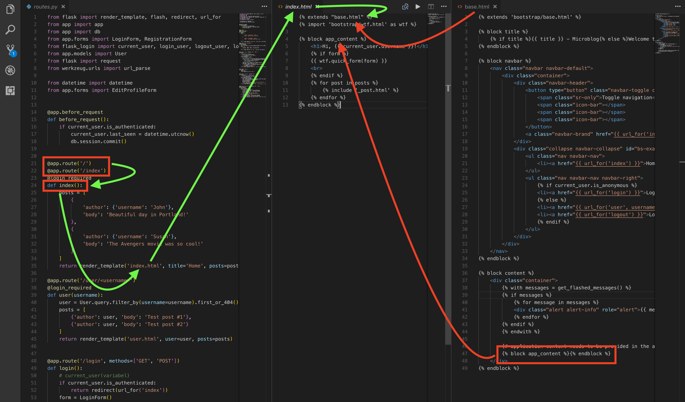
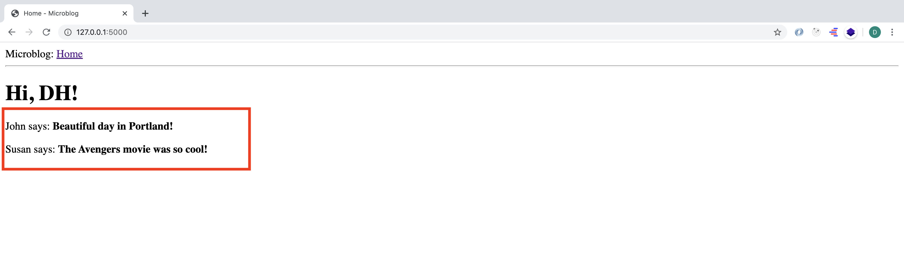

# MICRO-BLOG-DOC (Part 2)

## `Section: Front End`(Template in python web development.)

### `Summary`: In this documentation, we learn how to use template feature in python web development.（连接 HTML templates）

### `Check Dependencies:`

- flask 
- python-dotenv 

### `Brief Contents & codes position`
- 2.1 Create a html file to take care of the general page structure。
    - `Location: ./app/templates/base.html`
- 2.2 Create a new html as derived template from the same base.html template.
    - `Location: ./app/templates/index.html`

---------------------------------------------

- 2.3 Change some code in `routes.py` and render the templates.
    - `Location: ./app/routes.py`

### `Step1: Create a html file to take care of the general page structure.`

#### `(*2.1)Location: ./app/templates/base.html`

```html
<html>
    <head>
      
      <title>{{ title }} - Microblog</title>
      
      <title>Welcome to Microblog</title>
      
    </head>
    <body>
        <div>Microblog: <a href="/index">Home</a></div>
        <hr>
        
    </body>
</html>
```

#### `Comment:`
- 知识点：if-else

### `Step2. Create a new html as derived template(同源子页) from the same base.html template.`

#### `(*2.2)Location: ./app/templates/index.html`

```html



    <h1>Hi, {{ user.username }}!</h1>
    
    <div><p>{{ post.author.username }} says: <b>{{ post.body }}</b></p></div>
    

```

#### `Comment:`
- 知识点：loops
- 知识点：Template Inheritance

### `Step3.Change some code in ‘routes.py’ and render the templates.`
#### `(*2.3)Location: ./app/routes.py`

```py
from flask import render_template
from app import app

@app.route('/')
@app.route('/index')
def index():
    user = {'username': 'DH'}
    posts = [
        {
            'author': {'username': 'John'},
            'body': 'Beautiful day in Portland!'
        },
        {
            'author': {'username': 'Susan'},
            'body': 'The Avengers movie was so cool!'
        }
    ]
    return render_template('index.html', title='Home', user=user, posts=posts)
```

#### `Comment:`
- 知识点：类似react中的`passing state to component`.
- 在这里，统称 __`view function`__.

### `Step4.Concept questions.`

#### `A. What is templates?`

- Templates help achieve this separation between presentation and business logic. In Flask, templates are written as separate files, stored in a templates folder that is inside the application package.

#### `B. What does the {...} mean in flask templates?`

- These placeholders represent the parts of the page that are variable and will only be known at runtime.

#### `C. What is 'render_templates' function?`
- This function takes a template filename and a variable list of template arguments and returns the same template, but with all the placeholders in it replaced with actual values.

#### `D. How does Template Inheritance works?`

-  The extends statement establishes the inheritance link between the two templates, so that Jinja2 knows that when it is asked to render index.html it needs to embed it inside base.html. The two templates have matching block statements with name content, and this is how Jinja2 knows how to combine the two templates into one. 

#### `E. How the application works in this structure.`

<p align="center">

</p>

### `Step5: Run the application.`

- Run the command:
```bash
(venv) $ flask run
```
<p align="center">

</p>


### `总结：`

- flask 如何`render html 文件`，又是如何拼接 html 文件以达到重复利用的效果。
- flask 下 html 的基本格式。
- view function 是如何向 html 文件传递变量的。