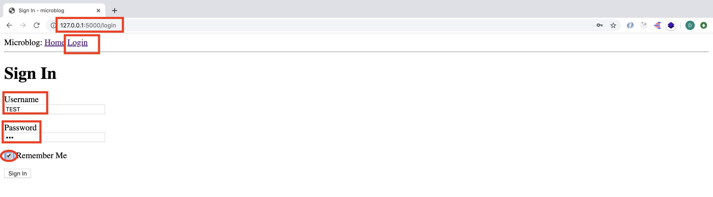
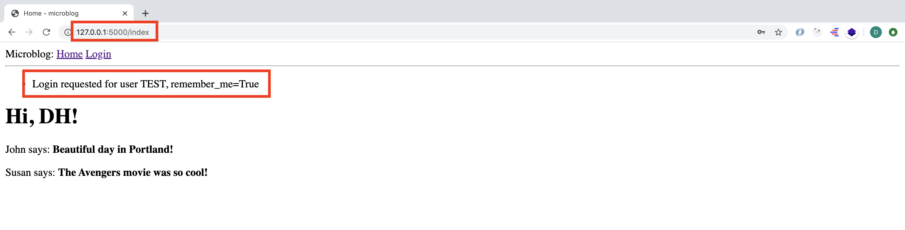
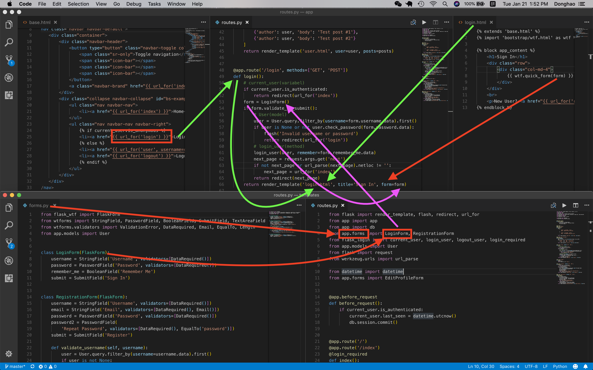

# MICRO-BLOG-DOC (Part 3)

## `Section: Front End`(Web Forms.)

### `Summary`: In this documentation, we learn how to build a web form and recieve data. （view function + class + form 结构）

### `Check Dependencies:`

- flask 
- python-dotenv

```diff
+ flask-wtf (new)
``` 

### `Brief Contents & codes position`
- 3.1 Install new extension, Set up global variables configuration and use them in `Flask configuration`.
    - `(*3.1)Location: ./config.py,`
    - `(*3.2)Location: ./app/__init__.py`.

- 3.2 Create a web form class.
    - `(*3.3)Location: ./app/forms.py`

- 3.3 Create a corresponding HTML template. 
    - `(*3.4)Location: ./app/templates/login.html`

- 3.4 Create a view function to handle the form.
    - `(*3.5)Location: ./app/routes.py`

- 3.5 Set up a link for login template.
    - `(*3.6)Location: ./app/templates/base.html`

### `Step1: Install new extension, Set up global variables configuration and use them in Flask configuration.`

##### 1.Install extension
```bash
(venv) $ pip install flask-wtf
```

##### 2.`(*3.1)Location: ./config.py`
```py
import os

class Config(object):
    SECRET_KEY = os.environ.get('SECRET_KEY') or 'you-will-never-guess'
```

```diff
+ 在 ./.flaskenv 中的叫 pre environment variable
+ 在 ./config.py 中的叫 configuration global variable
```

##### 3.`(*3.2)Location: ./app/__init__.py`

```py
from flask import Flask
from config import Config

app = Flask(__name__)
app.config.from_object(Config)

from app import routes
```

### `Step2. Create a web form class.`

##### `(*3.3)Location: ./app/forms.py`

```py
from flask_wtf import FlaskForm
from wtforms import StringField, PasswordField, BooleanField, SubmitField
from wtforms.validators import DataRequired

class LoginForm(FlaskForm):
    username = StringField('Username', validators=[DataRequired()])
    password = PasswordField('Password', validators=[DataRequired()])
    remember_me = BooleanField('Remember Me')
    submit = SubmitField('Sign In')
```

#### `Comment:`
- 在这里定义了form将会收到哪些key，这些key的value是怎样定义的，有什么样的validation和required。
- 这里定义的主要是变量的个数和存在格式。（四个变量：username, password, remember_me, submit）

### `Step3 Create a corresponding HTML template.`
##### `(*3.4)Location: ./app/templates/login.html`

```html



    <h1>Sign In</h1>
    <form action="" method="post" novalidate>
        {{ form.hidden_tag() }}
        <p>
            {{ form.username.label }}<br>
            {{ form.username(size=32) }}<br>
            
            <span style="color: red;">[{{ error }}]</span>
            
        </p>
        <p>
            {{ form.password.label }}<br>
            {{ form.password(size=32) }}<br>
            
            <span style="color: red;">[{{ error }}]</span>
            
        </p>
        <p>{{ form.remember_me() }} {{ form.remember_me.label }}</p>
        <p>{{ form.submit() }}</p>
    </form>

```

#### `Comment:`
- 这里主要是定义了表格的外部呈现模式还有变量的位置，可以看见上面定义的四个变量都在这里面。


### `Step4 Create a view function to handle the form.`
##### `(*3.5)Location: ./app/routes.py`

```py
from flask import render_template, flash, redirect, url_for
from app import app
from app.forms import LoginForm

@app.route('/')
@app.route('/index')
def index():
    user = {'username': 'DH'}
    posts = [
        {
            'author': {'username': 'John'},
            'body': 'Beautiful day in Portland!'
        },
        {
            'author': {'username': 'Susan'},
            'body': 'The Avengers movie was so cool!'
        }
    ]
    return render_template('index.html', title='Home', user=user, posts=posts)

@app.route('/login', methods=['GET', 'POST'])
def login():
    form = LoginForm()
    if form.validate_on_submit():
        flash('Login requested for user {}, remember_me={}'.format(
            form.username.data, form.remember_me.data))
        return redirect(url_for('index'))
    return render_template('login.html', form=form, title='Sign In')
```

#### `Comment:`
- 在这里进行了两个大动作，一个是新增了一个 view function ，另一个是把 class 和 template 用 view function `map`起来。

### `Step5 Set up a link for login template.`
##### `(*3.6)Location: ./app/templates/base.html`

```html
<html>
    <head>
        
        <title>{{ title }} - microblog</title>
        
        <title>microblog</title>
        
    </head>
    <body>
        <div>
            Microblog:
            <a href="{{ url_for('index') }}">Home</a>
            <a href="{{ url_for('login') }}">Login</a>
        </div>
        <hr>
        
        
        <ul>
            
            <li>{{ message }}</li>
            
        </ul>
        
        
        
    </body>
</html>
```

#### `Comment:`
- 经过整合之后，目前能实现的功能是，当用户在form填入数据时，然后调用在`routes.py`flash函数就可以储存在form中填入的指定数据，最后在`base.html`中调用get_flashed_messages()显示出来。


### `Step6.Concept questions.`
#### `A. What is Extension?`

- Extensions are very important part of the Flask ecosystem, as they provide solutions to problems that Flask is intentionally not opinionated about.

- Flask extensions are regular Python packages that are installed with pip.

#### `B. How to recieve form data?` （IMPORTANT）

- The __`form.validate_on_submit()`__ method does all the form processing work. When the browser sends the GET request to receive the web page with the form, this method is going to return False, so in that case the function skips the if statement and goes directly to render the template in the last line of the function.

- When the browser sends the POST request as a result of the user pressing the submit button, __`form.validate_on_submit()`__ is going to gather all the data, run all the validators attached to fields, and if everything is all right it will return True, indicating that the data is valid and can be processed by the application. But if at least one field fails validation, then the function will return False, and that will cause the form to be rendered back to the user, like in the GET request case.

#### `C. How to render the flashed messages?`
- When you call the __`flash()`__ function, Flask stores the message, but flashed messages will not magically appear in web pages. The templates of the application need to render these flashed messages in a way that works for the site layout.

- Here I'm using a with construct to assign the result of calling __`get_flashed_messages()`__ to a messages variable, all in the context of the template. The get_flashed_messages() function comes from Flask, and returns a list of all the messages that have been registered with __`flash()`__ previously. 

### `Step7 TEST.`

- Run the command:
```bash
(venv) $ flask run
```
<p align="center">

</p>

<p align="center">

</p>

### `Step8 Files structure.`
<p align="center">

</p>

#### `*本章的难点在于理解class跟template是怎样在routes.py中对接起来，还有理解相关数据的流动方向与接口。`

### `总结：`

- flask 中常见的开发节奏：link + view function + class + template。
- 如何注册新的`configuration global variable`。
- 如何使用 `flask_wtf` 去完成设计 `form class`。
- `url_for('login')`  这里参数使用的是 view function 名字。