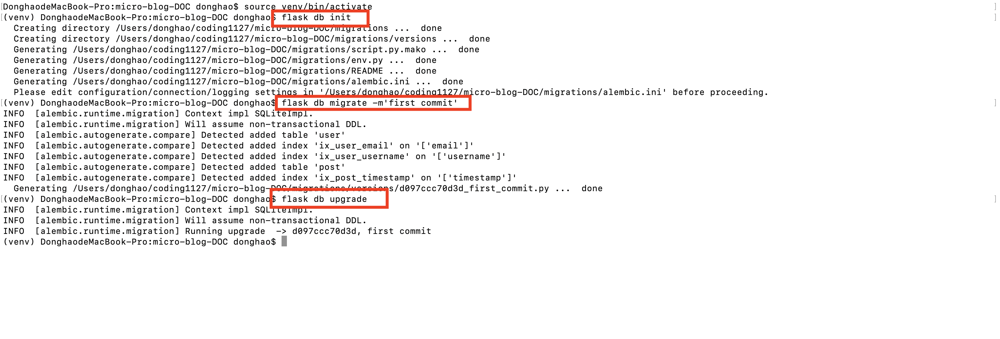
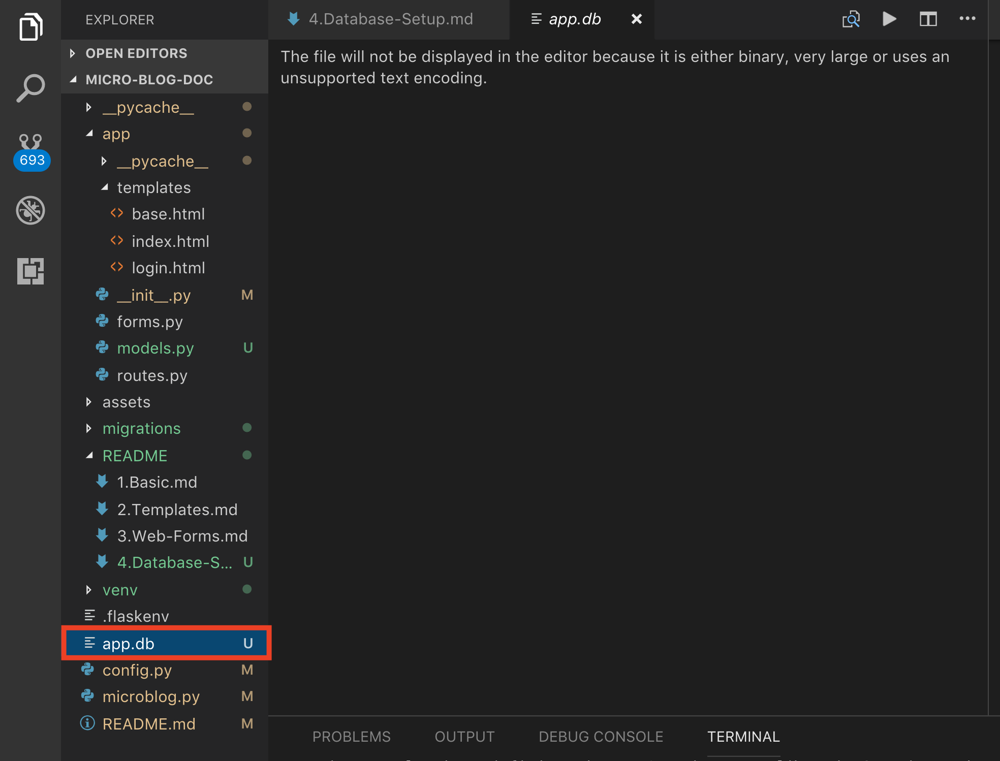
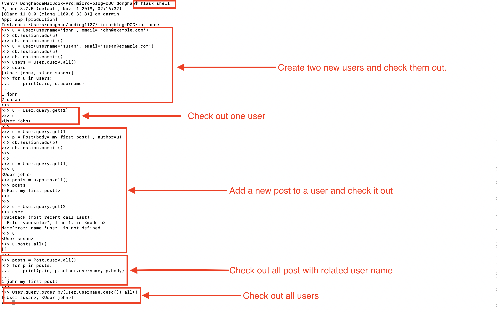

# MICRO-BLOG-DOC (Part 4)

## `Section: Back End`(Database)

### `Summary`: In this documentation, we learn how to setup a database and connect to the application. （数据库文件设置）

### `Check Dependencies:`

- flask 
- python-dotenv
- flask-wtf

```diff
+ flask-sqlalchemy (new)
+ flask-migrate (new)
```

### Flask migrate 常用命令循环
```bash
(venv) $ flask db init # 初始化

(venv) $ flask db migrate -m'<your message>' # 新建一个database文件或者更新database结构

(venv) $ flask db upgrade # 提交并完成新建或更新动作
```

### `Brief Contents & codes position`
- 4.1 Install new extensions, Set up global environment configuration.
    - `(*4.1)Location: ./config.py`.

- 4.2 Create instance right after the flask application is created.
    - `(*4.2)Location: ./app/__init__.py`

- 4.3 Set up data model. 
    - `(*4.3)Location: ./app/model.py`

- 4.4 General flask-migrate commands. 
    - `Location: ./app/routes.py`

- 4.5 Set up flask shell.
    - `(*4.4)Location: ./microblog.py`

### `Step1: Install new extensions, Set up global environment configuration.`

##### 1.Install extension
```bash
(venv) $ pip install flask-sqlalchemy
(venv) $ pip install flask-migrate
```

##### 2.`(*4.1)Location: ./config.py`
```py
import os
basedir = os.path.abspath(os.path.dirname(__file__))

class Config(object):
    SECRET_KEY = os.environ.get('SECRET_KEY') or 'you-will-never-guess'
    SQLALCHEMY_DATABASE_URI = os.environ.get('DATABASE_URL') or \
        'sqlite:///' + os.path.join(basedir, 'app.db')
    SQLALCHEMY_TRACK_MODIFICATIONS = False
```

#### `Comment:`
- It is in general a good practice to set configuration from environment variables, and provide a fallback value when the environment does not define the variable.


### `Step2. Create instance right after the flask application is created.` （加载新 extension）

##### `(*4.2)Location: ./app/__init__.py`

```py
from flask import Flask
from config import Config
from flask_sqlalchemy import SQLAlchemy
from flask_migrate import Migrate

app = Flask(__name__)
app.config.from_object(Config)
db = SQLAlchemy(app)
migrate = Migrate(app, db)

from app import routes, models
```

#### `Comment:`
- 改变的地方：db, migrate, models
- The database is going to be represented in the application by the database instance. The database migration engine will also have an instance. These are objects that need to be created after the application.

### `Step3 Set up data models.`
##### `(*4.3)Location: ./app/models.py`

```py
from datetime import datetime
from app import db

class User(db.Model):
    id = db.Column(db.Integer, primary_key=True)
    username = db.Column(db.String(64), index=True, unique=True)
    email = db.Column(db.String(120), index=True, unique=True)
    password_hash = db.Column(db.String(128))
    posts = db.relationship('Post', backref='author', lazy='dynamic')

    def __repr__(self):
        return '<User {}>'.format(self.username)

class Post(db.Model):
    id = db.Column(db.Integer, primary_key=True)
    body = db.Column(db.String(140))
    timestamp = db.Column(db.DateTime, index=True, default=datetime.utcnow)
    user_id = db.Column(db.Integer, db.ForeignKey('user.id'))

    def __repr__(self):
        return '<Post {}>'.format(self.body)
```

#### `Comment:`
- 这里主要是定义两个model，一个是user，另外一个是post。

### `Step4 General flask-migrate commands.`

#### `1. Create a migration repository`
```bash
(venv) $ flask db init
```

#### `2. Generates the migration script`
```bash
(venv) $ flask db migrate -m'<your message>'
```

#### `3. To apply the changes to the database, the flask db upgrade command must be used.`(更新model的结构)
```bash
(venv) $ flask db upgrade
```

#### `Comment:`
- Because this application uses SQLite, the upgrade command will detect that a database does not exist and will create it (you will notice a file named app.db is added after this command finishes, that is the SQLite database). 

- But with database migration support, after you modify the models in your application you generate a new migration script (flask db migrate), you probably review it to make sure the automatic generation did the right thing, and then apply the changes to your development database (flask db upgrade). You will add the migration script to source control and commit it.`（类似Git的操作）`

### `Step5 Set up flask shell.` （便捷方式）
##### `(*4.4)Location: ./microblog.py`

```py
from app import app, db
from app.models import User, Post

@app.shell_context_processor
def make_shell_context():
    return {'db': db, 'User': User, 'Post': Post}
```

#### `Comment:`
- The app.shell_context_processor decorator registers the function as a shell context function. When the flask shell command runs, it will invoke this function and register the items returned by it in the shell session. The reason the function returns a dictionary and not a list is that for each item you have to also provide a name under which it will be referenced in the shell, which is given by the dictionary keys.

- 未设置flask shell之前的运行命令：
```bash
(venv) $ python3
>>> from app import db
>>> from app.models import User, Post
>>> db
# ...
```

- 设置好flask shell后需要的运行命令：
```bash
(venv) $ flask shell
>>> db
# ...
```

- If you try the above and get NameError exceptions when you access db, User and Post, then the make_shell_context() function is not being registered with Flask. The most likely cause of this is that you have not set FLASK_APP=microblog.py in the environment.

### `Step6.Concept questions.`
#### `A. What is SQLite database?`

- During development, I'm going to use a SQLite database. SQLite databases are the most convenient choice for developing small applications, sometimes even not so small ones, as each database is stored in a single file on disk and there is no need to run a database server like MySQL and PostgreSQL.

#### `B. How to choose between relational databases and NoSQL database?`

- While there are great database products in both groups, my opinion is that relational databases are a better match for applications that have structured data such as lists of users, blog posts, etc., while NoSQL databases tend to be better for data that has a less defined structure.

#### `C. What is Flask-SQLAlchemy, what is ORM?`
- Flask-SQLAlchemy, an extension that provides a Flask-friendly wrapper to the popular SQLAlchemy package, which is an Object Relational Mapper or ORM. ORMs allow applications to manage a database using high-level entities such as classes, objects and methods instead of tables and SQL. The job of the ORM is to translate the high-level operations into database commands.

- The nice thing about SQLAlchemy is that it is an ORM not for one, but for many relational databases. SQLAlchemy supports a long list of database engines, including the popular MySQL, PostgreSQL and SQLite.

#### `D. What is Flask-Migrate?`
- As the application continues to grow, there is going to be a need change that structure, very likely to add new things, but sometimes also to modify or remove items. Alembic (the migration framework used by Flask-Migrate) will make these schema changes in a way that does not require the database to be recreated from scratch.


#### `E. How to mulipulate data to database?`
- Changes to a database are done in the context of a session, which can be accessed as db.session. Multiple changes can be accumulated in a session and once all the changes have been registered you can issue a single db.session.commit(), which writes all the changes atomically. If at any time while working on a session there is an error, a call to db.session.rollback() will abort the session and remove any changes stored in it. `The important thing to remember is that changes are only written to the database when db.session.commit() is called.`


#### `F. How flask shell works?`
- With a regular interpreter session, the app symbol is not known unless it is explicitly imported, but when using flask shell, the command pre-imports the application instance. The nice thing about flask shell is not that it pre-imports app, but that you can configure a "shell context", which is a list of other symbols to pre-import.

- The app.shell_context_processor decorator registers the function as a shell context function. When the flask shell command runs, it will invoke this function and register the items returned by it in the shell session. The reason the function returns a dictionary and not a list is that for each item you have to also provide a name under which it will be referenced in the shell, which is given by the dictionary keys.

 - After you add the shell context processor function you can work with database entities without having to import them.

### `Step7 TEST.`

- Run the command:
<p align="center">

</p>

- File structure
<p align="center">

</p>

- Run database commands
<p align="center">

</p>

### `总结：`

- 使用两个新的 extension：`flask-sqlalchemy 和 flask-migrate`。
- 同样是建立 class，`flask-sqlalchemy 的 model class`和 `flask_wft 的 form class`不一样。
- 如何使用 `flask-wtf` 去完成设计 `form class`。
- 更新数据库结构的命令集，对应数据库：SQLite。
- 什么是 flask shell。
- db shell 的命令是可以写在py文件中的。