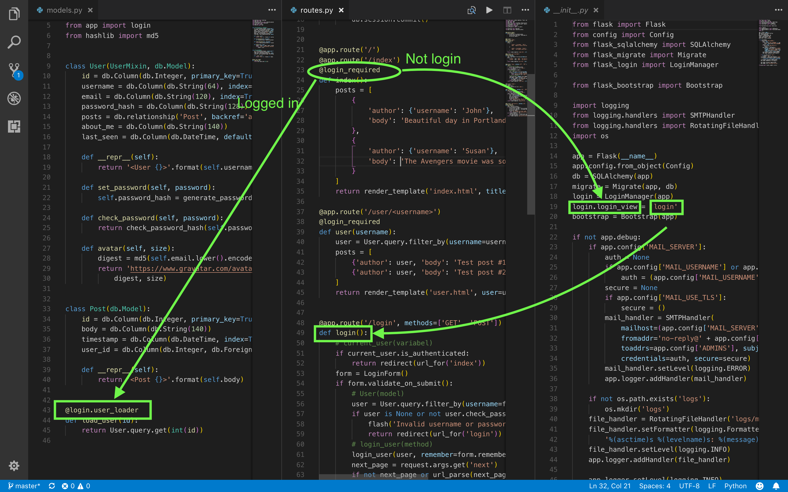
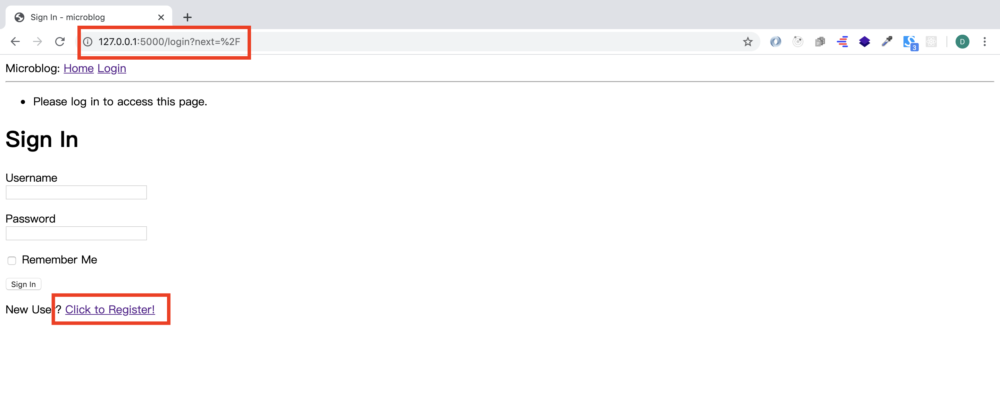
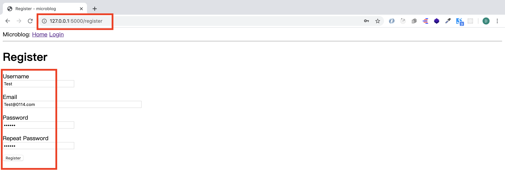
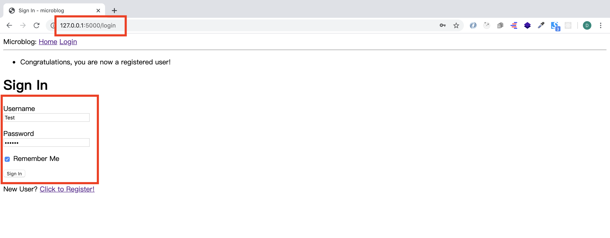
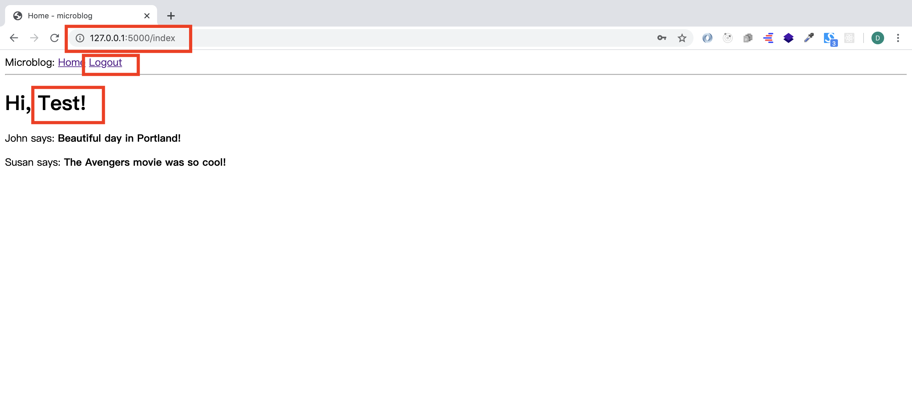
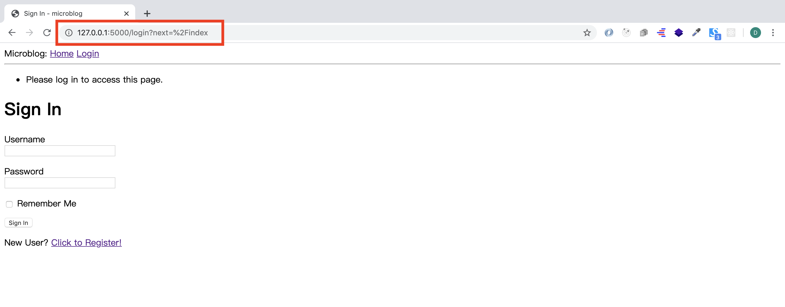

# MICRO-BLOG-DOC (Part 5)

## `Section: Back End`(User Logins)

### `Summary`: In this documentation, we learn how to setup functionalities about user login, logout, and register. （使用复杂 extension）

### `Check Dependencies:`

- flask 
- python-dotenv
- flask-wtf
- flask-sqlalchemy
- flask-migrate
- datetime (built-in)

```diff
+ flask-login (new)
+ werkzeug.security (built-in)
```

### 本章使用的外部函数：

#### `flask_login:`
```diff
+ UserMixin
+ current_user.is_anonymous (UserMixin)
+ current_user.is_authenticated (UserMixin)

+ LoginManager
+ login = LoginManager(app)
+ login.login_view = 'login'
+ @login.user_loader
+ current_user, login_user, logout_user, login_required
+ current_user.username
```

#### `werkzeug:`
```diff
+ generate_password_hash, check_password_hash
+ url_parse
```
#### `flask:`
```diff
+ request
+ next_page = request.args.get('next')
```
#### `wtforms.validators:`
```diff
+ ValidationError, DataRequired, Email, EqualTo
+ validate_<field_name>
```

- load_user(id)这个函数在`flask-login`中自动调用了。

- 在这里必须要说一下，form.py类中定义的 `validate_username(self, username), validate_email(self, email)` 是自启动函数，不需要外部调动解释如下:

- I have also added two methods to this class called validate_username() and validate_email(). When you add any methods that match the pattern __`validate_<field_name>`__, __`WTForms`__ takes those as custom validators and invokes them in addition to the stock validators. In this case I want to make sure that the username and email address entered by the user are not already in the database, so these two methods issue database queries expecting there will be no results. In the event a result exists, a validation error is triggered by raising ValidationError. The message included as the argument in the exception will be the message that will be displayed next to the field for the user to see.


### `Brief Contents & codes position`
- 5.1 Install new extension and create instance right after the flask application is created. 
    - __`(*5.1)Location: ./app/__init__.py`__
- 5.2 Add __`UserMixin`__ ，__`werkzeug`__ functions and __login__ method to models.py. 
    - __`(*5.2)Location: ./app/models.py`__

- 5.3 Add new login and logout features in routes. 
    - __`Location: ./app/routes.py`__

- 5.4 Expose logout link to users. 
    - __`(*5.3)Location: ./app/templates/base.html`__

- 5.5 Showing the Logged In User in Templates.
    - __`(*5.4)Location: ./app/templates/index.html`__

-------------------------------------------------------------------

- 5.6 Add a RegistrationForm class in `forms.py`. 
    - __`(*5.5)Location: ./app/forms.py`__

- 5.7 Create a corresponding HTML template.
    - __`(*5.6)(*5.7)Location: ./app/templates/register.html`__

- 5.8 Create a view function to handle this form.
    - __`(*5.8)Location: ./app/routes.py`__

### `Step1: Install new extension and create instance right after the flask application is created.`

#### `Install:`
```bash
(venv) $ pip install flask-login
```

##### `(*5.1)Location: ./app/__init__.py`

```py
from flask import Flask
from config import Config
from flask_sqlalchemy import SQLAlchemy
from flask_migrate import Migrate
from flask_login import LoginManager

app = Flask(__name__)
app.config.from_object(Config)
db = SQLAlchemy(app)
migrate = Migrate(app, db)
login = LoginManager(app)
login.login_view = 'login'

from app import routes, models
```

#### `Comment:`
1. As with other extensions, __`Flask-Login`__ needs to be created and initialized right after the application instance in __`app/__init__.py`__.

```py
from flask_login import LoginManager
#...
login = LoginManager(app)
```

2. 用于实现登陆后返回上一个受保护（需登录）网页功能的插件，就是未登录用户访问了需要登陆的网页，网页自动跳转回到登陆界面（view function），登陆成功后自动跳转到之前受保护的网页继续浏览。

（***指定返回界面）
```py
login.login_view = 'login'
```
- Flask-Login provides a very useful feature that forces users to log in before they can view certain pages of the application. If a user who is not logged in tries to view a protected page, Flask-Login will automatically redirect the user to the login form, and only redirect back to the page the user wanted to view after the login process is complete.

- The 'login' value above is the function (or endpoint) name for the login view. In other words, the name you would use in a url_for() call to get the URL.

- 原理图：
<p align="center">

</p>

### `Step2. Add UserMixin，werkzeug functions and login method to models.py.`

##### `(*5.2)Location: ./app/models.py`

```py
from datetime import datetime
from app import db
from werkzeug.security import generate_password_hash, check_password_hash
from flask_login import UserMixin
from app import login

class User(UserMixin, db.Model):
    id = db.Column(db.Integer, primary_key=True)
    username = db.Column(db.String(64), index=True, unique=True)
    email = db.Column(db.String(120), index=True, unique=True)
    password_hash = db.Column(db.String(128))
    posts = db.relationship('Post', backref='author', lazy='dynamic')

    def __repr__(self):
        return '<User {}>'.format(self.username)
    
    def set_password(self, password):
        self.password_hash = generate_password_hash(password)

    def check_password(self, password):
        return check_password_hash(self.password_hash, password)

class Post(db.Model):
    id = db.Column(db.Integer, primary_key=True)
    body = db.Column(db.String(140))
    timestamp = db.Column(db.DateTime, index=True, default=datetime.utcnow)
    user_id = db.Column(db.Integer, db.ForeignKey('user.id'))

    def __repr__(self):
        return '<Post {}>'.format(self.body)

@login.user_loader
def load_user(id):
    return User.query.get(int(id))
```

#### `Comment:`
1. Add __`UserMixin`__ to User model.(`UserMixin`是来自`flask_login`新组件，给user添加状态信息。)
```py
from flask_login import UserMixin
#...
class User(UserMixin, db.Model):
```

2. Add __`werkzeug`__ functions and add them to User model.(给User加入加密method。)
```py
from werkzeug.security import generate_password_hash, check_password_hash
#...
def set_password(self, password):
    self.password_hash = generate_password_hash(password)

def check_password(self, password):
    return check_password_hash(self.password_hash, password)
```

3. Add login method, and the method will run automatically when a logged in user try to view protected page.

```py
@login.user_loader
def load_user(id):
    return User.query.get(int(id))
```

4. Now that the application has access to a user database and knows how to generate and verify password hashes, this view function can be completed.(建模完成，下面准备调用实现目标功能。)

### `Step3 Add new login and logout features in routes.`
##### `Location: ./app/routes.py`

```py
from flask import render_template, flash, redirect, url_for
from app import app
from app.forms import LoginForm
from flask_login import current_user, login_user, logout_user, login_required
from app.models import User
from flask import request
from werkzeug.urls import url_parse

@app.route('/')
@app.route('/index')
@login_required
def index():
    user = {'username': 'DH'}
    posts = [
        {
            'author': {'username': 'John'},
            'body': 'Beautiful day in Portland!'
        },
        {
            'author': {'username': 'Susan'},
            'body': 'The Avengers movie was so cool!'
        }
    ]
    return render_template('index.html', title='Home', user=user, posts=posts)

@app.route('/login', methods=['GET', 'POST'])
def login():
    # current_user(variabel)
    if current_user.is_authenticated: 
        return redirect(url_for('index'))
    form = LoginForm()
    if form.validate_on_submit():
        # User(model)
        user = User.query.filter_by(username=form.username.data).first()
        if user is None or not user.check_password(form.password.data):
            flash('Invalid username or password')
            return redirect(url_for('login'))
        # login_user(method)
        login_user(user, remember=form.remember_me.data)
        next_page = request.args.get('next')
        if not next_page or url_parse(next_page).netloc != '':
            next_page = url_for('index')
        return redirect(next_page)
    return render_template('login.html', title='Sign In', form=form)

@app.route('/logout')
def logout():
    logout_user()
    return redirect(url_for('index'))
```

#### `Comment:`
1. 引入model和flask_login的built-in变量和函数
```py
from flask_login import current_user, login_user, logout_user, login_required
from app.models import User
```

2. 使用这些变量和函数。
```py
@app.route('/login', methods=['GET', 'POST'])
def login():
    # current_user(variabel)
    if current_user.is_authenticated: 
        return redirect(url_for('index'))
    form = LoginForm()
    if form.validate_on_submit():
        # User(model)
        user = User.query.filter_by(username=form.username.data).first()
        if user is None or not user.check_password(form.password.data):
            flash('Invalid username or password')
            return redirect(url_for('login'))
        # login_user(method)
        login_user(user, remember=form.remember_me.data)
        next_page = request.args.get('next')
        if not next_page or url_parse(next_page).netloc != '':
            next_page = url_for('index')
        return redirect(next_page)
    return render_template('login.html', title='Sign In', form=form)

@app.route('/logout')
def logout():
    # logout_user(method)
    logout_user()
    return redirect(url_for('index'))
```

3. 向指定route加入flask_login中的 __`@login_required`__，规定需要完成登陆之后才能浏览的 protected route，如果没有登陆，则返回在`./app/__init__.py`中设定好的 view function。

```py
@app.route('/')
@app.route('/index')
@login_required
```

4. 对应 __`第一步`__ 中的登陆返回原受保护网页功能。
```py
from flask import request
from werkzeug.urls import url_parse
#...

    next_page = request.args.get('next')
    if not next_page or url_parse(next_page).netloc != '':
        next_page = url_for('index')
    return redirect(next_page)
```

5. Do not pass user to template anymore.
```py
return render_template('login.html', title='Sign In', form=form)
```

6. 使用 User model 已定义的 __`check_password`__
```py
    if user is None or not user.check_password(form.password.data):
        flash('Invalid username or password')
        return redirect(url_for('login'))
```

### `Step4 Expose logout link to users.`
##### `(*5.3)Location: ./app/templates/base.html`

```html
<html>

<head>
    
    <title>{{ title }} - microblog</title>
    
    <title>microblog</title>
    
</head>

<body>
    <div>
        Microblog:
        <a href="{{ url_for('index') }}">Home</a>
        
        <a href="{{ url_for('login') }}">Login</a>
        
        <a href="{{ url_for('logout') }}">Logout</a>
        
    </div>
    <hr>  
    <ul>
        
        <li>{{ message }}</li>
        
    </ul>
      
</body>

</html>
```

#### `Comment:`
1. 这里主要是使用了if else还有flask_login的 __`current_user.is_anonymous`__ 变量，来自 __`UserMixin`__。
```html
    
    <a href="{{ url_for('login') }}">Login</a>
    
    <a href="{{ url_for('logout') }}">Logout</a>
    
```
2. The __`is_anonymous`__ property is one of the attributes that Flask-Login adds to user objects through the UserMixin class. The __`current_user.is_anonymous`__ expression is going to be True only when the user is not logged in.

### `Step5 Showing the Logged In User in Templates.`
##### `(*5.4)Location: ./app/templates/index.html`

```html



    <h1>Hi, {{ current_user.username }}!</h1>
    
    <div><p>{{ post.author.username }} says: <b>{{ post.body }}</b></p></div>
    

```

#### `Comment:`
1. 这里使用了flask_login的 __`current_user.username`__ 变量。

2. What you have so far is:
- If you start the application and try to access http://localhost:5000/ or http://localhost:5000/index, you will be immediately redirected to the login page, and after you log in using the credentials of the user that you added to your database, you will be returned to the original page, in which you will see a personalized greeting.

### `Step6 Add a RegistrationForm class in forms.py.`
##### `(*5.5)Location: ./app/forms.py`

```py
from flask_wtf import FlaskForm
from wtforms import StringField, PasswordField, BooleanField, SubmitField
from wtforms.validators import ValidationError, DataRequired, Email, EqualTo
from app.models import User

class LoginForm(FlaskForm):
    username = StringField('Username', validators=[DataRequired()])
    password = PasswordField('Password', validators=[DataRequired()])
    remember_me = BooleanField('Remember Me')
    submit = SubmitField('Sign In')

class RegistrationForm(FlaskForm):
    username = StringField('Username', validators=[DataRequired()])
    email = StringField('Email', validators=[DataRequired(), Email()])
    password = PasswordField('Password', validators=[DataRequired()])
    password2 = PasswordField(
        'Repeat Password', validators=[DataRequired(), EqualTo('password')])
    submit = SubmitField('Register')

    def validate_username(self, username):
        user = User.query.filter_by(username=username.data).first()
        if user is not None:
            raise ValidationError('Please use a different username.')

    def validate_email(self, email):
        user = User.query.filter_by(email=email.data).first()
        if user is not None:
            raise ValidationError('Please use a different email address.')
```

#### `Comment:`
- 这里添加的 __`validate_username(self, username)`__ 和 __`validate_email(self, email)`__ 都是自启动验证函数。

### `Step7 Create a corresponding HTML template.`

- Create register template.
##### `(*5.6)Location: ./app/templates/register.html`

```html



    <h1>Register</h1>
    <form action="" method="post">
        {{ form.hidden_tag() }}
        <p>
            {{ form.username.label }}<br>
            {{ form.username(size=32) }}<br>
            
            <span style="color: red;">[{{ error }}]</span>
            
        </p>
        <p>
            {{ form.email.label }}<br>
            {{ form.email(size=64) }}<br>
            
            <span style="color: red;">[{{ error }}]</span>
            
        </p>
        <p>
            {{ form.password.label }}<br>
            {{ form.password(size=32) }}<br>
            
            <span style="color: red;">[{{ error }}]</span>
            
        </p>
        <p>
            {{ form.password2.label }}<br>
            {{ form.password2(size=32) }}<br>
            
            <span style="color: red;">[{{ error }}]</span>
            
        </p>
        <p>{{ form.submit() }}</p>
    </form>

```
- Add a link to register view function.
##### `(*5.7)Location: ./app/templates/login.html`

```html



    <h1>Sign In</h1>
    <form action="" method="post" novalidate>
        {{ form.hidden_tag() }}
        <p>
            {{ form.username.label }}<br>
            {{ form.username(size=32) }}<br>
            
            <span style="color: red;">[{{ error }}]</span>
            
        </p>
        <p>
            {{ form.password.label }}<br>
            {{ form.password(size=32) }}<br>
            
            <span style="color: red;">[{{ error }}]</span>
            
        </p>
        <p>{{ form.remember_me() }} {{ form.remember_me.label }}</p>
        <p>{{ form.submit() }}</p>
    </form>
    <p>New User? <a href="{{ url_for('register') }}">Click to Register!</a></p>

```

#### `Comment:`
1. A link to connect __`view function: register`__
```html
<p>New User? <a href="{{ url_for('register') }}">Click to Register!</a></p>
```


### `Step8 Create a view function to handle this form.`
##### `(*5.8)Location: ./app/routes.py`

```py
from flask import render_template, flash, redirect, url_for
from app import app
from app import db
from app.forms import LoginForm, RegistrationForm
from flask_login import current_user, login_user, logout_user, login_required
from app.models import User
from flask import request
from werkzeug.urls import url_parse

@app.route('/')
@app.route('/index')
@login_required
def index():
    posts = [
        {
            'author': {'username': 'John'},
            'body': 'Beautiful day in Portland!'
        },
        {
            'author': {'username': 'Susan'},
            'body': 'The Avengers movie was so cool!'
        }
    ]
    return render_template('index.html', title='Home', user=user, posts=posts)

@app.route('/login', methods=['GET', 'POST'])
def login():
    # current_user(variabel)
    if current_user.is_authenticated: 
        return redirect(url_for('index'))
    form = LoginForm()
    if form.validate_on_submit():
        # User(model)
        user = User.query.filter_by(username=form.username.data).first()
        if user is None or not user.check_password(form.password.data):
            flash('Invalid username or password')
            return redirect(url_for('login'))
        # login_user(method)
        login_user(user, remember=form.remember_me.data)
        next_page = request.args.get('next')
        if not next_page or url_parse(next_page).netloc != '':
            next_page = url_for('index')
        return redirect(next_page)
    return render_template('login.html', title='Sign In', form=form)

@app.route('/logout')
def logout():
    logout_user()
    return redirect(url_for('index'))

@app.route('/register', methods=['GET', 'POST'])
def register():
    if current_user.is_authenticated:
        return redirect(url_for('index'))
    form = RegistrationForm()
    if form.validate_on_submit():
        user = User(username=form.username.data, email=form.email.data)
        user.set_password(form.password.data)
        db.session.add(user)
        db.session.commit()
        flash('Congratulations, you are now a registered user!')
        return redirect(url_for('login'))
    return render_template('register.html', title='Register', form=form)
```

#### `Comment:`
1. This view function should also be mostly self-explanatory. I first make sure the user that invokes this route is not logged in. The form is handled in the same way as the one for logging in. The logic that is done inside the if validate_on_submit() conditional creates a new user with the username, email and password provided, writes it to the database, and then redirects to the login prompt so that the user can log in.

2. Import form and db.
```py
from app import db
from app.forms import LoginForm, RegistrationForm
```

3. 使用 User model 已定义的 __`set_password`__

```py
if form.validate_on_submit():
    user = User(username=form.username.data, email=form.email.data)
    user.set_password(form.password.data)
    db.session.add(user)
    db.session.commit()
    flash('Congratulations, you are now a registered user!')
    return redirect(url_for('login'))
```

### `Step9 Concept questions.`

#### `A. How does werkzeug work?` `(无需要解密密钥secret但能够进行对比的dependency)`

```bash
>>> from werkzeug.security import generate_password_hash
>>> hash = generate_password_hash('foobar')
>>> hash
'pbkdf2:sha256:50000$vT9fkZM8$04dfa35c6476acf7e788a1b5b3c35e217c78dc04539d295f011f01f18cd2175f'
>>>
>>> from werkzeug.security import check_password_hash
>>> check_password_hash(hash, 'foobar')
True
>>> check_password_hash(hash, 'barfoo')
False
```

1. In the example above, the password foobar is transformed into a long encoded string through a series of cryptographic operations that have no known reverse operation, which means that a person that obtains the hashed password will be unable to use it to obtain the original password. As an additional measure, if you hash the same password multiple times, you will get different results, so this makes it impossible to identify if two users have the same password by looking at their hashes.

#### `B. User Loader Function 的设计原理?` （IMPORTANT）
##### `Location: ./app/models.py`
```py
from app import login
# ...

@login.user_loader
def load_user(id):
    return User.query.get(int(id))
```

- 注意，login 是来自 __`flask-login`__ 的，同样 @login.user_loader 也是来自 __`flask-login`__， 它这里已经封装好大部分功能，包括当检测到protected网页的时候自动调用，`load_user(id)` 是用来指明需要从什么方式和地方调用身份信息。

1. Flask-Login keeps track of the logged in user by storing its unique identifier in Flask's user session, a storage space assigned to each user who connects to the application. Each time the logged-in user navigates to a new page, Flask-Login retrieves the ID of the user from the session, and then loads that user into memory.

2. Because Flask-Login knows nothing about databases, it needs the application's help in loading a user. For that reason, the extension expects that the application will configure a user loader function, that can be called to load a user given the ID.

3. The user loader is registered with Flask-Login with the @login.user_loader decorator. The id that Flask-Login passes to the function as an argument is going to be a string, so databases that use numeric IDs need to convert the string to integer as you see above.

#### `C. 如何解释登陆返回功能?`
```py
    next_page = request.args.get('next')
    if not next_page or url_parse(next_page).netloc != '':
        next_page = url_for('index')
    return redirect(next_page)
```
1. If the login URL does not have a next argument, then the user is redirected to the index page.
2. If the login URL includes a next argument that is set to a relative path (or in other words, a URL without the domain portion), then the user is redirected to that URL.
3. If the login URL includes a next argument that is set to a full URL that includes a domain name, then the user is redirected to the index page.
4. The first and second cases are self-explanatory. The third case is in place to make the application more secure. An attacker could insert a URL to a malicious site in the next argument, so the application only redirects when the URL is relative, which ensures that the redirect stays within the same site as the application. To determine if the URL is relative or absolute, I parse it with Werkzeug's url_parse() function and then check if the netloc component is set or not.


#### `D. UserMixin 的作用?`（给用户添加状态信息，4个动态属性）
1. The four required items are listed below:

- is_authenticated: a property that is True if the user has valid credentials or False otherwise.
- is_active: a property that is True if the user's account is active or False otherwise.
- is_anonymous: a property that is False for regular users, and True for a special, anonymous user.
- get_id(): a method that returns a unique identifier for the user as a string (unicode, if using Python 2).

2. I can implement these four easily, but since the implementations are fairly generic, Flask-Login provides a mixin class called UserMixin that includes generic implementations that are appropriate for most user model classes.

### `Step10 TEST.`

```bash
(venv) $ flask run
```

1. Because we are going to view http://127.0.0.1:5000/, which is a protected route, so it will redirect to login page.
<p align="center">

</p>

2. Register a new user.
<p align="center">

</p>

3. Redirect back to __`login page`__ after register successfully.
<p align="center">

</p>

4. Login success, now we are viewing __`http://127.0.0.1:5000/`__, with a new button __`Logout`__
<p align="center">

</p>

5. Click __`Logout`__, and redirect to __`login page`__
<p align="center">

</p>

### `总结：`

- 本章的难度在于弄清楚新的 extension 带来的自定义变量，封装程度高。
- 第二步是难点，加入了很多新的function。
- 重点在于第2、3、8这三个部分。

### `Login 功能的主要部件：`

```diff
+ 指定的返回登陆 view function， login.login_view = 'login'
+ UserMixin， 对用户的登录状态信息的记录
+ @login.user_loader， 当浏览受保护网页时读取用户信息和权限
+ @login_required， 对特定 view function 进行浏览登陆保护
+ login_user(), flask_login中自定义的把信息注册到extension的函数
```

