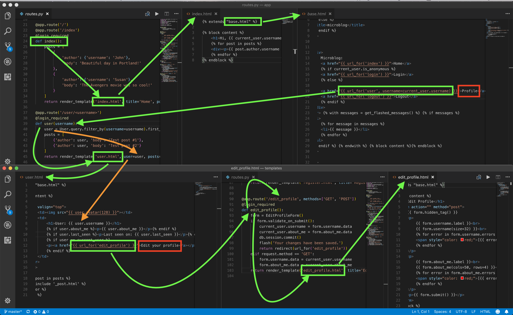
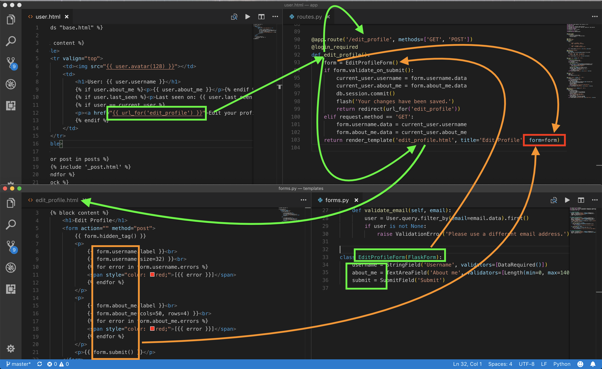
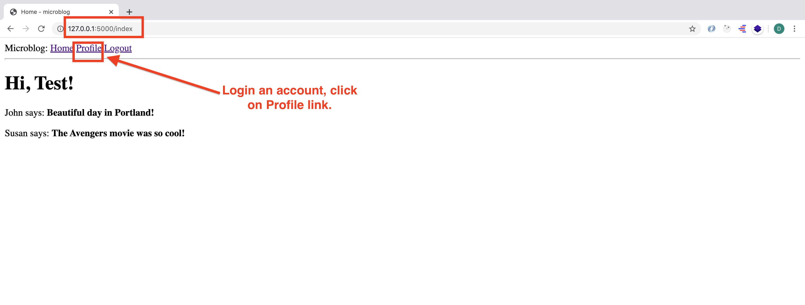
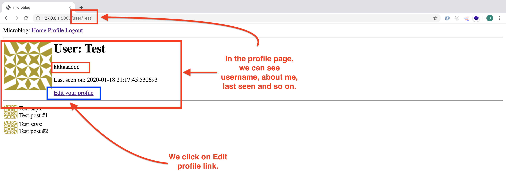
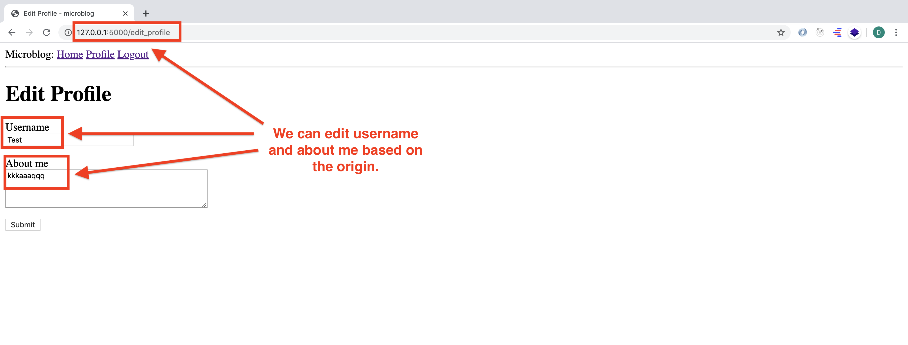
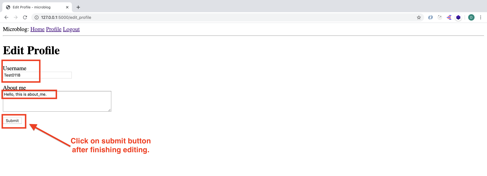
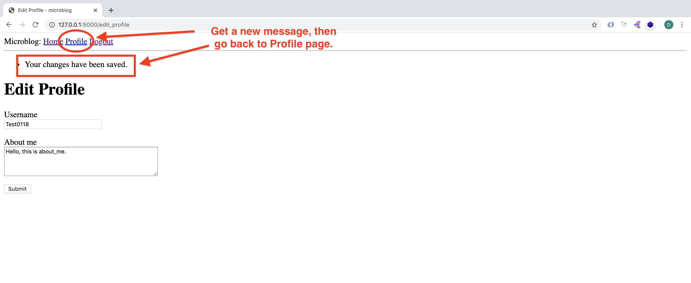
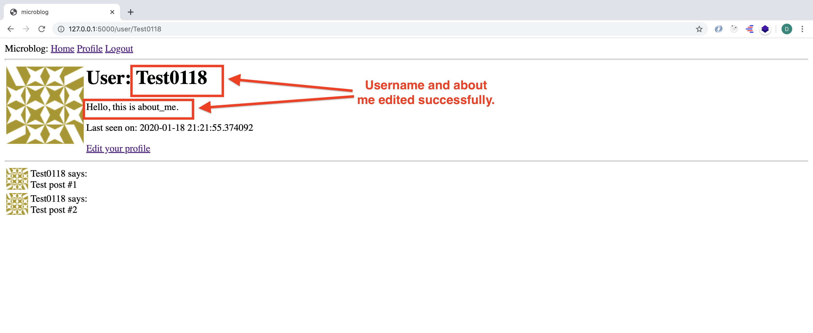

# MICRO-BLOG-DOC (Part 6)

## `Section: Back End`(Profile and Avartars)

### `Summary`: In this documentation, we learn how to set up Profile page and some avatars, also we implement editing profile. （新增数据库 columns）

### `Check Dependencies:`

- flask 
- python-dotenv
- flask-wtf
- flask-sqlalchemy
- flask-migrate
- flask-login
- werkzeug.security (built-in)
- datetime (built-in)

### 本章主要实现功能：
1. 有一个link可以连接 __`user.html`__，进行查看用户 profile。

<p align="center">

</p>

2. 有一个link可以进入 __`edit_profile.html`__ 并进行填表动作。

<p align="center">

</p>

3. 本章的重点在于如何理清各个变量在不同文件之间的传输过程。


### 本章使用的外部函数：

#### `hashlib:`
```diff
+ md5
```

#### `wtfforms:`
```diff
+ TextAreaField
```
#### `wtforms.validators:`
```diff
+ Length
```


### `Brief Contents & codes position`
- 6.1 Create a user html template (profile page). 
    - __`(*6.1)Location: ./app/templates/user.html`__
- 6.2 Create a sub-template (for indivitual post) 
    - __`(*6.2)Location: ./app/templates/_post.html`__

- 6.3 Add a new link in base.html to connect user.html (profile page). 
    - __`(*6.3)Location: ./app/templates/base.html`__

- 6.4 Add new columns and method in User model. 
    - __`(*6.4)Location: ./app/model.py`__

- 6.5 Generate a database migration.

-----------------------------------------------------------
- 6.6 Create a profile editing form class. 
    - __`(*6.5)Location: ./app/forms.py`__

- 6.7 Create a profile editing form corresponding html template. 
    - __`(*6.6)Location: ./app/templates/edit_profile.html`__

- 6.8 Create a profile editing form view function. 
    - __`(*6.7)Location: ./app/routes.py`__

### `Step1: Create a user html template.(profile page)`

##### `(*6.1)Location: ./app/templates/user.html`

```html



    <table>
        <tr valign="top">
            <td></td>
            <td>
                <h1>User: {{ user.username }}</h1>
                <p>{{ user.about_me }}</p>
                <p>Last seen on: {{ user.last_seen }}</p>
                
                <p><a href="{{ url_for('edit_profile') }}">Edit your profile</a></p>
                
            </td>
        </tr>
    </table>
    <hr>
    
        
    

```

#### `Comment:`
1. avatar ，在这里它是一个定义在 User model 中的 method。__`avatar是 method 不是 attribute。`__
```html
<td></td>
```
2. Invoke sub-template，把 post 往下传送。
```html

    

```
3. about_me & last seen 从User model中增加。
```html
<p>{{ user.about_me }}</p>
<p>Last seen on: {{ user.last_seen }}</p>
```
4. A link to connect __`edit_profile.html`__， 它这里具体引用的不是一个 Link，而是一个 view function。
```html

    <p><a href="{{ url_for('edit_profile') }}">Edit your profile</a></p>

```

### `Step2: Create a sub-template (for indivitual post).`

##### `(*6.2)Location: ./app/templates/_post.html`

```html
<table>
    <tr valign="top">
        <td>
            
        </td>
        <td>{{ post.author.username }} says:
            <br>{{ post.body }}</td>
    </tr>
</table>
```

#### `Comment:`
1. sub-template
2. avatar，在这里它是一个定义在 User model 中的 method。
```html
<td>
    
</td>
```

### `Step3. Add a new link in base.html to connect user.html (profile page)`

##### `(*6.3)Location: ./app/templates/base.html`

```html
<html>

<head>
    
    <title>{{ title }} - microblog</title>
    
    <title>microblog</title>
    
</head>

<body>
    <div>
      Microblog:
        <a href="{{ url_for('index') }}">Home</a>
      
        <a href="{{ url_for('login') }}">Login</a>
      
        <a href="{{ url_for('user', username=current_user.username) }}">Profile</a>
        <a href="{{ url_for('logout') }}">Logout</a>
      
    </div>
    <hr> 
     
    
    <ul>
        
        <li>{{ message }}</li>
        
    </ul>
    
     
    
</body>

</html>
```

#### `Comment:`
1. The only interesting change here is the url_for() call that is used to generate the link to the profile page. Since the user profile view function takes a dynamic argument, the url_for() function receives a value for it as a keyword argument. Since this is a link that points to the logged in's user profile, I can use Flask-Login's current_user to generate the correct URL.

```html
<a href="{{ url_for('user', username=current_user.username) }}">Profile</a>
```

2. 
```diff
+ url_for('user', username=current_user.username)
+ 其中user是指函数名字，是view function，username是将要传递的参数。
```

### `Step4 Add new columns and method in User model.`
##### `(*6.4)Location: ./app/models.py`

```py
from datetime import datetime
from app import db
from werkzeug.security import generate_password_hash, check_password_hash
from flask_login import UserMixin
from app import login
from hashlib import md5


class User(UserMixin, db.Model):
    id = db.Column(db.Integer, primary_key=True)
    username = db.Column(db.String(64), index=True, unique=True)
    email = db.Column(db.String(120), index=True, unique=True)
    password_hash = db.Column(db.String(128))
    posts = db.relationship('Post', backref='author', lazy='dynamic')
    about_me = db.Column(db.String(140))
    last_seen = db.Column(db.DateTime, default=datetime.utcnow)

    def __repr__(self):
        return '<User {}>'.format(self.username)
 
    def set_password(self, password):
        self.password_hash = generate_password_hash(password)

    def check_password(self, password):
        return check_password_hash(self.password_hash, password)
    
    def avatar(self, size):
        digest = md5(self.email.lower().encode('utf-8')).hexdigest()
        return 'https://www.gravatar.com/avatar/{}?d=identicon&s={}'.format(
            digest, size)


class Post(db.Model):
    id = db.Column(db.Integer, primary_key=True)
    body = db.Column(db.String(140))
    timestamp = db.Column(db.DateTime, index=True, default=datetime.utcnow)
    user_id = db.Column(db.Integer, db.ForeignKey('user.id'))

    def __repr__(self):
        return '<Post {}>'.format(self.body)


@login.user_loader
def load_user(id):
    return User.query.get(int(id))
```

#### `Comment:`
1. new method， 函数名 __`avatar`__
```py
from hashlib import md5
# ...
    def avatar(self, size):
        digest = md5(self.email.lower().encode('utf-8')).hexdigest()
        return 'https://www.gravatar.com/avatar/{}?d=identicon&s={}'.format(digest, size)
```
2. new columns, 增加两个新数据列，about_me 和 last_seen

```py
about_me = db.Column(db.String(140))
last_seen = db.Column(db.DateTime, default=datetime.utcnow)
```

3. 在本介绍中，一般都是先定义 __`model class (step 4)`__ 和 __`html template (step1)`__，接着有 __`form class (step 5)`__，最后通过 __`view function (step 8)`__ 将两者结合起来。

### `Step5 Generate a database migration.`

```bash
(venv) $ flask db migrate -m "Add new columns in user model"
(venv) $ flask db upgrade
```

#### `Comment:`
1. Every time the database is modified it is necessary to generate a database migration. In Chapter 4 I showed you how to set up the application to track database changes through migration scripts. Now I have two new fields that I want to add to the database, so the first step is to generate the migration script. 

2. I hope you realize how useful it is to work with a migration framework. Any users that were in the database are still there, the migration framework surgically applies the changes in the migration script without destroying any data.


### `Step6 Create a profile editing form class.`
##### `(*6.5)Location: ./app/forms.py`

```py
from flask_wtf import FlaskForm
from wtforms import StringField, PasswordField, BooleanField, SubmitField, TextAreaField
from wtforms.validators import ValidationError, DataRequired, Email, EqualTo, Length
from app.models import User


class LoginForm(FlaskForm):
    username = StringField('Username', validators=[DataRequired()])
    password = PasswordField('Password', validators=[DataRequired()])
    remember_me = BooleanField('Remember Me')
    submit = SubmitField('Sign In')


class RegistrationForm(FlaskForm):
    username = StringField('Username', validators=[DataRequired()])
    email = StringField('Email', validators=[DataRequired(), Email()])
    password = PasswordField('Password', validators=[DataRequired()])
    password2 = PasswordField(
        'Repeat Password', validators=[DataRequired(), EqualTo('password')])
    submit = SubmitField('Register')

    def validate_username(self, username):
        user = User.query.filter_by(username=username.data).first()
        if user is not None:
            raise ValidationError('Please use a different username.')

    def validate_email(self, email):
        user = User.query.filter_by(email=email.data).first()
        if user is not None:
            raise ValidationError('Please use a different email address.')


class EditProfileForm(FlaskForm):
    username = StringField('Username', validators=[DataRequired()])
    about_me = TextAreaField('About me', validators=[Length(min=0, max=140)])
    submit = SubmitField('Submit')
```

#### `Comment:`
1. import some tools to build __`EditProfileForm`__.
```py
from wtforms import TextAreaField
from wtforms.validators import Length
```
2. Create a new editing form class.
```py
class EditProfileForm(FlaskForm):
    username = StringField('Username', validators=[DataRequired()])
    about_me = TextAreaField('About me', validators=[Length(min=0, max=140)])
    submit = SubmitField('Submit')
```

### `Step7 Create a profile editing form html template.`
##### `(*6.6)Location: ./app/templates/edit_profile.html`

```html



    <h1>Edit Profile</h1>
    <form action="" method="post">
        {{ form.hidden_tag() }}
        <p>
            {{ form.username.label }}<br>
            {{ form.username(size=32) }}<br>
            
                <span style="color: red;">[{{ error }}]</span>
            
        </p>
        <p>
            {{ form.about_me.label }}<br>
            {{ form.about_me(cols=50, rows=4) }}<br>
            
                <span style="color: red;">[{{ error }}]</span>
            
        </p>
        <p>{{ form.submit() }}</p>
    </form>

```

#### `Comment:`
1. 这里主要介绍的是如何建造表单模型。


### `Step8 Create a profile editing form view function.`
##### `(*6.7)Location: ./app/routes.py`

```py
from flask import render_template, flash, redirect, url_for
from app import app
from app import db
from app.forms import LoginForm, RegistrationForm
from flask_login import current_user, login_user, logout_user, login_required
from app.models import User
from flask import request
from werkzeug.urls import url_parse

from datetime import datetime
from app.forms import EditProfileForm


@app.before_request
def before_request():
    if current_user.is_authenticated:
        current_user.last_seen = datetime.utcnow()
        db.session.commit()


@app.route('/')
@app.route('/index')
@login_required
def index():
    posts = [
        {
            'author': {'username': 'John'},
            'body': 'Beautiful day in Portland!'
        },
        {
            'author': {'username': 'Susan'},
            'body': 'The Avengers movie was so cool!'
        }
    ]
    return render_template('index.html', title='Home', posts=posts)

@app.route('/user/<username>')
@login_required
def user(username):
    user = User.query.filter_by(username=username).first_or_404()
    posts = [
        {'author': user, 'body': 'Test post #1'},
        {'author': user, 'body': 'Test post #2'}
    ]
    return render_template('user.html', user=user, posts=posts)


@app.route('/login', methods=['GET', 'POST'])
def login():
    # current_user(variabel)
    if current_user.is_authenticated:
        return redirect(url_for('index'))
    form = LoginForm()
    if form.validate_on_submit():
        # User(model)
        user = User.query.filter_by(username=form.username.data).first()
        if user is None or not user.check_password(form.password.data):
            flash('Invalid username or password')
            return redirect(url_for('login'))
        # login_user(method)
        login_user(user, remember=form.remember_me.data)
        next_page = request.args.get('next')
        if not next_page or url_parse(next_page).netloc != '':
            next_page = url_for('index')
        return redirect(next_page)
    return render_template('login.html', title='Sign In', form=form)


@app.route('/logout')
def logout():
    logout_user()
    return redirect(url_for('index'))


@app.route('/register', methods=['GET', 'POST'])
def register():
    if current_user.is_authenticated:
        return redirect(url_for('index'))
    form = RegistrationForm()
    if form.validate_on_submit():
        user = User(username=form.username.data, email=form.email.data)
        user.set_password(form.password.data)
        db.session.add(user)
        db.session.commit()
        flash('Congratulations, you are now a registered user!')
        return redirect(url_for('login'))
    return render_template('register.html', title='Register', form=form)


@app.route('/edit_profile', methods=['GET', 'POST'])
@login_required
def edit_profile():
    form = EditProfileForm()
    if form.validate_on_submit():
        current_user.username = form.username.data
        current_user.about_me = form.about_me.data
        db.session.commit()
        flash('Your changes have been saved.')
        return redirect(url_for('edit_profile'))
    elif request.method == 'GET':
        form.username.data = current_user.username
        form.about_me.data = current_user.about_me
    return render_template('edit_profile.html', title='Edit Profile', form=form)
```

#### `Comment:`
1. User profile view function. (联系 __`base.html`__)
```py
@app.route('/user/<username>')
@login_required
def user(username):
    user = User.query.filter_by(username=username).first_or_404()
    posts = [
        {'author': user, 'body': 'Test post #1'},
        {'author': user, 'body': 'Test post #2'}
    ]
    return render_template('user.html', user=user, posts=posts)
```

2. Record time of last visit. (联系 __`models.py`__)
```py
from datetime import datetime
#...
@app.before_request
def before_request():
    if current_user.is_authenticated:
        current_user.last_seen = datetime.utcnow()
        db.session.commit()
```

3. Here is the view function that ties everything together. (联系 __`forms.py`__, __`models.py`__, __`edit_profile.html`__, __`user.html`__)

```py
from app.forms import EditProfileForm
#...
@app.route('/edit_profile', methods=['GET', 'POST'])
@login_required
def edit_profile():
    form = EditProfileForm()
    if form.validate_on_submit():
        current_user.username = form.username.data
        current_user.about_me = form.about_me.data
        db.session.commit()
        flash('Your changes have been saved.')
        return redirect(url_for('edit_profile'))
    elif request.method == 'GET':
        form.username.data = current_user.username
        form.about_me.data = current_user.about_me
    return render_template('edit_profile.html', title='Edit Profile', form=form)
```

<p align="center">

</p>

4. 这里设计的是一个在原本数据上修改的表格。

### `Step9 Concept questions.`

#### `A. How does avartar work?`

1. The new avatar() method of the User class returns the URL of the user's avatar image, scaled to the requested size in pixels. For users that don't have an avatar registered, an "identicon" image will be generated. To generate the MD5 hash, I first convert the email to lower case, as this is required by the Gravatar service. Then, because the MD5 support in Python works on bytes and not on strings, I encode the string as bytes before passing it on to the hash function.

#### `B. How does @before_request work?`

1. The @before_request decorator from Flask register the decorated function to be executed right before the view function. This is extremely useful because now I can insert code that I want to execute before any view function in the application, and I can have it in a single place. The implementation simply checks if the current_user is logged in, and in that case sets the last_seen field to the current time. I mentioned this before, a server application needs to work in consistent time units, and the standard practice is to use the UTC time zone. Using the local time of the system is not a good idea, because then what goes in the database is dependent on your location. The last step is to commit the database session, so that the change made above is written to the database. If you are wondering why there is no db.session.add() before the commit, consider that when you reference current_user, Flask-Login will invoke the user loader callback function, which will run a database query that will put the target user in the database session. So you can add the user again in this function, but it is not necessary because it is already there.

2. If you view your profile page after you make this change, you will see the "Last seen on" line with a time that is very close to the current time. And if you navigate away from the profile page and then return, you will see that the time is constantly updated.

#### `C. How does edit_profile view function work?` (基于原型修改，所见即所得。)

1. This view function is slightly different to the other ones that process a form. If validate_on_submit() returns True I copy the data from the form into the user object and then write the object to the database. But when validate_on_submit() returns False it can be due to two different reasons. First, it can be because the browser just sent a GET request, which I need to respond by providing an initial version of the form template. It can also be when the browser sends a POST request with form data, but something in that data is invalid. For this form, I need to treat these two cases separately. When the form is being requested for the first time with a GET request, I want to pre-populate the fields with the data that is stored in the database, so I need to do the reverse of what I did on the submission case and move the data stored in the user fields to the form, as this will ensure that those form fields have the current data stored for the user. But in the case of a validation error I do not want to write anything to the form fields, because those were already populated by WTForms. To distinguish between these two cases, I check request.method, which will be GET for the initial request, and POST for a submission that failed validation.

### `Step10 TEST.`

```bash
(venv) $ flask run
```

1. `index.html` , login user.
<p align="center">

</p>

2. `user.html` , profile page.
<p align="center">

</p>


3. `edit_profile.html`
<p align="center">

</p>

4. `edit_profile.html`
<p align="center">

</p>

5. `edit_profile.html`
<p align="center">

</p>

6. `user.html` , profile page.
<p align="center">

</p>

### `总结：`
- 向 `url_for()`传递 view function，同时还可以传递 view function 需要的参数。
- 写到这里，感觉这里面的 authentication 跟 redux 中的 authentication 设定思路差不多。