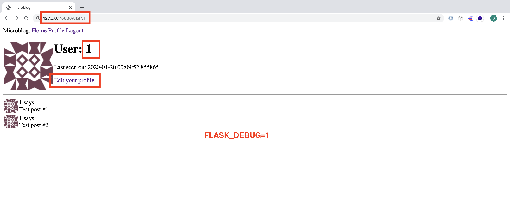

# MICRO-BLOG-DOC (Part 7)

## `Section: Back End`(Error handling)

### `Summary`: In this documentation, we fixed a bug, and will learn different ways to handle errors. （处理特定的 error 返回信息。）

### `Check Dependencies:`

- flask 
- python-dotenv
- flask-wtf
- flask-sqlalchemy
- flask-migrate
- flask-login

- werkzeug.security (built-in)
- datetime (built-in)

### 本章提出的一个bug：
1. 登陆一个用户，然后在 __`edit_profile.html`__ 中把用户名修改成本身已经存在的另外一个用户名字，应用就会报错。
2. 报错是因为提交的时候在database发现了重名，所以发生了来自database的错误。我们要想办法避免这个错误，思路是先查询数据库，发现有重名就用应用内提示信息反馈，而不是应用程序崩溃。
3. 我们要做的就是避免由database的错误引发application崩溃。
4. 本部分介绍了两部分收集error信息的方法，第一个是发送邮件的方式，第二种是建立文档的方式。（这两种方式都是需要关闭debug mode，即 __`FLASK_DEBUG=0`__。）

### 本章使用的外部函数：

#### `logging.handlers`
```diff
+ SMTPHandler
+ RotatingFileHandler
```


### `Brief Contents & codes position`
- 7.1 Enable debug mode. 
    - __`Location: ./.flaskenv`__
- 7.2 Custom Error Pages. 
    - __`(*7.1 - *7.3)Location: ./app/templates/404.html  ./app/templates/500.html  ./app/errors.py`__

- 7.3 Creat new global variables to set up email configuration.
    - __`(*7.4)Location: ./config.py`__

- 7.4 Log errors by email. 
    - __`(*7.5)Location: ./.flaskenv`__

- 7.5 Logging to a file. 
    - __`(*7.6)Location: ./__init__.py`__

-----------------------------------------------------------
- 7.6 Fixing the duplicate username bug. 
    - __`(*7.7 - 7.8)Location: ./app/forms.py  ./app/routes.py`__


### `Step1: Enable debug mode.`

##### `Location: ./.flaskenv` (environment variables)

```py
FLASK_APP=microblog.py
FLASK_DEBUG=1
```

#### `Comment:`
1. When you are developing your application, you can enable debug mode, a mode in which Flask outputs a really nice debugger directly on your browser. 

2. The debugger allows you expand each stack frame and see the corresponding source code. You can also open a Python prompt on any of the frames and execute any valid Python expressions, for example to check the values of variables.

3. It is extremely important that you never run a Flask application in debug mode on a production server. The debugger allows the user to remotely execute code in the server, so it can be an unexpected gift to a malicious user who wants to infiltrate your application or your server. As an additional security measure, the debugger running in the browser starts locked, and on first use will ask for a PIN number, which you can see in the output of the flask run command.

4. Since I am in the topic of debug mode, I should mention the second important feature that is enabled with debug mode, which is the reloader. This is a very useful development feature that automatically restarts the application when a source file is modified. If you run flask run while in debug mode, you can then work on your application and any time you save a file, the application will restart to pick up the new code.

### `Step2: Custom Error Page.`

a. Declare a custom error handler and two error functions.
##### `(*7.1)Location: ./app/errors.py`

```py
from flask import render_template
from app import app, db

@app.errorhandler(404)
def not_found_error(error):
    return render_template('404.html'), 404

@app.errorhandler(500)
def internal_error(error):
    db.session.rollback()
    return render_template('500.html'), 500
```

#### `Comment:`
1. The error functions work very similarly to view functions. For these two errors, I'm returning the contents of their respective templates. Note that both functions return a second value after the template, which is the error code number. 

2. The error handler for the 500 errors could be invoked after a database error, which was actually the case with the username duplicate above. To make sure any failed database sessions do not interfere with any database accesses triggered by the template, I issue a session rollback. This resets the session to a clean state.

b. Add new html templates.
##### `(*7.2)Location: ./templates/404.html`

```html



    <h1>File Not Found</h1>
    <p><a href="{{ url_for('index') }}">Back</a></p>

```

##### `(*7.3)Location: ./templates/500.html`

```html



    <h1>An unexpected error has occurred</h1>
    <p>The administrator has been notified. Sorry for the inconvenience!</p>
    <p><a href="{{ url_for('index') }}">Back</a></p>

```

#### `Comment:`
1. 后面还会在 __`./app/__init__.py`__ 中引进 errors.py ，详细查看step5。


### `Step3. Creat new global variables to set up email configuration. `

##### `(*7.4)Location: ./config.py`

```py
import os
basedir = os.path.abspath(os.path.dirname(__file__))

class Config(object):
    SECRET_KEY = os.environ.get('SECRET_KEY') or 'you-will-never-guess'
    SQLALCHEMY_DATABASE_URI = os.environ.get('DATABASE_URL') or \
        'sqlite:///' + os.path.join(basedir, 'app.db')
    SQLALCHEMY_TRACK_MODIFICATIONS = False

    MAIL_SERVER = os.environ.get('MAIL_SERVER')
    MAIL_PORT = int(os.environ.get('MAIL_PORT') or 25)
    MAIL_USE_TLS = os.environ.get('MAIL_USE_TLS') is not None
    MAIL_USERNAME = os.environ.get('MAIL_USERNAME')
    MAIL_PASSWORD = os.environ.get('MAIL_PASSWORD')
    ADMINS = ['your-email@example.com']
```

#### `Comment:`
1. The other problem with the default error handling provided by Flask is that there are no notifications, stack trace for errors are printed to the terminal, which means that the output of the server process needs to be monitored to discover errors. When you are running the application during development, this is perfectly fine, but once the application is deployed on a production server, nobody is going to be looking at the output, so a more robust solution needs to be put in place. （非本地调试时遇到的问题调试方案，使用email。）

2. I think it is very important that I take a proactive approach regarding errors. If an error occurs on the production version of the application, I want to know right away. So my first solution is going to be to configure Flask to send me an email immediately after an error, with the stack trace of the error in the email body.

3. Flask uses Python's logging package to write its logs, and this package already has the ability to send logs by email. All I need to do to get emails sent out on errors is to add a SMTPHandler instance to the Flask logger object, which is app.logger:（对 __`./app/__init__`__ 文件的 __`Email logger`__ 在 step5。）

### `Step4 Log errors by email.`

1. The easiest one is to use the SMTP debugging server from Python. This is a fake email server that accepts emails, but instead of sending them, it prints them to the console. To run this server, open a second terminal session and run the following command on it:

A. Terminal 1
```bash
(venv) $ python -m smtpd -n -c DebuggingServer localhost:8025
```

B. Terminal 2 or set up environment variables.

```bash
(venv) $ export FLASK_DEBUG=0
(venv) $ export MAIL_SERVER=localhost
(venv) $ export MAIL_PORT=8025
```

##### `(*7.5)Location: ./.flaskenv`

```py
FLASK_APP=microblog.py
FLASK_DEBUG=0
MAIL_SERVER=localhost
MAIL_PORT=8025
```

C. Run the application
```bash
(venv) $ flask run
```

#### `Comment:`
1. 以上两种方法偏向于第二种 set up environment variables。
2. 对 __`./app/__init__`__ 文件的 __`Email logger`__ 设定在 step5。）

### `Step5 Logging to a file.`

##### `(*7.6)Location: ./app/__init__.py`

```py
from flask import Flask
from config import Config
from flask_sqlalchemy import SQLAlchemy
from flask_migrate import Migrate
from flask_login import LoginManager

import logging
from logging.handlers import SMTPHandler
from logging.handlers import RotatingFileHandler
import os

app = Flask(__name__)
app.config.from_object(Config)
db = SQLAlchemy(app)
migrate = Migrate(app, db)
login = LoginManager(app)
login.login_view = 'login'

if not app.debug:
    if app.config['MAIL_SERVER']:
        auth = None
        if app.config['MAIL_USERNAME'] or app.config['MAIL_PASSWORD']:
            auth = (app.config['MAIL_USERNAME'], app.config['MAIL_PASSWORD'])
        secure = None
        if app.config['MAIL_USE_TLS']:
            secure = ()
        mail_handler = SMTPHandler(
            mailhost=(app.config['MAIL_SERVER'], app.config['MAIL_PORT']),
            fromaddr='no-reply@' + app.config['MAIL_SERVER'],
            toaddrs=app.config['ADMINS'], subject='Microblog Failure',
            credentials=auth, secure=secure)
        mail_handler.setLevel(logging.ERROR)
        app.logger.addHandler(mail_handler)

    if not os.path.exists('logs'):
        os.mkdir('logs')
    file_handler = RotatingFileHandler('logs/microblog.log', maxBytes=10240, backupCount=10)
    file_handler.setFormatter(logging.Formatter(
        '%(asctime)s %(levelname)s: %(message)s [in %(pathname)s:%(lineno)d]'))
    file_handler.setLevel(logging.INFO)
    app.logger.addHandler(file_handler)

    app.logger.setLevel(logging.INFO)
    app.logger.info('Microblog startup')

from app import routes, models, errors
```

#### `Comment:`
1. 对应step2 中引进 `error.py`:

```py
from app import routes, models, errors
```

2. __`Email logger`__,对应 step3 和 step4 中 `add a SMTPHandler instance to the Flask logger object, which is app.logger`:

```py
import logging
from logging.handlers import SMTPHandler
# ...
if not app.debug:
    if app.config['MAIL_SERVER']:
        auth = None
        if app.config['MAIL_USERNAME'] or app.config['MAIL_PASSWORD']:
            auth = (app.config['MAIL_USERNAME'], app.config['MAIL_PASSWORD'])
        secure = None
        if app.config['MAIL_USE_TLS']:
            secure = ()
        mail_handler = SMTPHandler(
            mailhost=(app.config['MAIL_SERVER'], app.config['MAIL_PORT']),
            fromaddr='no-reply@' + app.config['MAIL_SERVER'],
            toaddrs=app.config['ADMINS'], subject='Microblog Failure',
            credentials=auth, secure=secure)
        mail_handler.setLevel(logging.ERROR)
        app.logger.addHandler(mail_handler)
```

3. __`File logger`__, To enable a file based log  handler, this type of  RotatingFileHandler, needs to be attached to the application logger, in a similar way to the email handler.（File logger）

```py
from logging.handlers import RotatingFileHandler
import os
# ...

if not app.debug:
    # ...

    if not os.path.exists('logs'):
        os.mkdir('logs')
    file_handler = RotatingFileHandler('logs/microblog.log', maxBytes=10240,
                                       backupCount=10)
    file_handler.setFormatter(logging.Formatter(
        '%(asctime)s %(levelname)s: %(message)s [in %(pathname)s:%(lineno)d]'))
    file_handler.setLevel(logging.INFO)
    app.logger.addHandler(file_handler)

    app.logger.setLevel(logging.INFO)
    app.logger.info('Microblog startup')
```

### `Step6 Fixing the duplicate username bug.`
##### `(*7.7 - 7.8)Location: ./app/forms.py  ./app/routes.py`

__`PartA`__. Add validation in the `EditProfileForm` class.

##### `(*7.7)Location: ./app/forms.py`
```py
from flask_wtf import FlaskForm
from wtforms import StringField, PasswordField, BooleanField, SubmitField, TextAreaField
from wtforms.validators import ValidationError, DataRequired, Email, EqualTo, Length
from app.models import User


class LoginForm(FlaskForm):
    username = StringField('Username', validators=[DataRequired()])
    password = PasswordField('Password', validators=[DataRequired()])
    remember_me = BooleanField('Remember Me')
    submit = SubmitField('Sign In')


class RegistrationForm(FlaskForm):
    username = StringField('Username', validators=[DataRequired()])
    email = StringField('Email', validators=[DataRequired(), Email()])
    password = PasswordField('Password', validators=[DataRequired()])
    password2 = PasswordField(
        'Repeat Password', validators=[DataRequired(), EqualTo('password')])
    submit = SubmitField('Register')

    def validate_username(self, username):
        user = User.query.filter_by(username=username.data).first()
        if user is not None:
            raise ValidationError('Please use a different username.')

    def validate_email(self, email):
        user = User.query.filter_by(email=email.data).first()
        if user is not None:
            raise ValidationError('Please use a different email address.')


class EditProfileForm(FlaskForm):
    username = StringField('Username', validators=[DataRequired()])
    about_me = TextAreaField('About me', validators=[Length(min=0, max=140)])
    submit = SubmitField('Submit')

    def __init__(self, original_username, *args, **kwargs):
        super(EditProfileForm, self).__init__(*args, **kwargs)
        self.original_username = original_username

    def validate_username(self, username):
        if username.data != self.original_username:
            user = User.query.filter_by(username=self.username.data).first()
            if user is not None:
                raise ValidationError('Please use a different username.')
```

#### `Comment:`
1. Validation code, 难点在于弄清楚这两个自定义的函数是怎么启动的。(RegistrationForm 也有两个相似的自启动函数，解释如下)

- I have also added two methods to this class called validate_username() and validate_email(). When you add any methods that match the pattern __`validate_<field_name>`__, __`WTForms`__ takes those as custom validators and invokes them in addition to the stock validators. In this case I want to make sure that the username and email address entered by the user are not already in the database, so these two methods issue database queries expecting there will be no results. In the event a result exists, a validation error is triggered by raising ValidationError. The message included as the argument in the exception will be the message that will be displayed next to the field for the user to see.

```py
    def __init__(self, original_username, *args, **kwargs):
        super(EditProfileForm, self).__init__(*args, **kwargs)
        self.original_username = original_username

    def validate_username(self, username):
        if username.data != self.original_username:
            user = User.query.filter_by(username=self.username.data).first()
            if user is not None:
                raise ValidationError('Please use a different username.')
```
2. The implementation is in a custom validation method, but there is an overloaded constructor that accepts the original username as an argument. This username is saved as an instance variable, and checked in the validate_username() method. If the username entered in the form is the same as the original username, then there is no reason to check the database for duplicates. __`（这里提到了定义了函数但可以自动调用的功能。）`__

----------------------------------------------------------------------

__`PartB.`__ To use this new validation method, I need to add the original username argument in the view function, where the form object is created:

##### `(*7.8)Location: ./app/routes.py`

```py
from flask import render_template, flash, redirect, url_for
from app import app
from app import db
from app.forms import LoginForm, RegistrationForm
from flask_login import current_user, login_user, logout_user, login_required
from app.models import User
from flask import request
from werkzeug.urls import url_parse

from datetime import datetime
from app.forms import EditProfileForm


@app.before_request
def before_request():
    if current_user.is_authenticated:
        current_user.last_seen = datetime.utcnow()
        db.session.commit()


@app.route('/')
@app.route('/index')
@login_required
def index():
    posts = [
        {
            'author': {'username': 'John'},
            'body': 'Beautiful day in Portland!'
        },
        {
            'author': {'username': 'Susan'},
            'body': 'The Avengers movie was so cool!'
        }
    ]
    return render_template('index.html', title='Home', posts=posts)

@app.route('/user/<username>')
@login_required
def user(username):
    user = User.query.filter_by(username=username).first_or_404()
    posts = [
        {'author': user, 'body': 'Test post #1'},
        {'author': user, 'body': 'Test post #2'}
    ]
    return render_template('user.html', user=user, posts=posts)


@app.route('/login', methods=['GET', 'POST'])
def login():
    # current_user(variabel)
    if current_user.is_authenticated:
        return redirect(url_for('index'))
    form = LoginForm()
    if form.validate_on_submit():
        # User(model)
        user = User.query.filter_by(username=form.username.data).first()
        if user is None or not user.check_password(form.password.data):
            flash('Invalid username or password')
            return redirect(url_for('login'))
        # login_user(method)
        login_user(user, remember=form.remember_me.data)
        next_page = request.args.get('next')
        if not next_page or url_parse(next_page).netloc != '':
            next_page = url_for('index')
        return redirect(next_page)
    return render_template('login.html', title='Sign In', form=form)


@app.route('/logout')
def logout():
    logout_user()
    return redirect(url_for('index'))


@app.route('/register', methods=['GET', 'POST'])
def register():
    if current_user.is_authenticated:
        return redirect(url_for('index'))
    form = RegistrationForm()
    if form.validate_on_submit():
        user = User(username=form.username.data, email=form.email.data)
        user.set_password(form.password.data)
        db.session.add(user)
        db.session.commit()
        flash('Congratulations, you are now a registered user!')
        return redirect(url_for('login'))
    return render_template('register.html', title='Register', form=form)


@app.route('/edit_profile', methods=['GET', 'POST'])
@login_required
def edit_profile():
    form = EditProfileForm(current_user.username)
    if form.validate_on_submit():
        current_user.username = form.username.data
        current_user.about_me = form.about_me.data
        db.session.commit()
        flash('Your changes have been saved.')
        return redirect(url_for('edit_profile'))
    elif request.method == 'GET':
        form.username.data = current_user.username
        form.about_me.data = current_user.about_me
    return render_template('edit_profile.html', title='Edit Profile', form=form)
```

#### `Comment:`
1. 下面这句是调用 EditProfileForm 中的 __`__init__(self, original_username, *args, **kwargs)`__, 另外的验证函数 __`validate_username(self, username)`__ 是自启动。

```py
form = EditProfileForm(current_user.username)
```

2. Now the bug is fixed and duplicates in the edit profile form will be prevented in most cases. This is not a perfect solution, because it may not work when two or more processes are accessing the database at the same time. In that situation, a race condition could cause the validation to pass, but a moment later when the rename is attempted the database was already changed by another process and cannot rename the user. This is somewhat unlikely except for very busy applications that have a lot of server processes, so I'm not going to worry about it for now.

### `Step7 Concept questions.`

#### `A. How does email logger work?`

1. As you can see in __`__init__.py`__ , I'm only going to enable the email logger when the application is running without debug mode, which is indicated by app.debug being True, and also when the email server exists in the configuration.

2. Setting up the email logger is somewhat tedious due to having to handle optional security options that are present in many email servers. But in essence, the code above creates a SMTPHandler instance, sets its level so that it only reports errors and not warnings, informational or debugging messages, and finally attaches it to the app.logger object from Flask.

#### `B. How does file logger work?`
1. The RotatingFileHandler class is nice because it rotates the logs, ensuring that the log files do not grow too large when the application runs for a long time. In this case I'm limiting the size of the log file to 10KB, and I'm keeping the last ten log files as backup.

2. The logging.Formatter class provides custom formatting for the log messages. Since these messages are going to a file, I want them to have as much information as possible. So I'm using a format that includes the timestamp, the logging level, the message and the source file and line number from where the log entry originated.

3. To make the logging more useful, I'm also lowering the logging level to the INFO category, both in the application logger and the file logger handler. In case you are not familiar with the logging categories, they are DEBUG, INFO, WARNING, ERROR and CRITICAL in increasing order of severity.

### `Step8 TEST.`

```bash
(venv) $ flask run
```

1. Turn the debug mode off without custome error page.
<p align="center">

</p>

2. Login with username `1`.
<p align="center">

</p>


3. Edit the username with an existed name in database.
<p align="center">

</p>

4. Turn the debug mode on.
<p align="center">

</p>

5. Turn the debug mode off, with custom error page.
<p align="center">

</p>

6. Turn the debug mode off, with flie logger.
<p align="center">

</p>

7. Turn the debug mode off, with flie logger.
<p align="center">

</p>

8. Turn the debug mode off, with email logger.
<p align="center">

</p>

9. Fixed the bug.
<p align="center">

</p>

### `总结：`
- *** 对于`form = EditProfileForm(current_user.username)`的理解是难点。（step6）
- 在这里跟在之后设定 email server 的意思是，所有从这个application 发出的 email，无论收件人是谁，都在这个 email server 中全部截取。