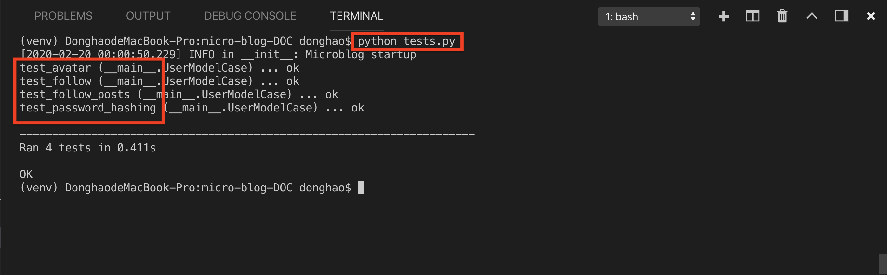
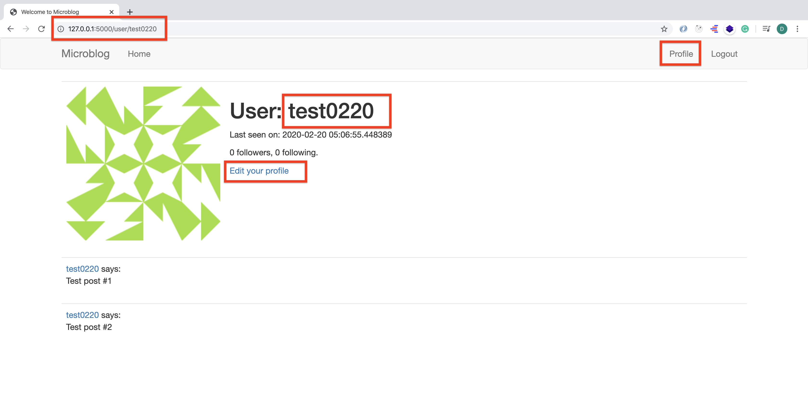
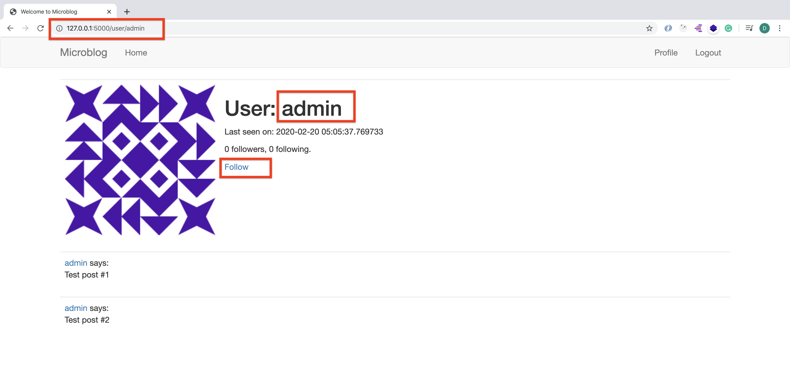
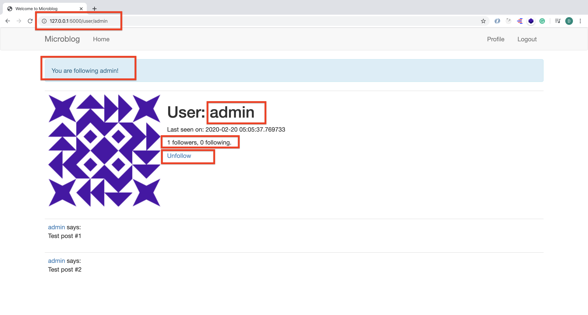
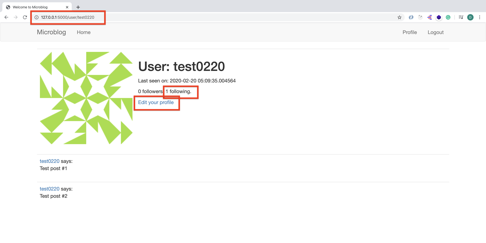

# MICRO-BLOG-DOC (Part 8)

## `Section: Back End`(Followers)

### `Summary`: In this documentation, we add followers feature.（新 columns，新表格关系，动态参数的 view function。）

### `Check Dependencies:`

- flask 
- python-dotenv
- flask-wtf
- flask-sqlalchemy
- flask-migrate
- flask-login

- werkzeug.security (built-in)
- datetime (built-in)

### 本章提要：
1. 本章主要涉及的是数据表之间的对应关系，比如`one-to-many (user与post的关系)`，还有`many-to-many (user与user的关系)`。

2. 本章的重点难点在于处理`user table`自己与自己建立一个`association table`,另外的的重点在于学习如何写`testing 文件`，还有如何把修改数据表之间的动作执行，改变之后呈现出来。

3. 对于本章的`one-to-many`。The relationship is represented in the database with the use of a foreign key on the "many" side. In the relationship above, the foreign key is the user_id field added to the posts table. This field links each post to the record of its author in the user table.
4. 对于本章的`many-to-many`。The representation of a many-to-many relationship requires the use of an auxiliary table called an association table. 

5. The followers table is the association table of the relationship. The foreign keys in this table are both pointing at entries in the user table, since it is linking users to users. Each record in this table represents one link between a follower user and a followed user.

### 本章使用的外部函数：

#### `暂无`
```diff

```


### `Brief Contents & codes position:`

- 8.1 Add a new column in user model and a new association table.
    - __`Location: ./app/models.py`__
- 8.2 Record the changes in a new database migration.

- 8.3 Add new column methods to user model, and a new post query method.
    - __`（*8.1）Location: ./app/models.py`__

- 8.4 Create a suite of automated tests. 
    - __`(*8.2)Location: ./app/tests.py`__

- 8.5 Build view functions to use the new column methods.  
    - __`（*8.3）Location: ./app/routes.py`__

- 8.6 Connect corresponding HTML template to view functions.  
    - __`(*8.4)Location: ./app/templates/user.html`__

### `Step1: Add a new column in user model and a new association table.`

##### `Location: ./app/models.py`

```py
from datetime import datetime
from app import db
from werkzeug.security import generate_password_hash, check_password_hash
from flask_login import UserMixin
from app import login
from hashlib import md5

followers = db.Table('followers',
    db.Column('follower_id', db.Integer, db.ForeignKey('user.id')),
    db.Column('followed_id', db.Integer, db.ForeignKey('user.id'))
)

class User(UserMixin, db.Model):
    id = db.Column(db.Integer, primary_key=True)
    username = db.Column(db.String(64), index=True, unique=True)
    email = db.Column(db.String(120), index=True, unique=True)
    password_hash = db.Column(db.String(128))
    posts = db.relationship('Post', backref='author', lazy='dynamic')
    about_me = db.Column(db.String(140))
    last_seen = db.Column(db.DateTime, default=datetime.utcnow)

    followed = db.relationship(
        'User', secondary=followers,
        primaryjoin=(followers.c.follower_id == id),
        secondaryjoin=(followers.c.followed_id == id),
        backref=db.backref('followers', lazy='dynamic'), lazy='dynamic')

    def __repr__(self):
        return '<User {}>'.format(self.username)

    def set_password(self, password):
        self.password_hash = generate_password_hash(password)

    def check_password(self, password):
        return check_password_hash(self.password_hash, password)

    def avatar(self, size):
        digest = md5(self.email.lower().encode('utf-8')).hexdigest()
        return 'https://www.gravatar.com/avatar/{}?d=identicon&s={}'.format(
            digest, size)

class Post(db.Model):
    id = db.Column(db.Integer, primary_key=True)
    body = db.Column(db.String(140))
    timestamp = db.Column(db.DateTime, index=True, default=datetime.utcnow)
    user_id = db.Column(db.Integer, db.ForeignKey('user.id'))

    def __repr__(self):
        return '<Post {}>'.format(self.body)


@login.user_loader
def load_user(id):
    return User.query.get(int(id))
```

#### `Comment:`
1. New association table.
```py
followers = db.Table('followers',
    db.Column('follower_id', db.Integer, db.ForeignKey('user.id')),
    db.Column('followed_id', db.Integer, db.ForeignKey('user.id'))
)
``` 

2. Build the relationship (a new column) between `user table` and the `association table` .

```py
    followed = db.relationship(
        'User', secondary=followers,
        primaryjoin=(followers.c.follower_id == id),
        secondaryjoin=(followers.c.followed_id == id),
        backref=db.backref('followers', lazy='dynamic'), lazy='dynamic')
```

### `Step2: Record the changes in a new database migration.(更新数据表结构)`

```bash
(venv) $ flask db migrate -m "followers"
(venv) $ flask db upgrade
```

### `Step3. Add new colum methods to user model.`
##### `(*8.1)Location: ./app/models.py`

```py
from datetime import datetime
from app import db
from werkzeug.security import generate_password_hash, check_password_hash
from flask_login import UserMixin
from app import login
from hashlib import md5

followers = db.Table('followers',
    db.Column('follower_id', db.Integer, db.ForeignKey('user.id')),
    db.Column('followed_id', db.Integer, db.ForeignKey('user.id'))
)

class User(UserMixin, db.Model):
    id = db.Column(db.Integer, primary_key=True)
    username = db.Column(db.String(64), index=True, unique=True)
    email = db.Column(db.String(120), index=True, unique=True)
    password_hash = db.Column(db.String(128))
    posts = db.relationship('Post', backref='author', lazy='dynamic')
    about_me = db.Column(db.String(140))
    last_seen = db.Column(db.DateTime, default=datetime.utcnow)

    followed = db.relationship(
        'User', secondary=followers,
        primaryjoin=(followers.c.follower_id == id),
        secondaryjoin=(followers.c.followed_id == id),
        backref=db.backref('followers', lazy='dynamic'), lazy='dynamic')

    def __repr__(self):
        return '<User {}>'.format(self.username)

    def set_password(self, password):
        self.password_hash = generate_password_hash(password)

    def check_password(self, password):
        return check_password_hash(self.password_hash, password)

    def avatar(self, size):
        digest = md5(self.email.lower().encode('utf-8')).hexdigest()
        return 'https://www.gravatar.com/avatar/{}?d=identicon&s={}'.format(
            digest, size)
    
    def follow(self, user):
        if not self.is_following(user):
            self.followed.append(user)

    def unfollow(self, user):
        if self.is_following(user):
            self.followed.remove(user)

    def is_following(self, user):
        return self.followed.filter(
            followers.c.followed_id == user.id).count() > 0

    def followed_posts(self):
        followed = Post.query.join(
            followers, (followers.c.followed_id == Post.user_id)).filter(
                followers.c.follower_id == self.id)
        own = Post.query.filter_by(user_id=self.id)
        return followed.union(own).order_by(Post.timestamp.desc())

class Post(db.Model):
    id = db.Column(db.Integer, primary_key=True)
    body = db.Column(db.String(140))
    timestamp = db.Column(db.DateTime, index=True, default=datetime.utcnow)
    user_id = db.Column(db.Integer, db.ForeignKey('user.id'))

    def __repr__(self):
        return '<Post {}>'.format(self.body)


@login.user_loader
def load_user(id):
    return User.query.get(int(id))
```

#### `Comment:`

1. New column method:
```py
    def follow(self, user):
        if not self.is_following(user):
            self.followed.append(user)

    def unfollow(self, user):
        if self.is_following(user):
            self.followed.remove(user)

    def is_following(self, user):
        return self.followed.filter(
            followers.c.followed_id == user.id).count() > 0
```

2. New posts query method:
```py
    def followed_posts(self):
        followed = Post.query.join(
            followers, (followers.c.followed_id == Post.user_id)).filter(
                followers.c.follower_id == self.id)
        own = Post.query.filter_by(user_id=self.id)
        return followed.union(own).order_by(Post.timestamp.desc())
```

3. 关于第二点method的设计思路：

- The most straightforward way is to leave the query as it is, but make sure all users are following themselves. If you are your own follower, then the query as shown above will find your own posts along with those of all the people you follow. The disadvantage of this method is that it affects the stats regarding followers. All follower counts are going to be inflated by one, so they'll have to be adjusted before they are shown. The second way to do this is by create a second query that returns the user's own posts, and then use the "union" operator to combine the two queries into a single one.


### `Step4 Create a suite of automated tests.`

##### `(*8.2)Location: ./app/tests.py`

```py
from datetime import datetime, timedelta
import unittest
from app import app, db
from app.models import User, Post

class UserModelCase(unittest.TestCase):
    def setUp(self):
        app.config['SQLALCHEMY_DATABASE_URI'] = 'sqlite://'
        db.create_all()

    def tearDown(self):
        db.session.remove()
        db.drop_all()

    def test_password_hashing(self):
        u = User(username='susan')
        u.set_password('cat')
        self.assertFalse(u.check_password('dog'))
        self.assertTrue(u.check_password('cat'))

    def test_avatar(self):
        u = User(username='john', email='john@example.com')
        self.assertEqual(u.avatar(128), ('https://www.gravatar.com/avatar/'
                                         'd4c74594d841139328695756648b6bd6'
                                         '?d=identicon&s=128'))

    def test_follow(self):
        u1 = User(username='john', email='john@example.com')
        u2 = User(username='susan', email='susan@example.com')
        db.session.add(u1)
        db.session.add(u2)
        db.session.commit()
        self.assertEqual(u1.followed.all(), [])
        self.assertEqual(u1.followers.all(), [])

        u1.follow(u2)
        db.session.commit()
        self.assertTrue(u1.is_following(u2))
        self.assertEqual(u1.followed.count(), 1)
        self.assertEqual(u1.followed.first().username, 'susan')
        self.assertEqual(u2.followers.count(), 1)
        self.assertEqual(u2.followers.first().username, 'john')

        u1.unfollow(u2)
        db.session.commit()
        self.assertFalse(u1.is_following(u2))
        self.assertEqual(u1.followed.count(), 0)
        self.assertEqual(u2.followers.count(), 0)

    def test_follow_posts(self):
        # create four users
        u1 = User(username='john', email='john@example.com')
        u2 = User(username='susan', email='susan@example.com')
        u3 = User(username='mary', email='mary@example.com')
        u4 = User(username='david', email='david@example.com')
        db.session.add_all([u1, u2, u3, u4])

        # create four posts
        now = datetime.utcnow()
        p1 = Post(body="post from john", author=u1,
                  timestamp=now + timedelta(seconds=1))
        p2 = Post(body="post from susan", author=u2,
                  timestamp=now + timedelta(seconds=4))
        p3 = Post(body="post from mary", author=u3,
                  timestamp=now + timedelta(seconds=3))
        p4 = Post(body="post from david", author=u4,
                  timestamp=now + timedelta(seconds=2))
        db.session.add_all([p1, p2, p3, p4])
        db.session.commit()

        # setup the followers
        u1.follow(u2)  # john follows susan
        u1.follow(u4)  # john follows david
        u2.follow(u3)  # susan follows mary
        u3.follow(u4)  # mary follows david
        db.session.commit()

        # check the followed posts of each user
        f1 = u1.followed_posts().all()
        f2 = u2.followed_posts().all()
        f3 = u3.followed_posts().all()
        f4 = u4.followed_posts().all()
        self.assertEqual(f1, [p2, p4, p1])
        self.assertEqual(f2, [p2, p3])
        self.assertEqual(f3, [p3, p4])
        self.assertEqual(f4, [p4])

if __name__ == '__main__':
    unittest.main(verbosity=2)
```

#### `Comment:`
1. 运行测试文件。
```bash
(venv) $ python tests.py
```

2. __`这个文件是本章的重点，学习怎样写。`__ 注意几个函数`assertEqual\assertTrue\assertFalse`

3. From now on, every time a change is made to the application, you can re-run the tests to make sure the features that are being tested have not been affected. Also, each time another feature is added to the application, a unit test should be written for it.


### `Step5 Build view functions to use the new column methods.`

##### `(*8.3)Location: ./app/routes.py`

```py
from flask import render_template, flash, redirect, url_for
from app import app
from app import db
from app.forms import LoginForm, RegistrationForm
from flask_login import current_user, login_user, logout_user, login_required
from app.models import User
from flask import request
from werkzeug.urls import url_parse

from datetime import datetime
from app.forms import EditProfileForm


@app.before_request
def before_request():
    if current_user.is_authenticated:
        current_user.last_seen = datetime.utcnow()
        db.session.commit()


@app.route('/')
@app.route('/index')
@login_required
def index():
    posts = [
        {
            'author': {'username': 'John'},
            'body': 'Beautiful day in Portland!'
        },
        {
            'author': {'username': 'Susan'},
            'body': 'The Avengers movie was so cool!'
        }
    ]
    return render_template('index.html', title='Home', posts=posts)

@app.route('/user/<username>')
@login_required
def user(username):
    user = User.query.filter_by(username=username).first_or_404()
    posts = [
        {'author': user, 'body': 'Test post #1'},
        {'author': user, 'body': 'Test post #2'}
    ]
    return render_template('user.html', user=user, posts=posts)


@app.route('/login', methods=['GET', 'POST'])
def login():
    # current_user(variabel)
    if current_user.is_authenticated:
        return redirect(url_for('index'))
    form = LoginForm()
    if form.validate_on_submit():
        # User(model)
        user = User.query.filter_by(username=form.username.data).first()
        if user is None or not user.check_password(form.password.data):
            flash('Invalid username or password')
            return redirect(url_for('login'))
        # login_user(method)
        login_user(user, remember=form.remember_me.data)
        next_page = request.args.get('next')
        if not next_page or url_parse(next_page).netloc != '':
            next_page = url_for('index')
        return redirect(next_page)
    return render_template('login.html', title='Sign In', form=form)


@app.route('/logout')
def logout():
    logout_user()
    return redirect(url_for('index'))


@app.route('/register', methods=['GET', 'POST'])
def register():
    if current_user.is_authenticated:
        return redirect(url_for('index'))
    form = RegistrationForm()
    if form.validate_on_submit():
        user = User(username=form.username.data, email=form.email.data)
        user.set_password(form.password.data)
        db.session.add(user)
        db.session.commit()
        flash('Congratulations, you are now a registered user!')
        return redirect(url_for('login'))
    return render_template('register.html', title='Register', form=form)


@app.route('/edit_profile', methods=['GET', 'POST'])
@login_required
def edit_profile():
    form = EditProfileForm(current_user.username)
    if form.validate_on_submit():
        current_user.username = form.username.data
        current_user.about_me = form.about_me.data
        db.session.commit()
        flash('Your changes have been saved.')
        return redirect(url_for('edit_profile'))
    elif request.method == 'GET':
        form.username.data = current_user.username
        form.about_me.data = current_user.about_me
    return render_template('edit_profile.html', title='Edit Profile', form=form)

@app.route('/follow/<username>')
@login_required
def follow(username):
    user = User.query.filter_by(username=username).first()
    if user is None:
        flash('User {} not found.'.format(username))
        return redirect(url_for('index'))
    if user == current_user:
        flash('You cannot follow yourself!')
        return redirect(url_for('user', username=username))
    current_user.follow(user)
    db.session.commit()
    flash('You are following {}!'.format(username))
    return redirect(url_for('user', username=username))

@app.route('/unfollow/<username>')
@login_required
def unfollow(username):
    user = User.query.filter_by(username=username).first()
    if user is None:
        flash('User {} not found.'.format(username))
        return redirect(url_for('index'))
    if user == current_user:
        flash('You cannot unfollow yourself!')
        return redirect(url_for('user', username=username))
    current_user.unfollow(user)
    db.session.commit()
    flash('You are not following {}.'.format(username))
    return redirect(url_for('user', username=username))
```

#### `Comment:`
1. New view functions:
```py
@app.route('/follow/<username>')
@login_required
def follow(username):
    user = User.query.filter_by(username=username).first()
    if user is None:
        flash('User {} not found.'.format(username))
        return redirect(url_for('index'))
    if user == current_user:
        flash('You cannot follow yourself!')
        return redirect(url_for('user', username=username))
    current_user.follow(user)
    db.session.commit()
    flash('You are following {}!'.format(username))
    return redirect(url_for('user', username=username))

@app.route('/unfollow/<username>')
@login_required
def unfollow(username):
    user = User.query.filter_by(username=username).first()
    if user is None:
        flash('User {} not found.'.format(username))
        return redirect(url_for('index'))
    if user == current_user:
        flash('You cannot unfollow yourself!')
        return redirect(url_for('user', username=username))
    current_user.unfollow(user)
    db.session.commit()
    flash('You are not following {}.'.format(username))
    return redirect(url_for('user', username=username))
```

2. 使用`new methods`的语句：
```py
current_user.follow(user)
current_user.unfollow(user)
```

### `Step6 Connect corresponding HTML template to view functions.`

##### `(*8.4)Location: ./app/templates/user.html`

```html
 
<table class="table table-hover">
    <tr>
        <td width="256px">
            
        </td>
        <td>
            <h1>User: {{ user.username }}</h1>
            
            <p>{{ user.about_me }}</p> 
            <p>Last seen on: {{ user.last_seen }}</p>
            <p>{{ user.followers.count() }} followers, {{ user.followed.count() }} following.</p>
            
            <p>
                <a href="{{ url_for('edit_profile') }}">Edit your profile</a>
            </p>
            
            <p>
                <a href="{{ url_for('follow', username=user.username) }}">Follow</a>
            </p>
            
            <p>
                <a href="{{ url_for('unfollow', username=user.username) }}">Unfollow</a>
            </p>
            
        </td>
    </tr>
</table>
 
     
 

```

#### `Comments:`
1. 之前定义的`column method, is_following()`在这里使用到了。

2. If the user is viewing his or her own profile, the "Edit" link shows as before.
If the user is viewing a user that is not currently followed, the "Follow" link shows.
If the user is viewing a user that is currently followed, the "Unfollow" link shows.


### `Step7 Concept questions.`

#### `A. What do we get so far?`

1. At this point you can run the application, create a few users and play with following and unfollowing users. The only thing you need to remember is to type the profile page URL of the user you want to follow or unfollow, since there is currently no way to see a list of users. For example, if you want to follow a user with the susan username, you will need to type http://localhost:5000/user/susan in the browser's address bar to access the profile page for that user. Make sure you check how the followed and follower user counts change as you issue follows or unfollows.

### `Step8 TEST.`

#### Run the tests file.

```bash
(venv) $ python tests.py
```

<p align="center">

</p>

#### Run the application.
```bash
(venv) $ flask run
```

1. We register two new user, `admin` and `test0220`, now we are in user `test0220` profile page.
<p align="center">

</p>

2. View `admin` page and follow `admin`.
<p align="center">

</p>

<p align="center">

</p>

3. Back to `test0220` profile page.
<p align="center">

</p>

### `总结：`
- *** 重点在于建立一个 associate table 并建立关系。
- 另外一个重点是写 testing 文件。
- 本章里面的 `follow` 和 `unfollow` 功能是通过有参数的 `view function(或者说url)`实现的。

