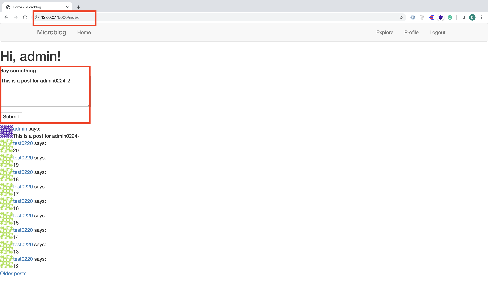
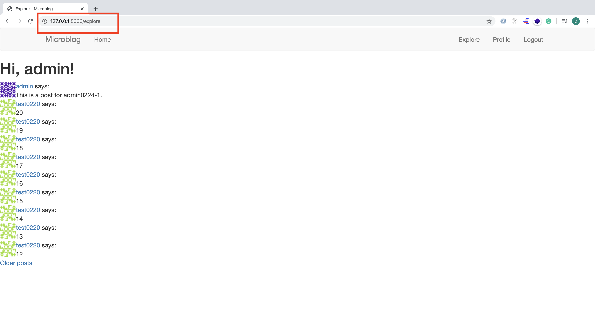
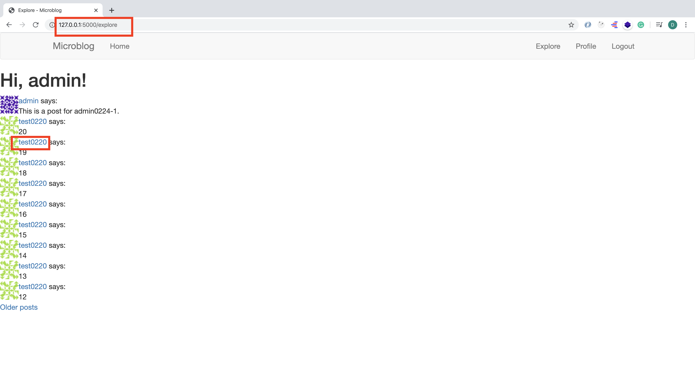
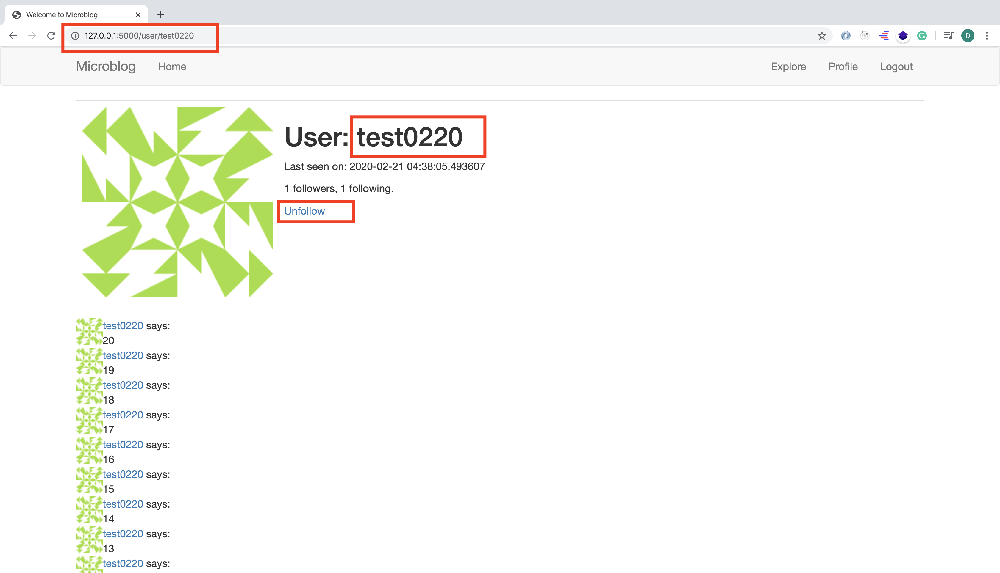

# MICRO-BLOG-DOC (Part 9)

## `Section: Back End`(Pagination)

### `Summary`: In this documentation, we add creating posts and posts pagination features. (page 参数是来自 url 的 query string argument)

### `Check Dependencies:`

- flask 
- python-dotenv
- flask-wtf
- flask-sqlalchemy
- flask-migrate
- flask-login

- werkzeug.security (built-in)
- datetime (built-in)

### 本章提要：
1. 

### 本章使用的外部函数：

#### `暂无`
```diff

```


### `Brief Contents & codes position:`

- 9.1 Add a new post form class. 
    - __`(*9.1)Location: ./app/forms.py`__
- 9.2 Add a form editor in index template. 
    - __`Location: ./app/templates/index.html`__
- 9.3 Add the form creation and handling in the view functions (index & explore). 
    - __`Location: ./app/routes.py`__

------------------------------------------------------------

- 9.4 Home page and explore page share a same template (index) with an if statement.  
    - __`Location: ./app/templates/index.html`__
- 9.5 Add a new link for explore page in navigation bar.  
    - __`(*9.2)Location: ./app/templates/base.html`__
- 9.6 Change the sub-template to show real posts. 
    - __`(*9.3)Location: ./app/templates/_post.html`__
- 9.7 Show all posts in index template.
    - __`Location: ./app/templates/index.html`__

-------------------------------------------------------------

- 9.8 Add pagination and page navigation in view functions (index & explore). 
    - __`Location: ./app/routes.py`__
    - __`(*9.4)Location: ./config.py`__
- 9.9 Add pagination to the index template. 
    - __`（*9.5）Location: ./app/templates/index.html`__
- 9.10 For other users profile page, add pagination and page navigation to view function `user`. 
    - __`（*9.6）Location: ./app/routes.py`__
- 9.11 Add page navigation and pagination to user profile template. 
    - __`（*9.7）Location: ./app/templates/user.html`__

--------------------------------------------------------------


### `Step1: Add a new post form class.`

##### `(*9.1)Location: ./app/forms.py`

```py
from flask_wtf import FlaskForm
from wtforms import StringField, PasswordField, BooleanField, SubmitField, TextAreaField
from wtforms.validators import ValidationError, DataRequired, Email, EqualTo, Length
from app.models import User


class LoginForm(FlaskForm):
    username = StringField('Username', validators=[DataRequired()])
    password = PasswordField('Password', validators=[DataRequired()])
    remember_me = BooleanField('Remember Me')
    submit = SubmitField('Sign In')


class RegistrationForm(FlaskForm):
    username = StringField('Username', validators=[DataRequired()])
    email = StringField('Email', validators=[DataRequired(), Email()])
    password = PasswordField('Password', validators=[DataRequired()])
    password2 = PasswordField(
        'Repeat Password', validators=[DataRequired(), EqualTo('password')])
    submit = SubmitField('Register')

    def validate_username(self, username):
        user = User.query.filter_by(username=username.data).first()
        if user is not None:
            raise ValidationError('Please use a different username.')

    def validate_email(self, email):
        user = User.query.filter_by(email=email.data).first()
        if user is not None:
            raise ValidationError('Please use a different email address.')


class EditProfileForm(FlaskForm):
    username = StringField('Username', validators=[DataRequired()])
    about_me = TextAreaField('About me', validators=[Length(min=0, max=140)])
    submit = SubmitField('Submit')

    def __init__(self, original_username, *args, **kwargs):
        super(EditProfileForm, self).__init__(*args, **kwargs)
        self.original_username = original_username

    def validate_username(self, username):
        if username.data != self.original_username:
            user = User.query.filter_by(username=self.username.data).first()
            if user is not None:
                raise ValidationError('Please use a different username.')

class PostForm(FlaskForm):
    post = TextAreaField('Say something', validators=[
        DataRequired(), Length(min=1, max=140)])
    submit = SubmitField('Submit')
```

#### `Comment:`
1. New form class.
```py
class PostForm(FlaskForm):
    post = TextAreaField('Say something', validators=[
        DataRequired(), Length(min=1, max=140)])
    submit = SubmitField('Submit')
``` 

2. 在这里对`form class`做个小结，它这里这个做法主要是把所有在`template`输入的数据转化成`class`的统一形式，然后在`view function`执行database的操作。

### `Step2: Add a form editor in index template.`

##### `Location: ./app/templates/index.html`

```html



    <h1>Hi, {{ current_user.username }}!</h1>
    <form action="" method="post">
        {{ form.hidden_tag() }}
        <p>
            {{ form.post.label }}<br>
            {{ form.post(cols=32, rows=4) }}<br>
            
                <span style="color: red;">[{{ error }}]</span>
            
        </p>
        <p>{{ form.submit() }}</p>
    </form>
    
        <p>
        {{ post.author.username }} says: <b>{{ post.body }}</b>
        </p>
    

```

#### `Comment:`
1. 可以发现，这里有一个叫`form`的变量，这个变量实际上是从`view function`传过来的，`view function`实际上就是`class`与`template`的桥梁，实现从`template`输入的数据转化到`class`中，同时它也是`class`与`model`之间的桥梁,把`class`的数据储存到`database`中。

### `Step3. Add the form creation and handling in the view functions (index page and explore page).`
##### `Location: ./app/routes.py`

```py
from flask import render_template, flash, redirect, url_for
from app import app
from app import db
from app.forms import LoginForm, RegistrationForm
from flask_login import current_user, login_user, logout_user, login_required
from app.models import User
from flask import request
from werkzeug.urls import url_parse

from datetime import datetime
from app.forms import EditProfileForm

from app.forms import PostForm
from app.models import Post


@app.before_request
def before_request():
    if current_user.is_authenticated:
        current_user.last_seen = datetime.utcnow()
        db.session.commit()


@app.route('/', methods=['GET', 'POST'])
@app.route('/index', methods=['GET', 'POST'])
@login_required
def index():
    form = PostForm()
    if form.validate_on_submit():
        post = Post(body=form.post.data, author=current_user)
        db.session.add(post)
        db.session.commit()
        flash('Your post is now live!')
        return redirect(url_for('index'))
    posts = current_user.followed_posts().all()
    return render_template("index.html", title='Home Page', form=form, posts=posts)


@app.route('/explore')
@login_required
def explore():
    posts = Post.query.order_by(Post.timestamp.desc()).all()
    return render_template('index.html', title='Explore', posts=posts)

#...
```

#### `Comment:`

1. Get the posts from database.
```py
from app.forms import PostForm
from app.models import Post

@app.route('/', methods=['GET', 'POST'])
@app.route('/index', methods=['GET', 'POST'])
@login_required
def index():
    form = PostForm()
    if form.validate_on_submit():
        post = Post(body=form.post.data, author=current_user)
        db.session.add(post)
        db.session.commit()
        flash('Your post is now live!')
        return redirect(url_for('index'))
    posts = current_user.followed_posts().all()
    return render_template("index.html", title='Home Page', form=form, posts=posts)


@app.route('/explore')
@login_required
def explore():
    posts = Post.query.order_by(Post.timestamp.desc()).all()
    return render_template('index.html', title='Explore', posts=posts)
```

2. 关于为什么在`新建post`之后要使用`redirect`动作(也是一个`refresh`动作)？

 - Notice how after I process the form data, I end the request by issuing a redirect to the home page. I could have easily skipped the redirect and allowed the function to continue down into the template rendering part, since this is already the index view function.

- So, why the redirect? It is a standard practice to respond to a POST request generated by a web form submission with a redirect. This helps mitigate an annoyance with how the refresh command is implemented in web browsers. All the web browser does when you hit the refresh key is to re-issue the last request. If a POST request with a form submission returns a regular response, then a refresh will re-submit the form. Because this is unexpected, the browser is going to ask the user to confirm the duplicate submission, but most users will not understand what the browser is asking them. But if a POST request is answered with a redirect, the browser is now instructed to send a GET request to grab the page indicated in the redirect, so now the last request is not a POST request anymore, and the refresh command works in a more predictable way.

- This simple trick is called the Post/Redirect/Get pattern. It avoids inserting duplicate posts when a user inadvertently refreshes the page after submitting a web form.


### `Step4 Home page and explore page share a same template (index) with an if statement.`

##### `Location: ./app/templates/index.html`

```html



    <h1>Hi, {{ current_user.username }}!</h1>
    
        <form action="" method="post">
            {{ form.hidden_tag() }}
            <p>
                {{ form.post.label }}<br>
                {{ form.post(cols=32, rows=4) }}<br>
                
                    <span style="color: red;">[{{ error }}]</span>
                
            </p>
            <p>{{ form.submit() }}</p>
        </form>
    
    
        <p>
        {{ post.author.username }} says: <b>{{ post.body }}</b>
        </p>
    

```

#### `Comment:`
1. 在这里需要说明的是，两个`view functions`是共用一个`template`的，但是传输的参数和内容不同，然后`template`也可以根据传输的参数变量用`if statement`来决定一些部件是否要显示，这样达到重复使用的效率目的（详见step4）。


### `Step5 Add a new link for explore page in navigation bar.`
##### `(*9.2)Location: ./app/templates/base.html`

```html



    {{ title }} - MicroblogWelcome to Microblog



    <nav class="navbar navbar-default">
        <div class="container">
            <div class="navbar-header">
                <button type="button" class="navbar-toggle collapsed" data-toggle="collapse" data-target="#bs-example-navbar-collapse-1" aria-expanded="false">
                    <span class="sr-only">Toggle navigation</span>
                    <span class="icon-bar"></span>
                    <span class="icon-bar"></span>
                    <span class="icon-bar"></span>
                </button>
                <a class="navbar-brand" href="{{ url_for('index') }}">Microblog</a>
            </div>
            <div class="collapse navbar-collapse" id="bs-example-navbar-collapse-1">
                <ul class="nav navbar-nav">
                    <li><a href="{{ url_for('index') }}">Home</a></li>
                </ul>
                <ul class="nav navbar-nav navbar-right">
                    
                    <li><a href="{{ url_for('login') }}">Login</a></li>
                    
                    <li><a href="{{ url_for('explore') }}">Explore</a></li>
                    <li><a href="{{ url_for('user', username=current_user.username) }}">Profile</a></li>
                    <li><a href="{{ url_for('logout') }}">Logout</a></li>
                    
                </ul>
            </div>
        </div>
    </nav>



    <div class="container">
        
        
            
            <div class="alert alert-info" role="alert">{{ message }}</div>
            
        
        

        {# application content needs to be provided in the app_content block #}
        
        
    </div>

```

#### `Comment:`
1. New link:
```html
<li><a href="{{ url_for('explore') }}">Explore</a></li>
```


### `Step6 Change the sub_template to show real posts.`
##### `(*9.3)Location: ./app/templates/_post.html`

```html
    <table>
        <tr valign="top">
            <td></td>
            <td>
                <a href="{{ url_for('user', username=post.author.username) }}">
                    {{ post.author.username }}
                </a>
                says:<br>{{ post.body }}
            </td>
        </tr>
    </table>
```

#### `Comments:`
1. 除了引用从上传输下来的数据，它这里还引用了一个`view function`,同时带变量`post.author.username`，这里需要查询之前的数据表关系很重要，这样才能使用涉及的数据。这里也是`href`跟`view function`的结合。
```html
<a href="{{ url_for('user',username=post.author.username) }}">{{ post.author.username }}</a>
```


### `Step7 Show all posts in index template.`
##### `Location: ./app/templates/index.html`

```html



    <h1>Hi, {{ current_user.username }}!</h1>
    
        <form action="" method="post">
            {{ form.hidden_tag() }}
            <p>
                {{ form.post.label }}<br>
                {{ form.post(cols=32, rows=4) }}<br>
                
                <span style="color: red;">[{{ error }}]</span>
                
            </p>
            <p>{{ form.submit() }}</p>
        </form>
    
    
        <p>{{ post.author.username }} says:     <b>{{ post.body }}</b>
        </p>
    

    
        
    

```

#### `Comments:`
1. 这里展示的是如何在主页用`for loop`向子组件传输数据的方法.
旧：
```html
    
        <p>
        {{ post.author.username }} says: <b>{{ post.body }}</b>
        </p>
    
```
新：
```html
    
        
    
```

### `Step8 Add pagination and page navigation in view functions (index & explore).`

#### a. Add configuration item.(增加全局变量 `POSTS_PER_PAGE`)
##### `(*9.4)Location: ./config.py`

```py
import os
basedir = os.path.abspath(os.path.dirname(__file__))

class Config(object):
    SECRET_KEY = os.environ.get('SECRET_KEY') or 'you-will-never-guess'
    SQLALCHEMY_DATABASE_URI = os.environ.get('DATABASE_URL') or \
        'sqlite:///' + os.path.join(basedir, 'app.db')
    SQLALCHEMY_TRACK_MODIFICATIONS = False

    MAIL_SERVER = os.environ.get('MAIL_SERVER')
    MAIL_PORT = int(os.environ.get('MAIL_PORT') or 25)
    MAIL_USE_TLS = os.environ.get('MAIL_USE_TLS') is not None
    MAIL_USERNAME = os.environ.get('MAIL_USERNAME')
    MAIL_PASSWORD = os.environ.get('MAIL_PASSWORD')
    ADMINS = ['your-email@example.com']

    POSTS_PER_PAGE = 10
```

#### b. Add pagination and page navigation to view functions.
##### `Location: ./app/routes.py`

```py
from flask import render_template, flash, redirect, url_for
from app import app
from app import db
from app.forms import LoginForm, RegistrationForm
from flask_login import current_user, login_user, logout_user, login_required
from app.models import User
from flask import request
from werkzeug.urls import url_parse

from datetime import datetime
from app.forms import EditProfileForm

from app.forms import PostForm
from app.models import Post


@app.route('/', methods=['GET', 'POST'])
@app.route('/index', methods=['GET', 'POST'])
@login_required
def index():
    form = PostForm()
    if form.validate_on_submit():
        post = Post(body=form.post.data, author=current_user)
        db.session.add(post)
        db.session.commit()
        flash('Your post is now live!')
        return redirect(url_for('index'))
    page = request.args.get('page', 1, type=int)
    posts = current_user.followed_posts().paginate(
        page, app.config['POSTS_PER_PAGE'], False)
    next_url = url_for('index', page=posts.next_num) \
        if posts.has_next else None
    prev_url = url_for('index', page=posts.prev_num) \
        if posts.has_prev else None
    return render_template('index.html', title='Home', form=form,
                           posts=posts.items, next_url=next_url,
                           prev_url=prev_url)


@app.route('/explore')
@login_required
def explore():
    page = request.args.get('page', 1, type=int)
    posts = Post.query.order_by(Post.timestamp.desc()).paginate(
        page, app.config['POSTS_PER_PAGE'], False)
    next_url = url_for('explore', page=posts.next_num) \
        if posts.has_next else None
    prev_url = url_for('explore', page=posts.prev_num) \
        if posts.has_prev else None
    return render_template("index.html", title='Explore', posts=posts.items,
                          next_url=next_url, prev_url=prev_url)

#...
```

#### `Comments:`
1. 这里主要的难点是这两段：
```py
page = request.args.get('page', 1, type=int)
posts = current_user.followed_posts().paginate(
    page, app.config['POSTS_PER_PAGE'], False)
```

- I need to decide how the page number is going to be incorporated into application URLs. A fairly common way is to use `a query string argument` to specify an optional page number, defaulting to page 1 if it is not given.

-  To access arguments given in the query string, I can use the Flask's request.args object. You have seen this already in Chapter 5, where I implemented user login URLs from Flask-Login that can include a next query string argument.

- With these changes, the two routes determine the page number to display, either from the page query string argument or a default of 1, and then use the paginate() method to retrieve only the desired page of results. The POSTS_PER_PAGE configuration item that determines the page size is accessed through the app.config object.

2. 还有这个用法：
```py
    next_url = url_for('explore', page=posts.next_num) \
        if posts.has_next else None
```

- Remember that I mentioned that the return value from a paginate() call is an object of a Pagination class from `Flask-SQLAlchemy`? So far, I have used the items attribute of this object, which contains the list of items retrieved for the selected page. But this object has a few other attributes that are useful when building pagination links:

- has_next: True if there is at least one more page after the current one
- has_prev: True if there is at least one more page before the current one
- next_num: page number for the next page
- prev_num: page number for the previous page


### `Step9 Add pagination to the index template.`
##### `(*9.5)Location: ./app/templates/index.html`

```html



    <h1>Hi, {{ current_user.username }}!</h1>
    
        <form action="" method="post">
            {{ form.hidden_tag() }}
            <p>
                {{ form.post.label }}<br>
                {{ form.post(cols=32, rows=4) }}<br>
                
                    <span style="color: red;">[{{ error }}]</span>
                
            </p>
            <p>{{ form.submit() }}</p>
        </form>
    
    
        
    
    
        <a href="{{ prev_url }}">Newer posts</a>
    
    
        <a href="{{ next_url }}">Older posts</a>
    

```

#### `Comments:`
1. 它这里的
```html
<a href="{{ prev_url }}">Newer posts</a>
```
- 你可以认为是在调用一个`view function`。

2. 使用方法
```diff
+ prev_url = url_for('explore', page=posts.prev_num)
+ return render_template("index.html", title='Explore', posts=posts.items,next_url=next_url, prev_url=prev_url)

+ <a href="{{ prev_url }}">Newer posts</a>
```


### `Step10 For other users profile page, add pagination and page navigation to view function 'user'.`
##### `(*9.6)Location: ./app/routes.py`

```py
from flask import render_template, flash, redirect, url_for
from app import app
from app import db
from app.forms import LoginForm, RegistrationForm
from flask_login import current_user, login_user, logout_user, login_required
from app.models import User
from flask import request
from werkzeug.urls import url_parse

from datetime import datetime
from app.forms import EditProfileForm

from app.forms import PostForm
from app.models import Post


@app.before_request
def before_request():
    if current_user.is_authenticated:
        current_user.last_seen = datetime.utcnow()
        db.session.commit()


@app.route('/', methods=['GET', 'POST'])
@app.route('/index', methods=['GET', 'POST'])
@login_required
def index():
    form = PostForm()
    if form.validate_on_submit():
        post = Post(body=form.post.data, author=current_user)
        db.session.add(post)
        db.session.commit()
        flash('Your post is now live!')
        return redirect(url_for('index'))
    page = request.args.get('page', 1, type=int)
    posts = current_user.followed_posts().paginate(
        page, app.config['POSTS_PER_PAGE'], False)
    next_url = url_for('index', page=posts.next_num) \
        if posts.has_next else None
    prev_url = url_for('index', page=posts.prev_num) \
        if posts.has_prev else None
    return render_template('index.html', title='Home', form=form, posts=posts.items, next_url=next_url,prev_url=prev_url)


@app.route('/explore')
@login_required
def explore():
    page = request.args.get('page', 1, type=int)
    posts = Post.query.order_by(Post.timestamp.desc()).paginate(
        page, app.config['POSTS_PER_PAGE'], False)
    next_url = url_for('explore', page=posts.next_num) \
        if posts.has_next else None
    prev_url = url_for('explore', page=posts.prev_num) \
        if posts.has_prev else None
    return render_template("index.html", title='Explore', posts=posts.items,next_url=next_url, prev_url=prev_url)


@app.route('/user/<username>')
@login_required
def user(username):
    user = User.query.filter_by(username=username).first_or_404()
    page = request.args.get('page', 1, type=int)
    posts = user.posts.order_by(Post.timestamp.desc()).paginate(
        page, app.config['POSTS_PER_PAGE'], False)
    next_url = url_for('user', username=user.username, page=posts.next_num) \
        if posts.has_next else None
    prev_url = url_for('user', username=user.username, page=posts.prev_num) \
        if posts.has_prev else None
    return render_template('user.html', user=user, posts=posts.items, next_url=next_url, prev_url=prev_url)


@app.route('/login', methods=['GET', 'POST'])
def login():
    # current_user(variabel)
    if current_user.is_authenticated:
        return redirect(url_for('index'))
    form = LoginForm()
    if form.validate_on_submit():
        # User(model)
        user = User.query.filter_by(username=form.username.data).first()
        if user is None or not user.check_password(form.password.data):
            flash('Invalid username or password')
            return redirect(url_for('login'))
        # login_user(method)
        login_user(user, remember=form.remember_me.data)
        next_page = request.args.get('next')
        if not next_page or url_parse(next_page).netloc != '':
            next_page = url_for('index')
        return redirect(next_page)
    return render_template('login.html', title='Sign In', form=form)


@app.route('/logout')
def logout():
    logout_user()
    return redirect(url_for('index'))


@app.route('/register', methods=['GET', 'POST'])
def register():
    if current_user.is_authenticated:
        return redirect(url_for('index'))
    form = RegistrationForm()
    if form.validate_on_submit():
        user = User(username=form.username.data, email=form.email.data)
        user.set_password(form.password.data)
        db.session.add(user)
        db.session.commit()
        flash('Congratulations, you are now a registered user!')
        return redirect(url_for('login'))
    return render_template('register.html', title='Register', form=form)


@app.route('/edit_profile', methods=['GET', 'POST'])
@login_required
def edit_profile():
    form = EditProfileForm(current_user.username)
    if form.validate_on_submit():
        current_user.username = form.username.data
        current_user.about_me = form.about_me.data
        db.session.commit()
        flash('Your changes have been saved.')
        return redirect(url_for('edit_profile'))
    elif request.method == 'GET':
        form.username.data = current_user.username
        form.about_me.data = current_user.about_me
    return render_template('edit_profile.html', title='Edit Profile', form=form)

@app.route('/follow/<username>')
@login_required
def follow(username):
    user = User.query.filter_by(username=username).first()
    if user is None:
        flash('User {} not found.'.format(username))
        return redirect(url_for('index'))
    if user == current_user:
        flash('You cannot follow yourself!')
        return redirect(url_for('user', username=username))
    current_user.follow(user)
    db.session.commit()
    flash('You are following {}!'.format(username))
    return redirect(url_for('user', username=username))

@app.route('/unfollow/<username>')
@login_required
def unfollow(username):
    user = User.query.filter_by(username=username).first()
    if user is None:
        flash('User {} not found.'.format(username))
        return redirect(url_for('index'))
    if user == current_user:
        flash('You cannot unfollow yourself!')
        return redirect(url_for('user', username=username))
    current_user.unfollow(user)
    db.session.commit()
    flash('You are not following {}.'.format(username))
    return redirect(url_for('user', username=username))
```

#### `Comments:`
1. 主要是对 view function `user`的修改，原理参照之前步骤。


### `Step11 Add page navigation and pagination to user profile template.`
##### `(*9.7)Location: ./app/templates/user.html`

```html
 


    <table class="table table-hover">
        <tr>
            <td width="256px">
                
            </td>
            <td>
                <h1>User: {{ user.username }}</h1>
                
                    <p>{{ user.about_me }}</p>
                
                
                    <p>Last seen on: {{ user.last_seen }}</p>
                
                <p>{{ user.followers.count() }} followers, {{ user.followed.count() }} following.</p>
                
                    <p>
                        <a href="{{ url_for('edit_profile') }}">Edit your profile</a>
                    </p>
                
                    <p>
                        <a href="{{ url_for('follow', username=user.username) }}">Follow</a>
                    </p>
                
                    <p>
                        <a href="{{ url_for('unfollow', username=user.username) }}">Unfollow</a>
                    </p>
                
            </td>
        </tr>
    </table>
    
        
    
    
        <a href="{{ prev_url }}">Newer posts</a>
    
    
        <a href="{{ next_url }}">Older posts</a>
    

```

#### `Comments:`
1. 原理跟之前步骤一样.


### `Step12 Concept questions.`

#### `A. `

1. 

### `Step13 TEST.`

#### Run the tests file.

```bash
(venv) $ python tests.py
```

#### Run the application.
```bash
(venv) $ flask run
```

1. A login user can create new post and view the old posts from own in home page.
<p align="center">

</p>

2. A login user can view all users' posts in explore page.
<p align="center">

</p>

3. A login user can view other users' posts by clicking the author's name.
<p align="center">

</p>

<p align="center">

</p>


### `总结：`
- *** 重点在 step8 和 step9，需要的页数来自 url，同时每页的间隔数来自全局变量，另外还有内置函数 paginate 的帮助。
- url_for() 加参数的方法很常见，目前见到过的有加 `username，page` 的。